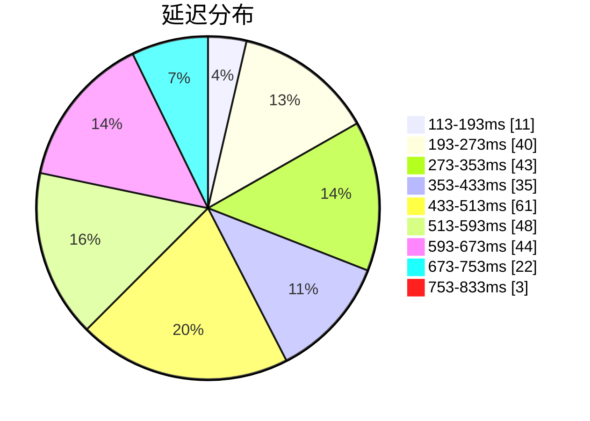
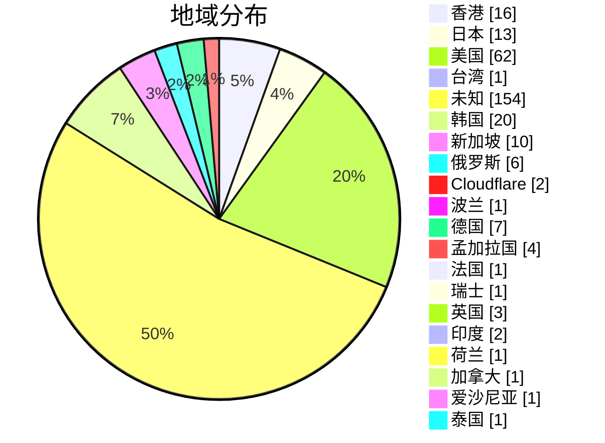
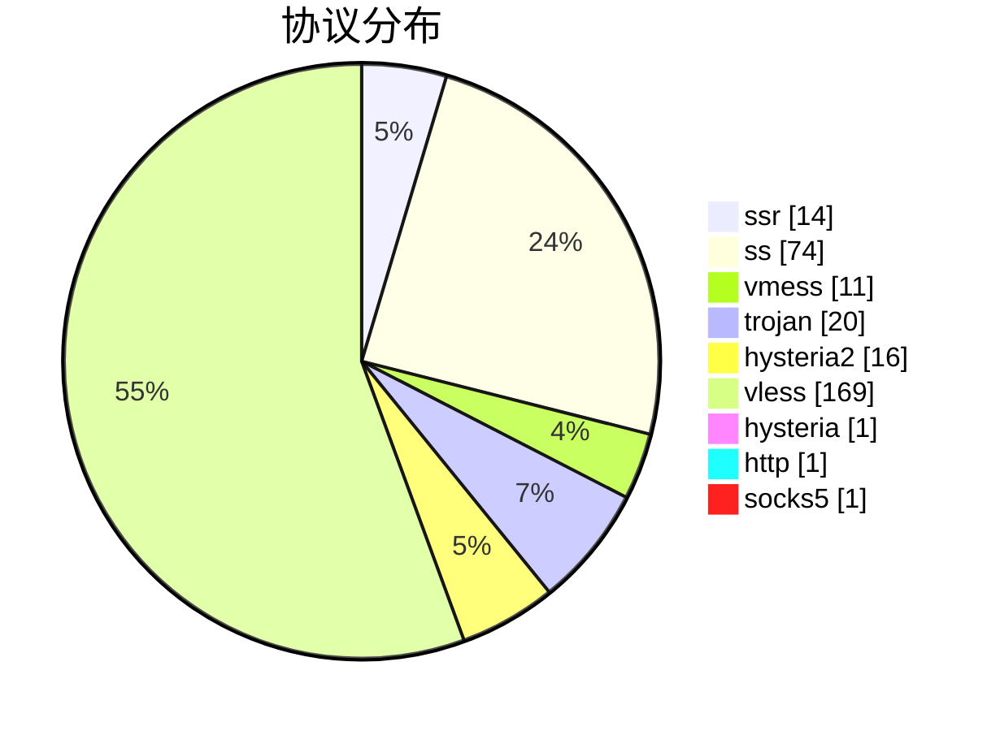

```mermaid
pie showData
title 延迟分布
"113-193ms" : 11
"193-273ms" : 40
"273-353ms" : 43
"353-433ms" : 35
"433-513ms" : 61
"513-593ms" : 48
"593-673ms" : 44
"673-753ms" : 22
"753-833ms" : 3
```

```mermaid
pie showData
title 地域分布
"香港" : 16
"日本" : 13
"美国" : 62
"台湾" : 1
"未知" : 154
"韩国" : 20
"新加坡" : 10
"俄罗斯" : 6
"Cloudflare" : 2
"波兰" : 1
"德国" : 7
"孟加拉国" : 4
"法国" : 1
"瑞士" : 1
"英国" : 3
"印度" : 2
"荷兰" : 1
"加拿大" : 1
"爱沙尼亚" : 1
"泰国" : 1
```

```mermaid
pie showData
title 协议分布
"ssr" : 14
"ss" : 74
"vmess" : 11
"trojan" : 20
"hysteria2" : 16
"vless" : 169
"hysteria" : 1
"http" : 1
"socks5" : 1
```