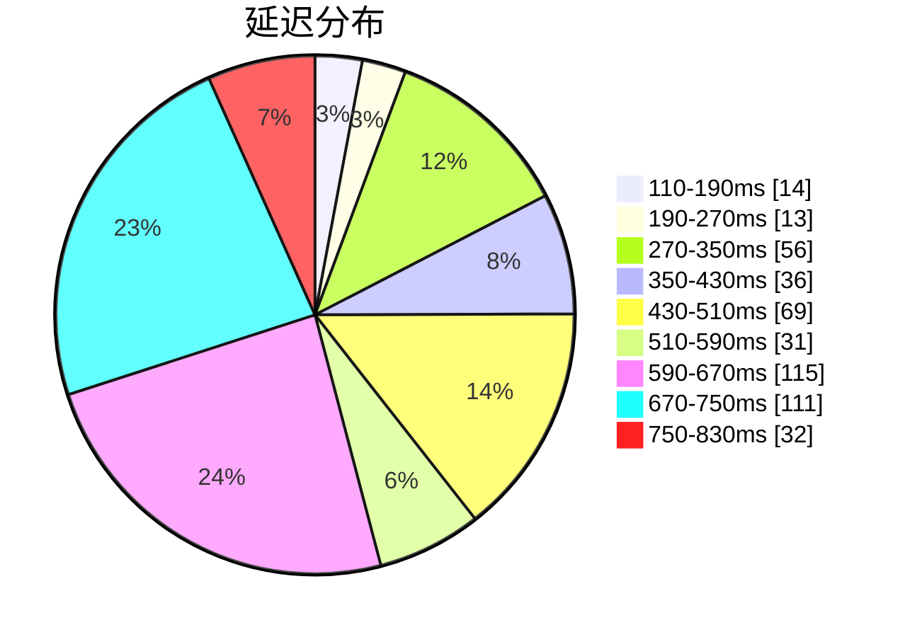
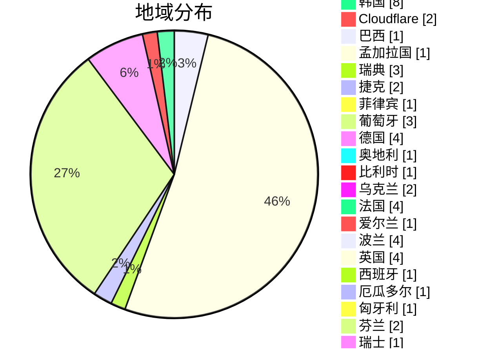
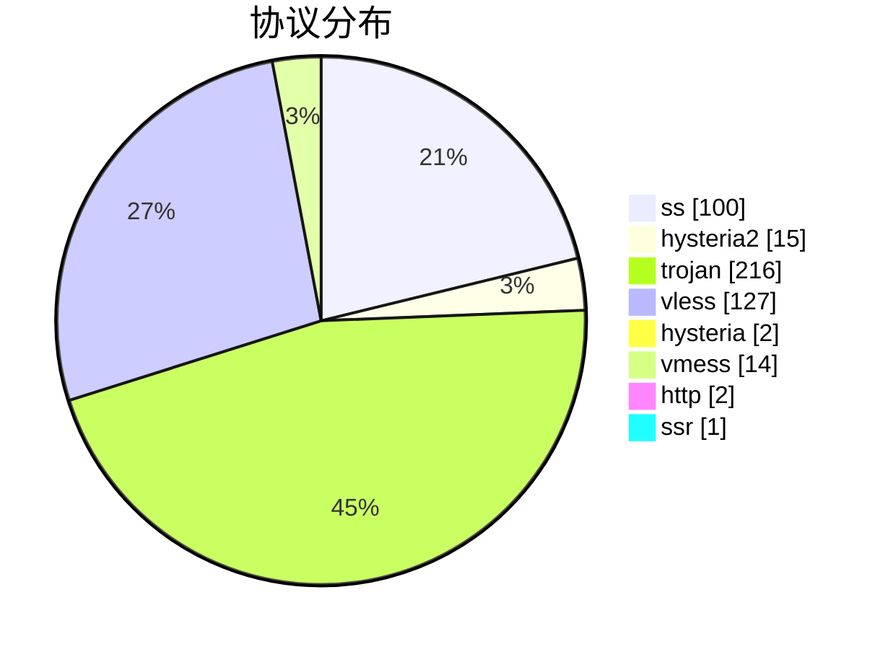

```mermaid
pie showData
title 延迟分布
"110-190ms" : 14
"190-270ms" : 13
"270-350ms" : 56
"350-430ms" : 36
"430-510ms" : 69
"510-590ms" : 31
"590-670ms" : 115
"670-750ms" : 111
"750-830ms" : 32
```

```mermaid
pie showData
title 地域分布
"香港" : 16
"未知" : 218
"新加坡" : 7
"日本" : 9
"中国" : 1
"台湾" : 128
"美国" : 28
"俄罗斯" : 2
"荷兰" : 7
"印度" : 3
"韩国" : 8
"Cloudflare" : 2
"巴西" : 1
"孟加拉国" : 1
"瑞典" : 3
"捷克" : 2
"菲律宾" : 1
"葡萄牙" : 3
"德国" : 4
"奥地利" : 1
"比利时" : 1
"乌克兰" : 2
"法国" : 4
"爱尔兰" : 1
"波兰" : 4
"英国" : 4
"西班牙" : 1
"厄瓜多尔" : 1
"匈牙利" : 1
"芬兰" : 2
"瑞士" : 1
"丹麦" : 1
"斯洛伐克" : 1
"哈萨克斯坦" : 1
"爱沙尼亚" : 1
"摩尔多瓦" : 1
"保加利亚" : 1
"拉脱维亚" : 1
"挪威" : 1
"希腊" : 1
"立陶宛" : 1
```

```mermaid
pie showData
title 协议分布
"ss" : 100
"hysteria2" : 15
"trojan" : 216
"vless" : 127
"hysteria" : 2
"vmess" : 14
"http" : 2
"ssr" : 1
```