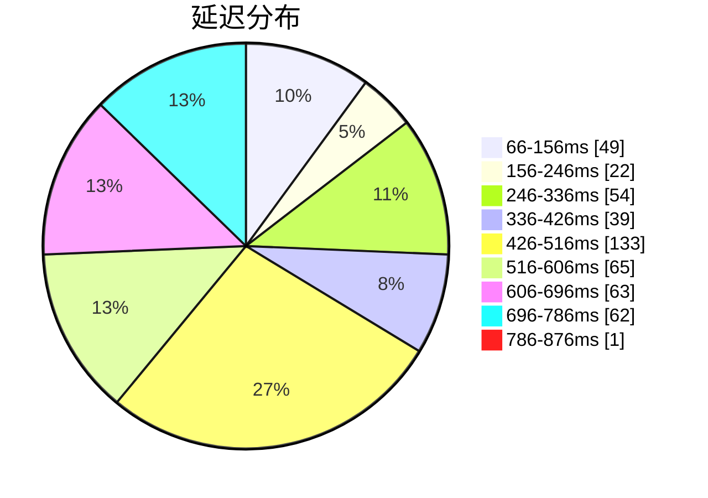
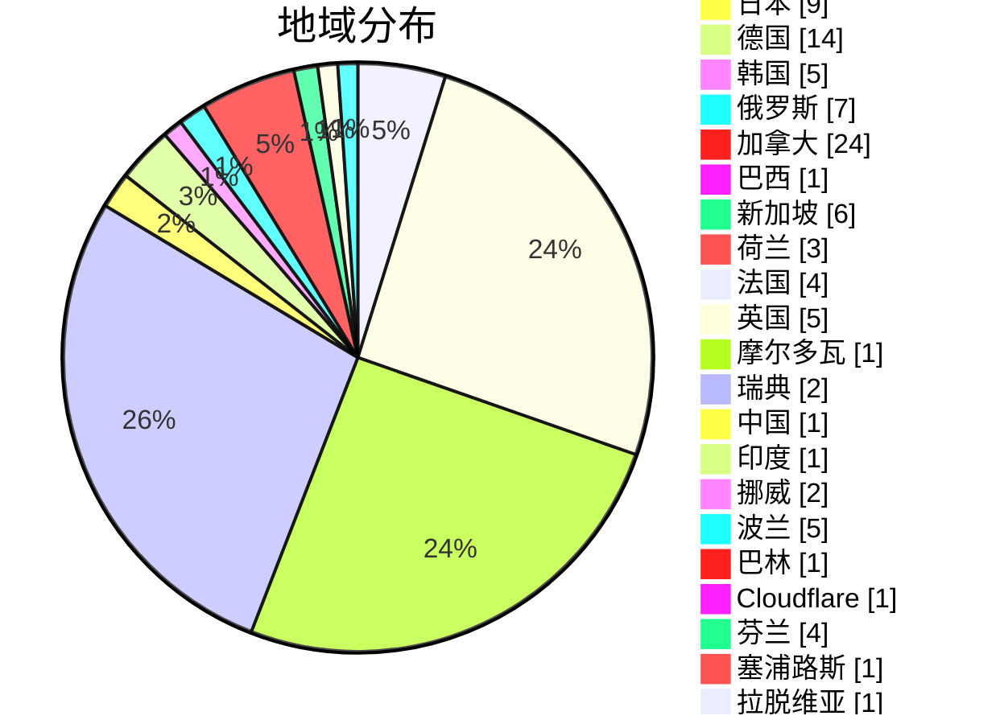
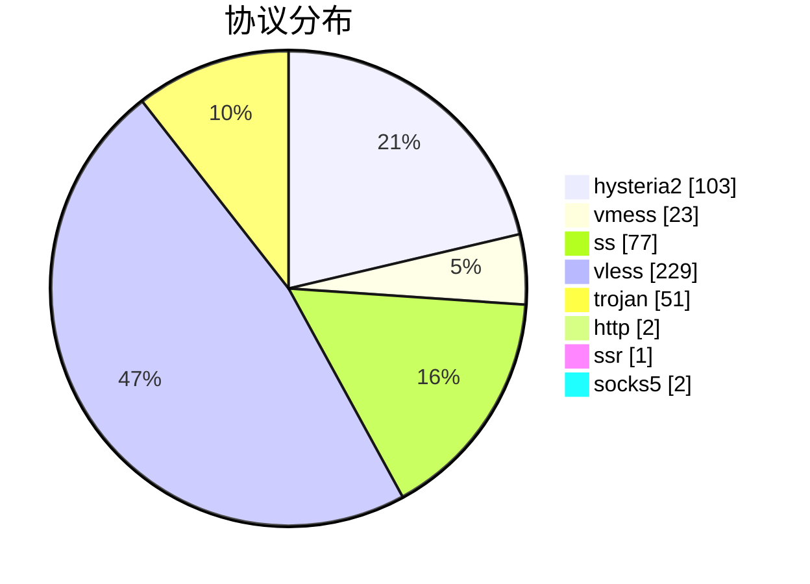

```mermaid
pie showData
title 延迟分布
"66-156ms" : 49
"156-246ms" : 22
"246-336ms" : 54
"336-426ms" : 39
"426-516ms" : 133
"516-606ms" : 65
"606-696ms" : 63
"696-786ms" : 62
"786-876ms" : 1
```

```mermaid
pie showData
title 地域分布
"香港" : 22
"未知" : 117
"台湾" : 117
"美国" : 127
"日本" : 9
"德国" : 14
"韩国" : 5
"俄罗斯" : 7
"加拿大" : 24
"巴西" : 1
"新加坡" : 6
"荷兰" : 3
"法国" : 4
"英国" : 5
"摩尔多瓦" : 1
"瑞典" : 2
"中国" : 1
"印度" : 1
"挪威" : 2
"波兰" : 5
"巴林" : 1
"Cloudflare" : 1
"芬兰" : 4
"塞浦路斯" : 1
"拉脱维亚" : 1
"瑞士" : 2
"斯洛文尼亚" : 1
"墨西哥" : 3
"卢森堡" : 1
```

```mermaid
pie showData
title 协议分布
"hysteria2" : 103
"vmess" : 23
"ss" : 77
"vless" : 229
"trojan" : 51
"http" : 2
"ssr" : 1
"socks5" : 2
```