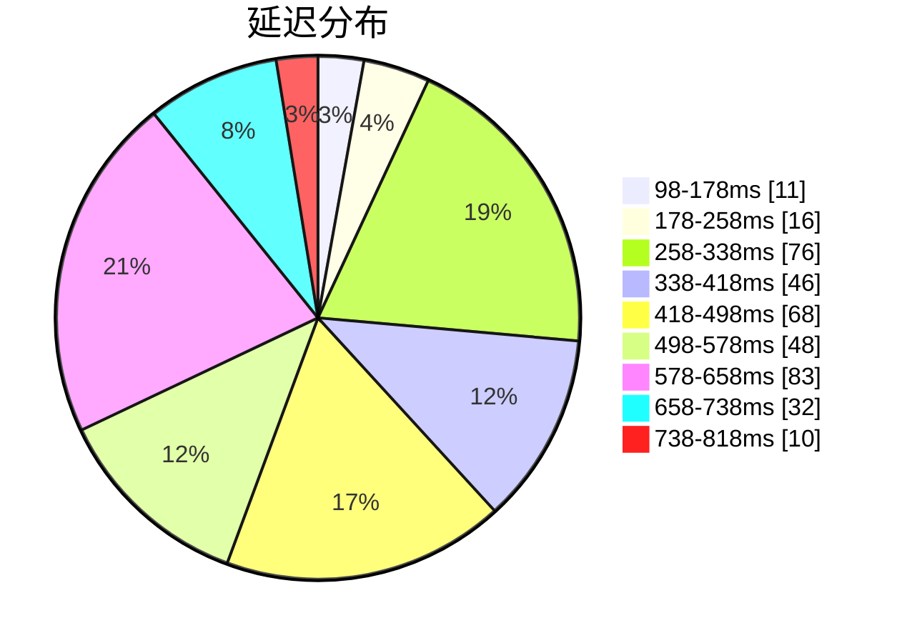
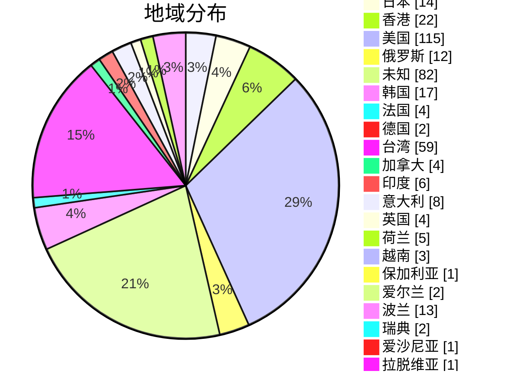
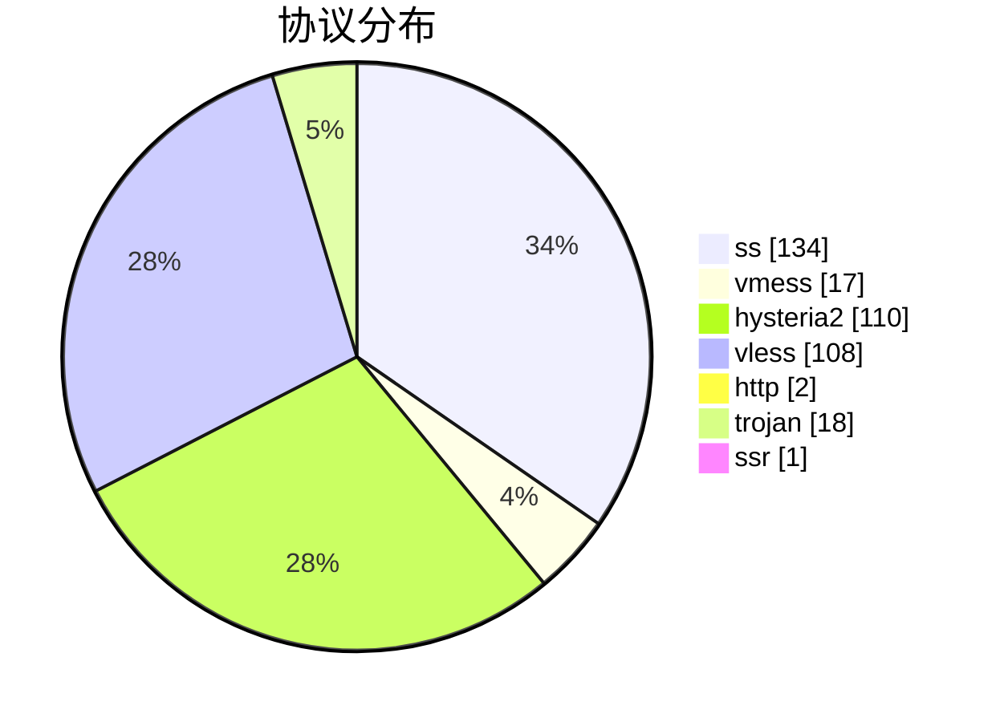

```mermaid
pie showData
title 延迟分布
"98-178ms" : 11
"178-258ms" : 16
"258-338ms" : 76
"338-418ms" : 46
"418-498ms" : 68
"498-578ms" : 48
"578-658ms" : 83
"658-738ms" : 32
"738-818ms" : 10
```

```mermaid
pie showData
title 地域分布
"新加坡" : 12
"日本" : 14
"香港" : 22
"美国" : 115
"俄罗斯" : 12
"未知" : 82
"韩国" : 17
"法国" : 4
"德国" : 2
"台湾" : 59
"加拿大" : 4
"印度" : 6
"意大利" : 8
"英国" : 4
"荷兰" : 5
"越南" : 3
"保加利亚" : 1
"爱尔兰" : 2
"波兰" : 13
"瑞典" : 2
"爱沙尼亚" : 1
"拉脱维亚" : 1
"瑞士" : 1
```

```mermaid
pie showData
title 协议分布
"ss" : 134
"vmess" : 17
"hysteria2" : 110
"vless" : 108
"http" : 2
"trojan" : 18
"ssr" : 1
```