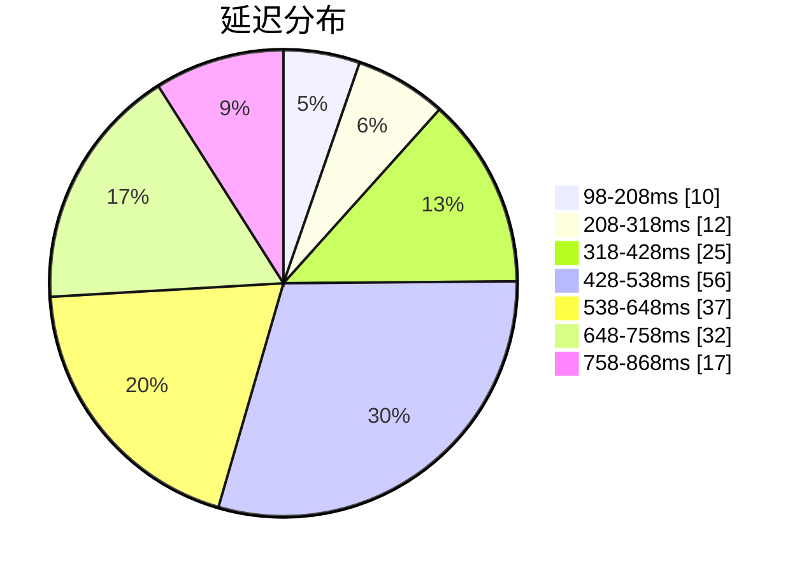
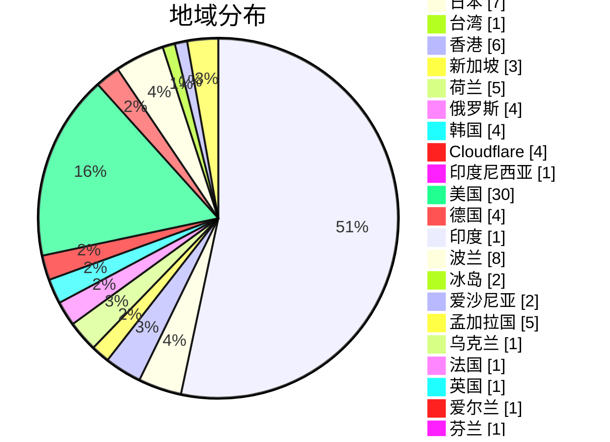
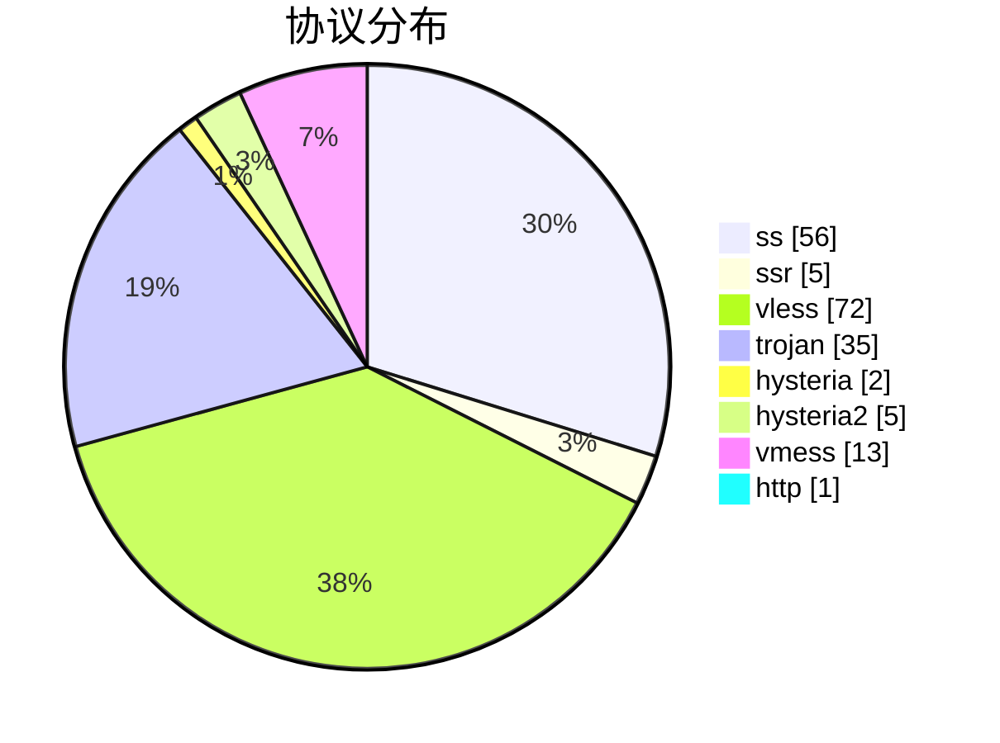

```mermaid
pie showData
title 延迟分布
"98-208ms" : 10
"208-318ms" : 12
"318-428ms" : 25
"428-538ms" : 56
"538-648ms" : 37
"648-758ms" : 32
"758-868ms" : 17
```

```mermaid
pie showData
title 地域分布
"未知" : 96
"日本" : 7
"台湾" : 1
"香港" : 6
"新加坡" : 3
"荷兰" : 5
"俄罗斯" : 4
"韩国" : 4
"Cloudflare" : 4
"印度尼西亚" : 1
"美国" : 30
"德国" : 4
"印度" : 1
"波兰" : 8
"冰岛" : 2
"爱沙尼亚" : 2
"孟加拉国" : 5
"乌克兰" : 1
"法国" : 1
"英国" : 1
"爱尔兰" : 1
"芬兰" : 1
"土耳其" : 1
```

```mermaid
pie showData
title 协议分布
"ss" : 56
"ssr" : 5
"vless" : 72
"trojan" : 35
"hysteria" : 2
"hysteria2" : 5
"vmess" : 13
"http" : 1
```