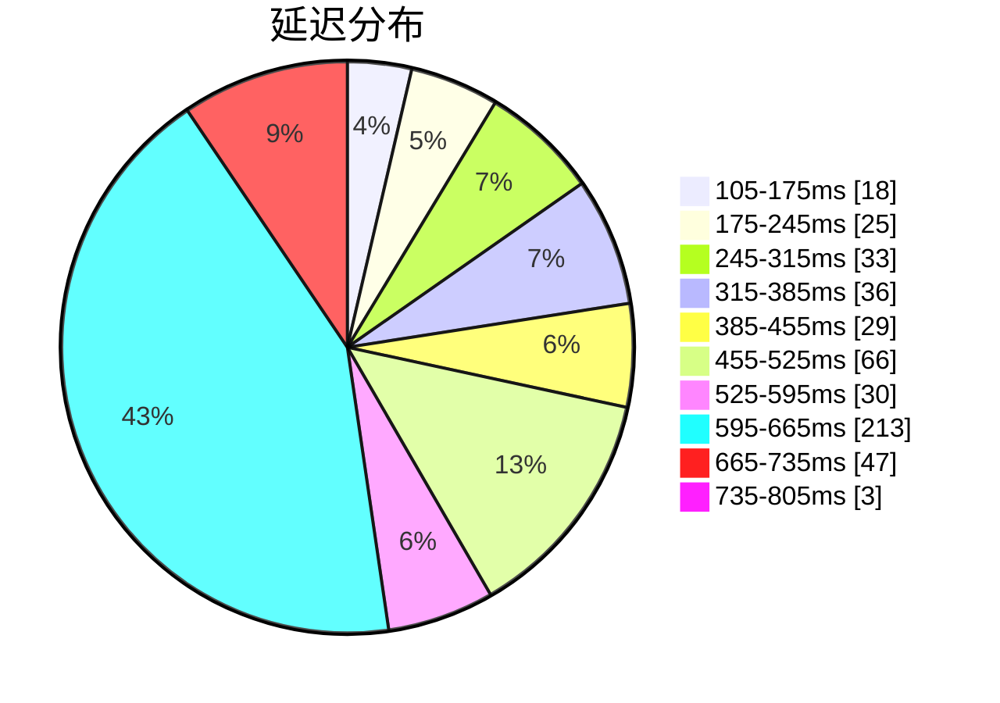
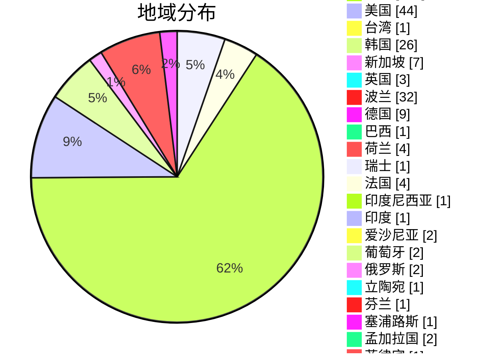
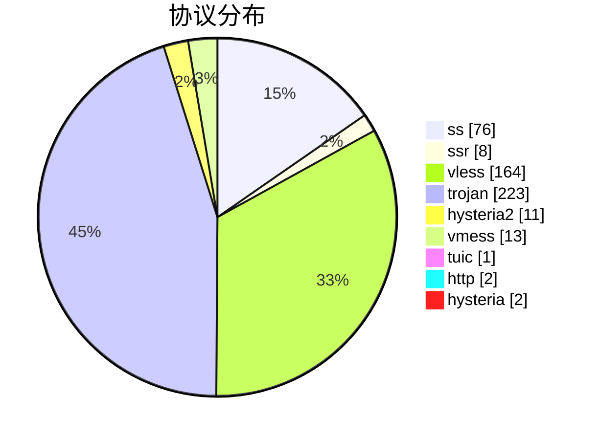

```mermaid
pie showData
title 延迟分布
"105-175ms" : 18
"175-245ms" : 25
"245-315ms" : 33
"315-385ms" : 36
"385-455ms" : 29
"455-525ms" : 66
"525-595ms" : 30
"595-665ms" : 213
"665-735ms" : 47
"735-805ms" : 3
```

```mermaid
pie showData
title 地域分布
"香港" : 25
"日本" : 18
"未知" : 309
"美国" : 44
"台湾" : 1
"韩国" : 26
"新加坡" : 7
"英国" : 3
"波兰" : 32
"德国" : 9
"巴西" : 1
"荷兰" : 4
"瑞士" : 1
"法国" : 4
"印度尼西亚" : 1
"印度" : 1
"爱沙尼亚" : 2
"葡萄牙" : 2
"俄罗斯" : 2
"立陶宛" : 1
"芬兰" : 1
"塞浦路斯" : 1
"孟加拉国" : 2
"菲律宾" : 1
"斯洛文尼亚" : 1
"加拿大" : 1
```

```mermaid
pie showData
title 协议分布
"ss" : 76
"ssr" : 8
"vless" : 164
"trojan" : 223
"hysteria2" : 11
"vmess" : 13
"tuic" : 1
"http" : 2
"hysteria" : 2
```