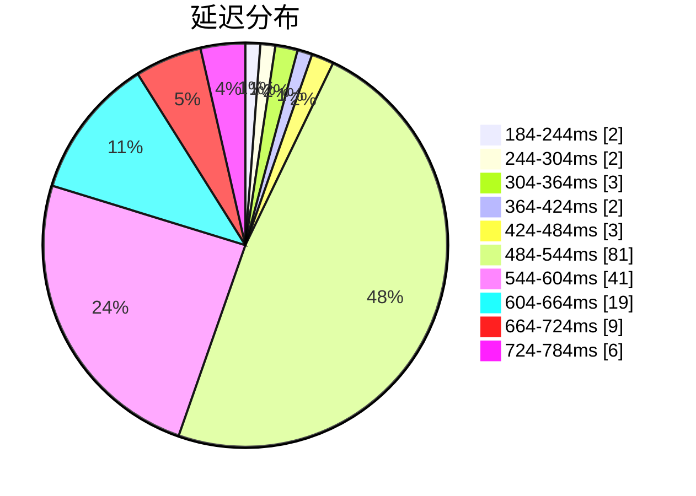
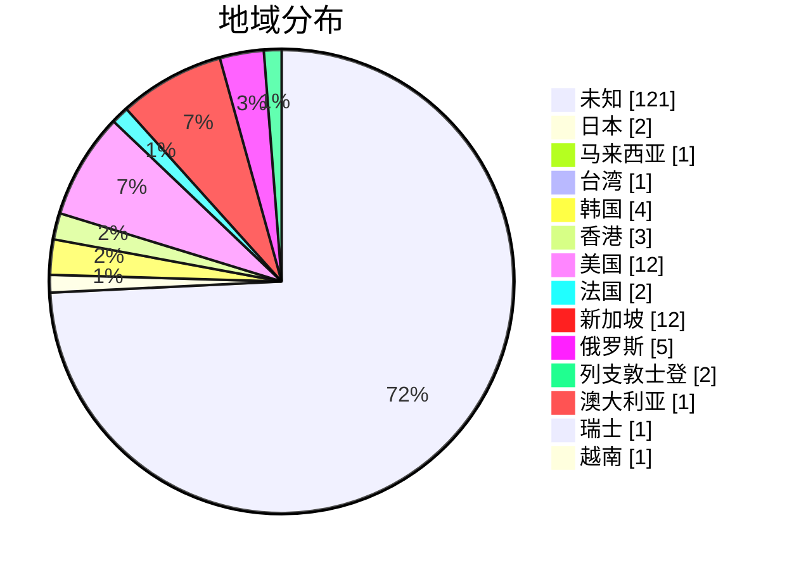
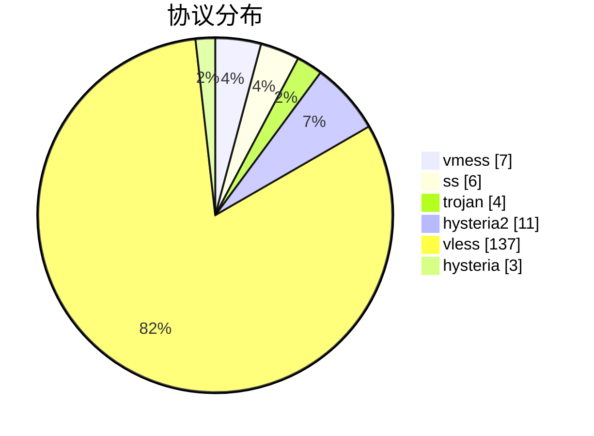

```mermaid
pie showData
title 延迟分布
"184-244ms" : 2
"244-304ms" : 2
"304-364ms" : 3
"364-424ms" : 2
"424-484ms" : 3
"484-544ms" : 81
"544-604ms" : 41
"604-664ms" : 19
"664-724ms" : 9
"724-784ms" : 6
```

```mermaid
pie showData
title 地域分布
"未知" : 121
"日本" : 2
"马来西亚" : 1
"台湾" : 1
"韩国" : 4
"香港" : 3
"美国" : 12
"法国" : 2
"新加坡" : 12
"俄罗斯" : 5
"列支敦士登" : 2
"澳大利亚" : 1
"瑞士" : 1
"越南" : 1
```

```mermaid
pie showData
title 协议分布
"vmess" : 7
"ss" : 6
"trojan" : 4
"hysteria2" : 11
"vless" : 137
"hysteria" : 3
```