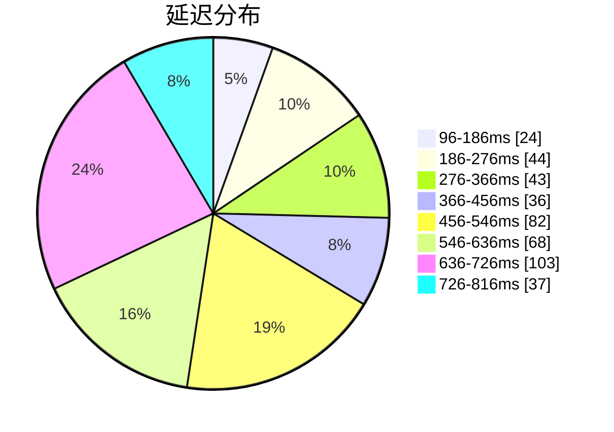
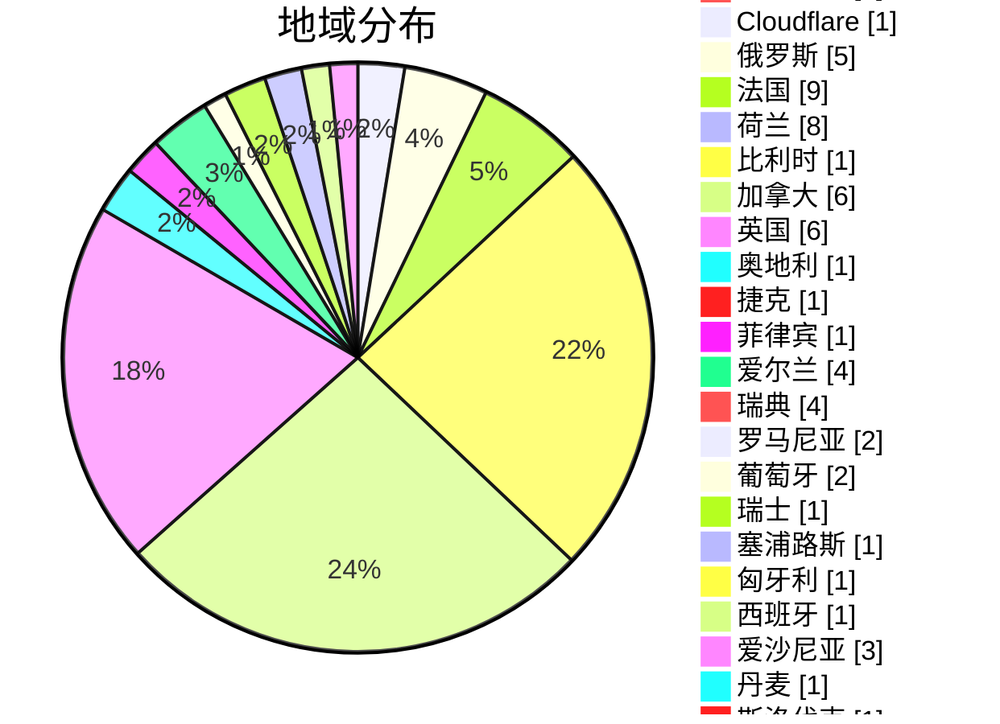
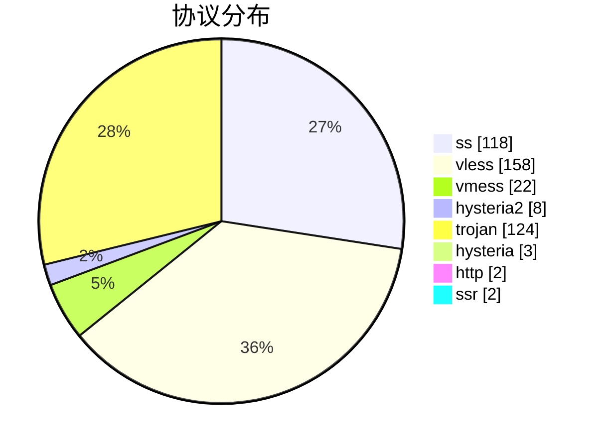

```mermaid
pie showData
title 延迟分布
"96-186ms" : 24
"186-276ms" : 44
"276-366ms" : 43
"366-456ms" : 36
"456-546ms" : 82
"546-636ms" : 68
"636-726ms" : 103
"726-816ms" : 37
```

```mermaid
pie showData
title 地域分布
"香港" : 10
"日本" : 18
"新加坡" : 23
"印度尼西亚" : 2
"未知" : 94
"美国" : 103
"台湾" : 78
"韩国" : 10
"中国" : 3
"波兰" : 8
"德国" : 13
"马来西亚" : 1
"Cloudflare" : 1
"俄罗斯" : 5
"法国" : 9
"荷兰" : 8
"比利时" : 1
"加拿大" : 6
"英国" : 6
"奥地利" : 1
"捷克" : 1
"菲律宾" : 1
"爱尔兰" : 4
"瑞典" : 4
"罗马尼亚" : 2
"葡萄牙" : 2
"瑞士" : 1
"塞浦路斯" : 1
"匈牙利" : 1
"西班牙" : 1
"爱沙尼亚" : 3
"丹麦" : 1
"斯洛伐克" : 1
"乌克兰" : 1
"保加利亚" : 1
"土耳其" : 1
"智利" : 1
"拉脱维亚" : 1
"冰岛" : 1
"摩尔多瓦" : 1
"挪威" : 1
"立陶宛" : 1
"希腊" : 1
"印度" : 4
```

```mermaid
pie showData
title 协议分布
"ss" : 118
"vless" : 158
"vmess" : 22
"hysteria2" : 8
"trojan" : 124
"hysteria" : 3
"http" : 2
"ssr" : 2
```