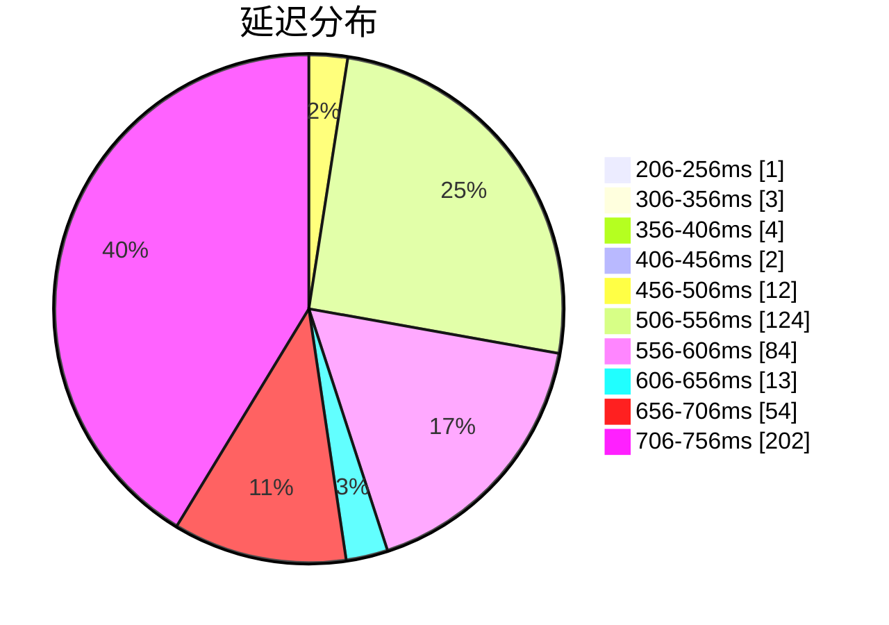
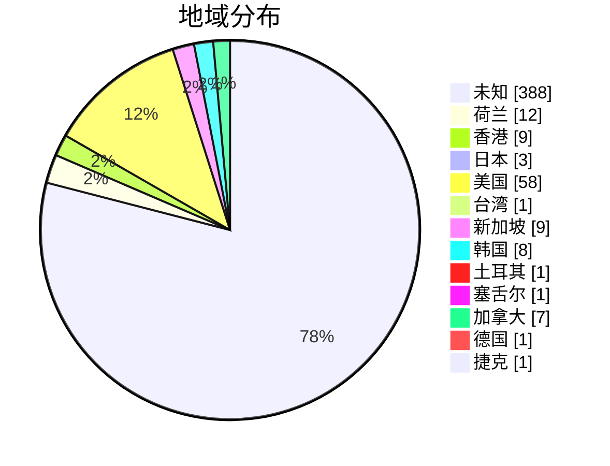
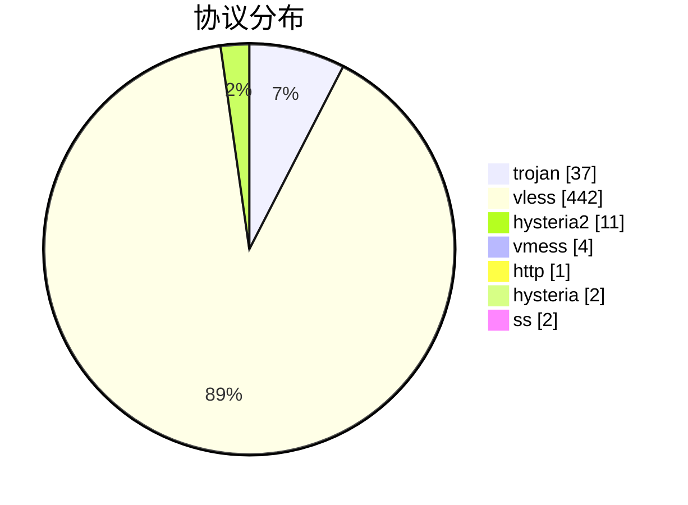

```mermaid
pie showData
title 延迟分布
"206-256ms" : 1
"306-356ms" : 3
"356-406ms" : 4
"406-456ms" : 2
"456-506ms" : 12
"506-556ms" : 124
"556-606ms" : 84
"606-656ms" : 13
"656-706ms" : 54
"706-756ms" : 202
```

```mermaid
pie showData
title 地域分布
"未知" : 388
"荷兰" : 12
"香港" : 9
"日本" : 3
"美国" : 58
"台湾" : 1
"新加坡" : 9
"韩国" : 8
"土耳其" : 1
"塞舌尔" : 1
"加拿大" : 7
"德国" : 1
"捷克" : 1
```

```mermaid
pie showData
title 协议分布
"trojan" : 37
"vless" : 442
"hysteria2" : 11
"vmess" : 4
"http" : 1
"hysteria" : 2
"ss" : 2
```