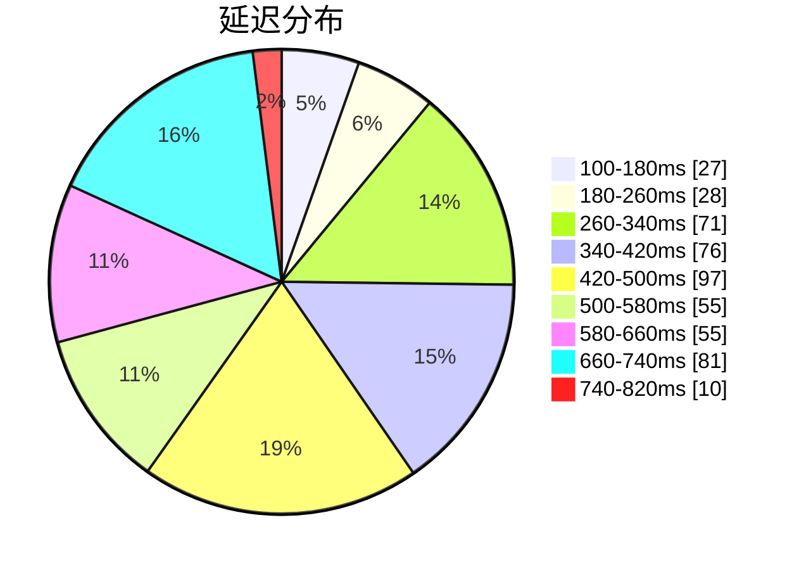
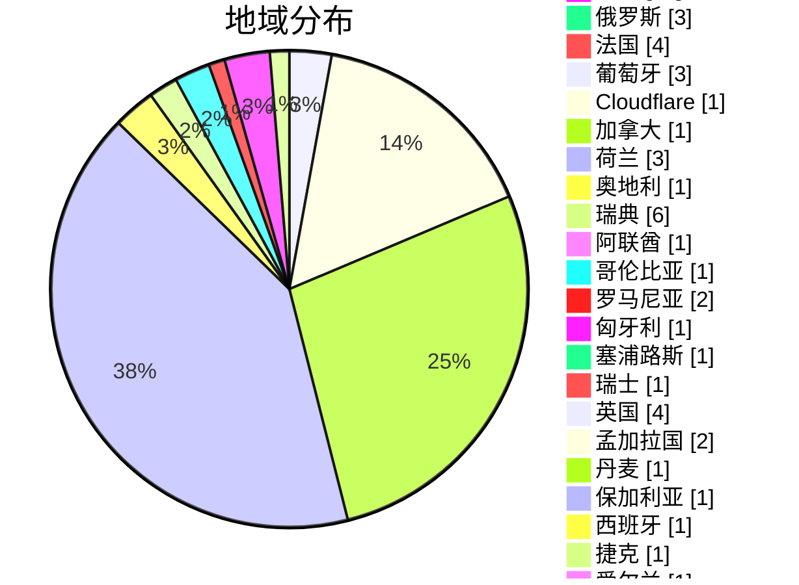
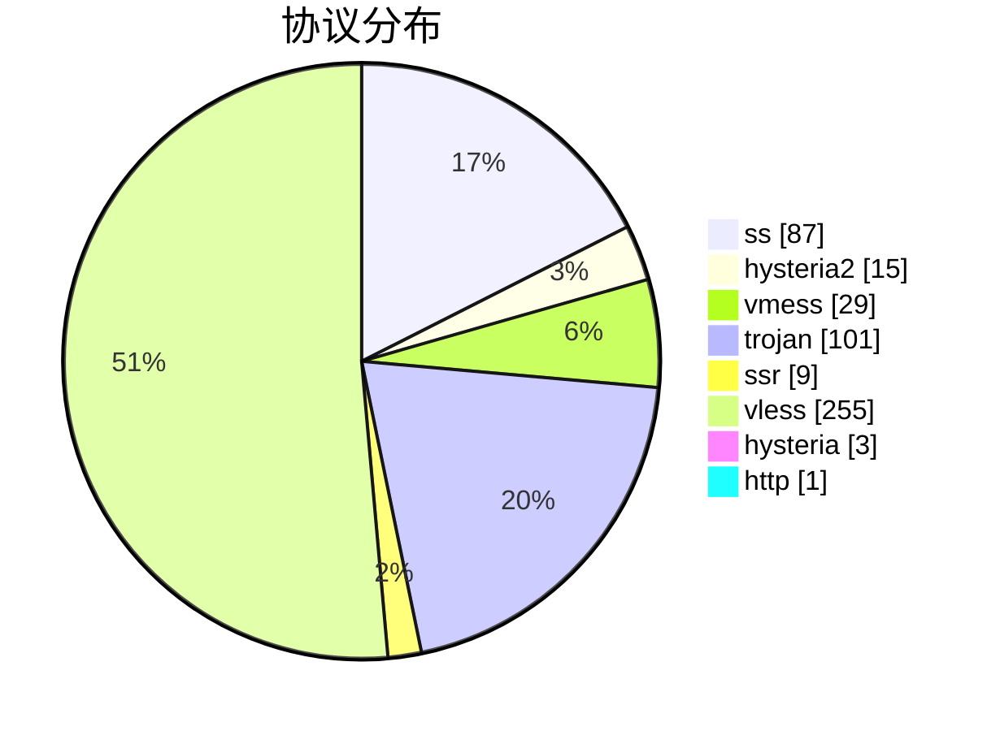

```mermaid
pie showData
title 延迟分布
"100-180ms" : 27
"180-260ms" : 28
"260-340ms" : 71
"340-420ms" : 76
"420-500ms" : 97
"500-580ms" : 55
"580-660ms" : 55
"660-740ms" : 81
"740-820ms" : 10
```

```mermaid
pie showData
title 地域分布
"香港" : 13
"台湾" : 72
"美国" : 125
"未知" : 188
"日本" : 13
"新加坡" : 9
"中国" : 1
"德国" : 11
"韩国" : 5
"波兰" : 14
"俄罗斯" : 3
"法国" : 4
"葡萄牙" : 3
"Cloudflare" : 1
"加拿大" : 1
"荷兰" : 3
"奥地利" : 1
"瑞典" : 6
"阿联酋" : 1
"哥伦比亚" : 1
"罗马尼亚" : 2
"匈牙利" : 1
"塞浦路斯" : 1
"瑞士" : 1
"英国" : 4
"孟加拉国" : 2
"丹麦" : 1
"保加利亚" : 1
"西班牙" : 1
"捷克" : 1
"爱尔兰" : 1
"冰岛" : 1
"希腊" : 1
"智利" : 1
"乌克兰" : 1
"墨西哥" : 1
"爱沙尼亚" : 1
"摩尔多瓦" : 1
"土耳其" : 1
"立陶宛" : 1
```

```mermaid
pie showData
title 协议分布
"ss" : 87
"hysteria2" : 15
"vmess" : 29
"trojan" : 101
"ssr" : 9
"vless" : 255
"hysteria" : 3
"http" : 1
```