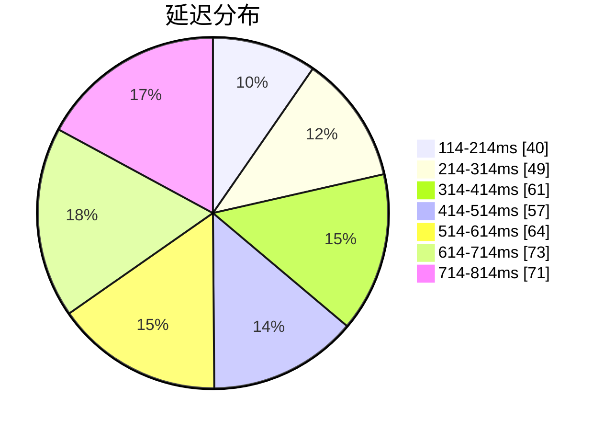
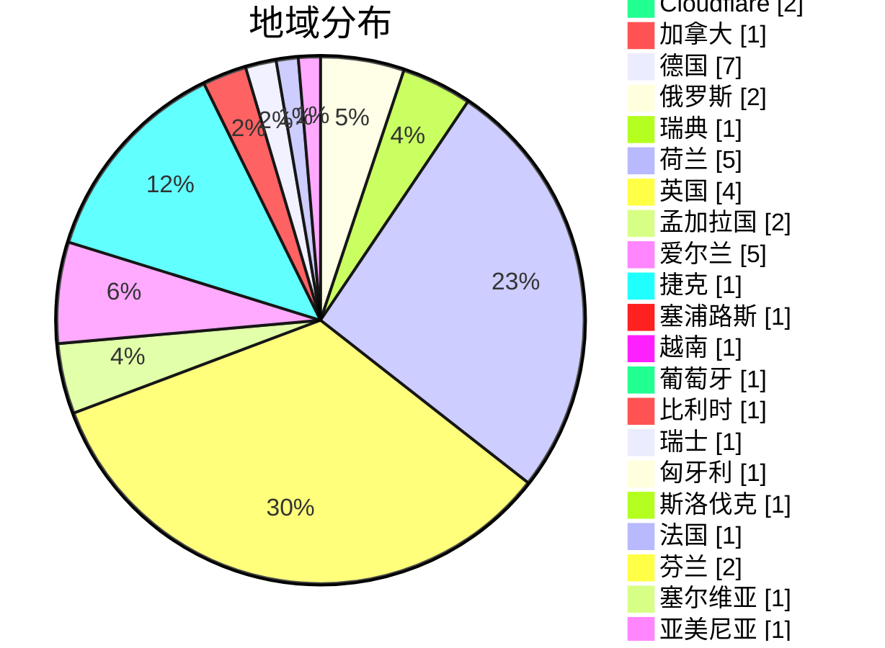
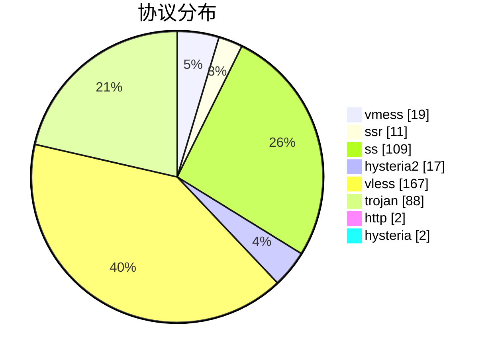

```mermaid
pie showData
title 延迟分布
"114-214ms" : 40
"214-314ms" : 49
"314-414ms" : 61
"414-514ms" : 57
"514-614ms" : 64
"614-714ms" : 73
"714-814ms" : 71
```

```mermaid
pie showData
title 地域分布
"中国" : 4
"日本" : 19
"香港" : 16
"台湾" : 97
"未知" : 125
"新加坡" : 16
"波兰" : 23
"美国" : 48
"韩国" : 10
"印度" : 4
"Cloudflare" : 2
"加拿大" : 1
"德国" : 7
"俄罗斯" : 2
"瑞典" : 1
"荷兰" : 5
"英国" : 4
"孟加拉国" : 2
"爱尔兰" : 5
"捷克" : 1
"塞浦路斯" : 1
"越南" : 1
"葡萄牙" : 1
"比利时" : 1
"瑞士" : 1
"匈牙利" : 1
"斯洛伐克" : 1
"法国" : 1
"芬兰" : 2
"塞尔维亚" : 1
"亚美尼亚" : 1
"西班牙" : 2
"罗马尼亚" : 1
"冰岛" : 1
"乌克兰" : 1
"保加利亚" : 1
"摩尔多瓦" : 1
"挪威" : 1
"丹麦" : 1
"立陶宛" : 1
"爱沙尼亚" : 1
```

```mermaid
pie showData
title 协议分布
"vmess" : 19
"ssr" : 11
"ss" : 109
"hysteria2" : 17
"vless" : 167
"trojan" : 88
"http" : 2
"hysteria" : 2
```