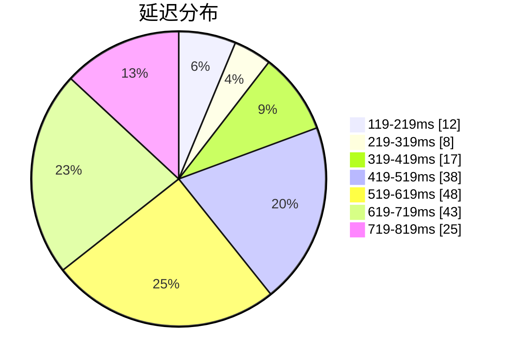
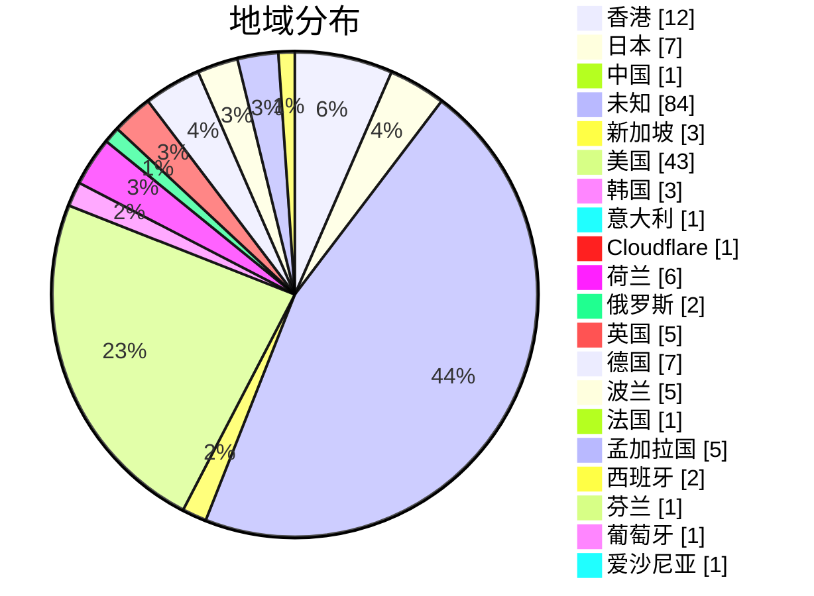
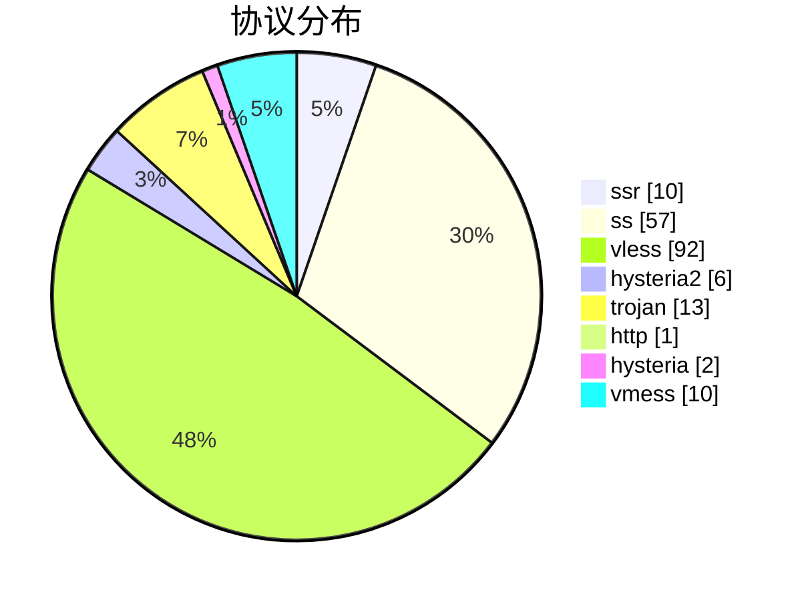

```mermaid
pie showData
title 延迟分布
"119-219ms" : 12
"219-319ms" : 8
"319-419ms" : 17
"419-519ms" : 38
"519-619ms" : 48
"619-719ms" : 43
"719-819ms" : 25
```

```mermaid
pie showData
title 地域分布
"香港" : 12
"日本" : 7
"中国" : 1
"未知" : 84
"新加坡" : 3
"美国" : 43
"韩国" : 3
"意大利" : 1
"Cloudflare" : 1
"荷兰" : 6
"俄罗斯" : 2
"英国" : 5
"德国" : 7
"波兰" : 5
"法国" : 1
"孟加拉国" : 5
"西班牙" : 2
"芬兰" : 1
"葡萄牙" : 1
"爱沙尼亚" : 1
```

```mermaid
pie showData
title 协议分布
"ssr" : 10
"ss" : 57
"vless" : 92
"hysteria2" : 6
"trojan" : 13
"http" : 1
"hysteria" : 2
"vmess" : 10
```