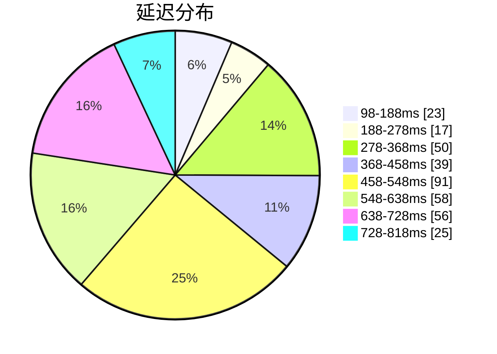
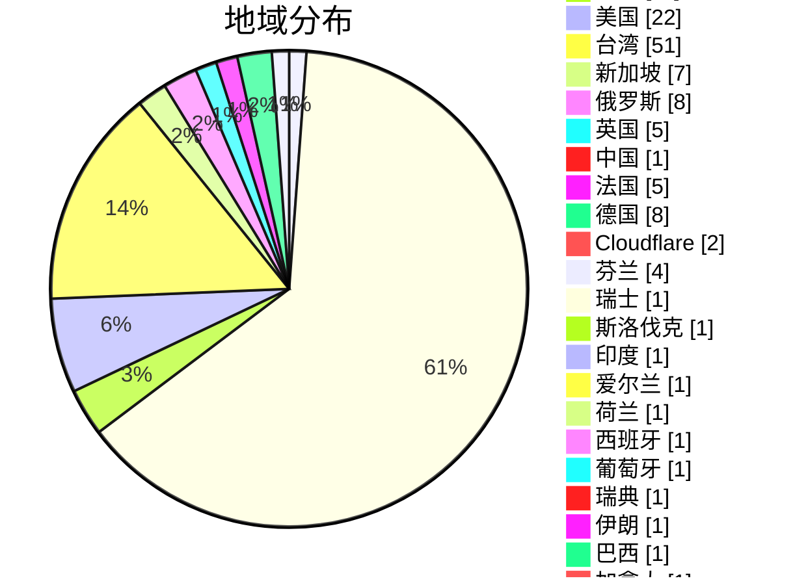
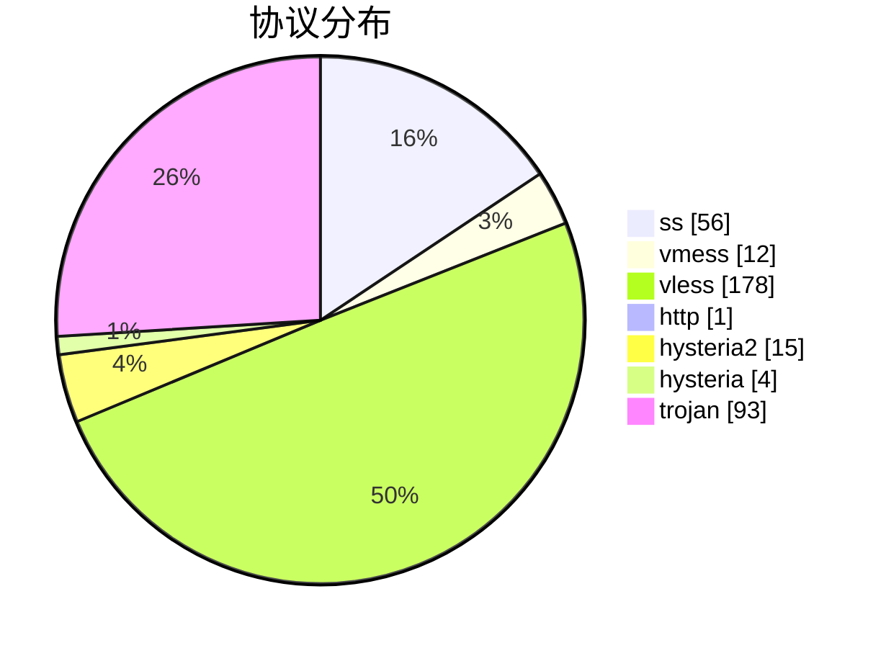

```mermaid
pie showData
title 延迟分布
"98-188ms" : 23
"188-278ms" : 17
"278-368ms" : 50
"368-458ms" : 39
"458-548ms" : 91
"548-638ms" : 58
"638-728ms" : 56
"728-818ms" : 25
```

```mermaid
pie showData
title 地域分布
"香港" : 4
"未知" : 218
"日本" : 11
"美国" : 22
"台湾" : 51
"新加坡" : 7
"俄罗斯" : 8
"英国" : 5
"中国" : 1
"法国" : 5
"德国" : 8
"Cloudflare" : 2
"芬兰" : 4
"瑞士" : 1
"斯洛伐克" : 1
"印度" : 1
"爱尔兰" : 1
"荷兰" : 1
"西班牙" : 1
"葡萄牙" : 1
"瑞典" : 1
"伊朗" : 1
"巴西" : 1
"加拿大" : 1
"印度尼西亚" : 1
"冰岛" : 1
```

```mermaid
pie showData
title 协议分布
"ss" : 56
"vmess" : 12
"vless" : 178
"http" : 1
"hysteria2" : 15
"hysteria" : 4
"trojan" : 93
```