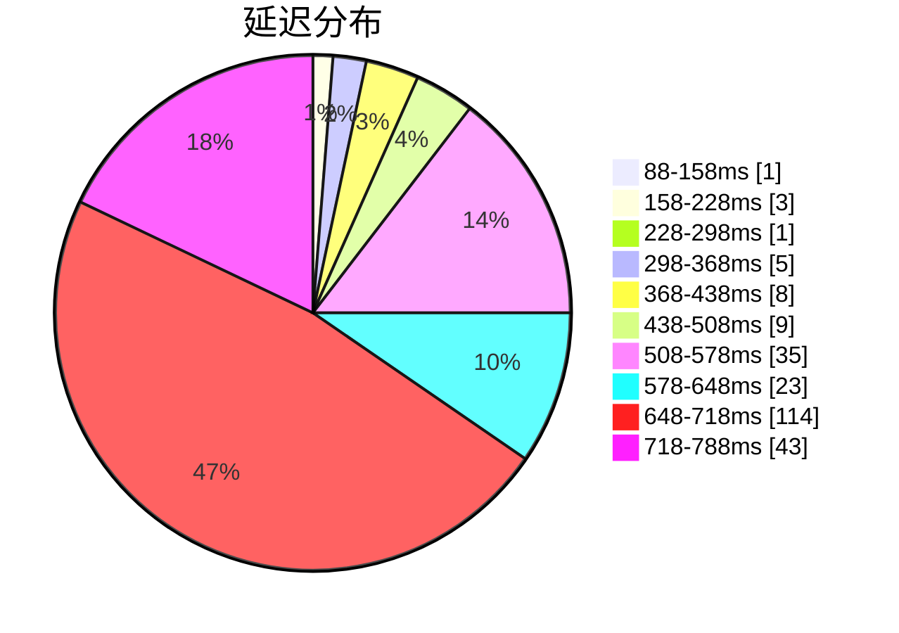
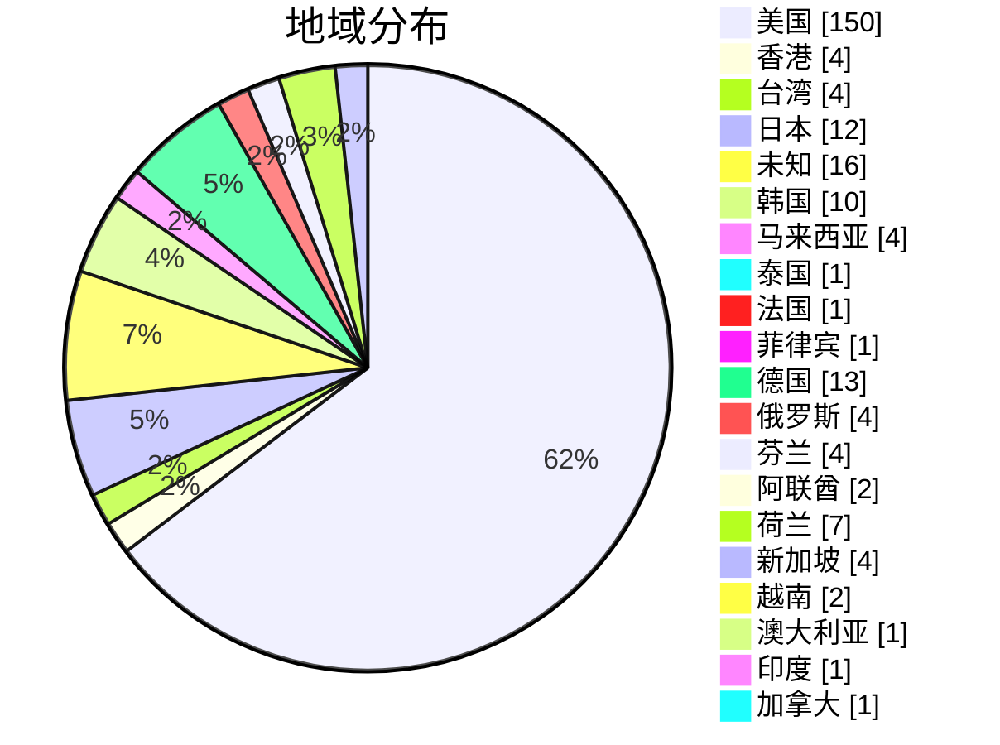
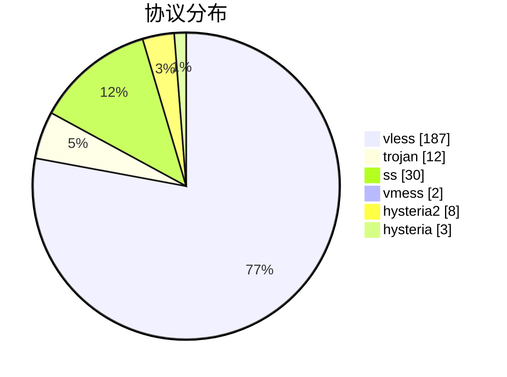

```mermaid
pie showData
title 延迟分布
"88-158ms" : 1
"158-228ms" : 3
"228-298ms" : 1
"298-368ms" : 5
"368-438ms" : 8
"438-508ms" : 9
"508-578ms" : 35
"578-648ms" : 23
"648-718ms" : 114
"718-788ms" : 43
```

```mermaid
pie showData
title 地域分布
"美国" : 150
"香港" : 4
"台湾" : 4
"日本" : 12
"未知" : 16
"韩国" : 10
"马来西亚" : 4
"泰国" : 1
"法国" : 1
"菲律宾" : 1
"德国" : 13
"俄罗斯" : 4
"芬兰" : 4
"阿联酋" : 2
"荷兰" : 7
"新加坡" : 4
"越南" : 2
"澳大利亚" : 1
"印度" : 1
"加拿大" : 1
```

```mermaid
pie showData
title 协议分布
"vless" : 187
"trojan" : 12
"ss" : 30
"vmess" : 2
"hysteria2" : 8
"hysteria" : 3
```