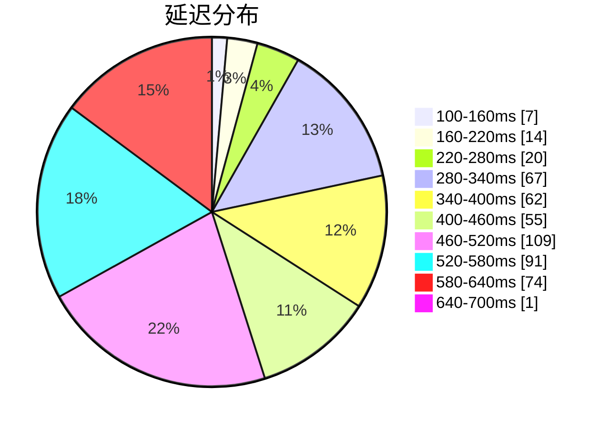
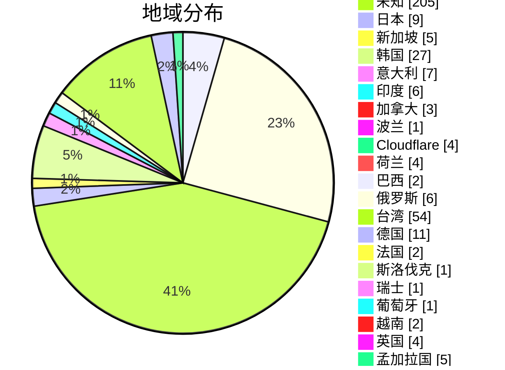
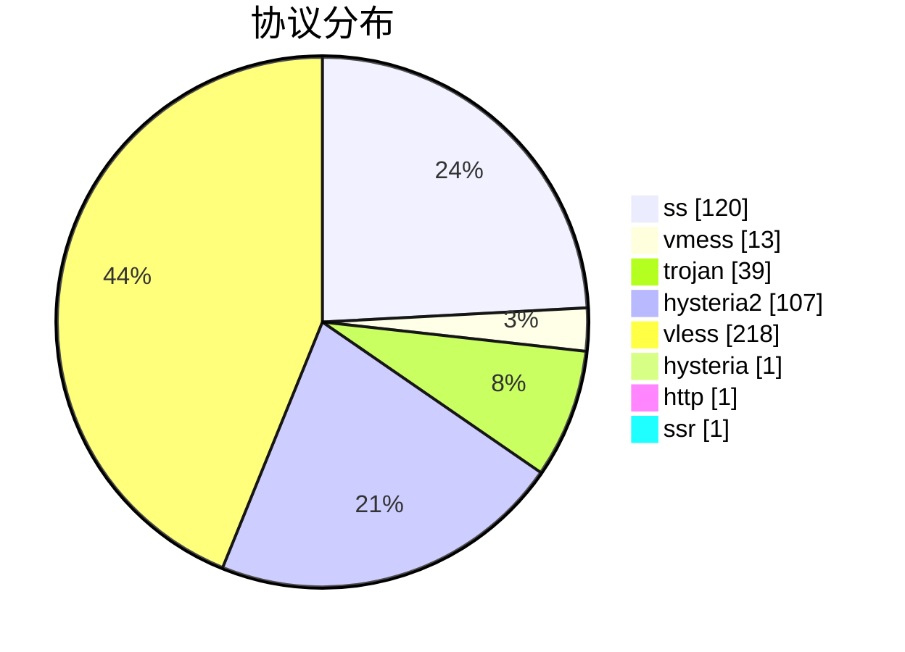

```mermaid
pie showData
title 延迟分布
"100-160ms" : 7
"160-220ms" : 14
"220-280ms" : 20
"280-340ms" : 67
"340-400ms" : 62
"400-460ms" : 55
"460-520ms" : 109
"520-580ms" : 91
"580-640ms" : 74
"640-700ms" : 1
```

```mermaid
pie showData
title 地域分布
"香港" : 21
"美国" : 117
"未知" : 205
"日本" : 9
"新加坡" : 5
"韩国" : 27
"意大利" : 7
"印度" : 6
"加拿大" : 3
"波兰" : 1
"Cloudflare" : 4
"荷兰" : 4
"巴西" : 2
"俄罗斯" : 6
"台湾" : 54
"德国" : 11
"法国" : 2
"斯洛伐克" : 1
"瑞士" : 1
"葡萄牙" : 1
"越南" : 2
"英国" : 4
"孟加拉国" : 5
"爱尔兰" : 1
"芬兰" : 1
```

```mermaid
pie showData
title 协议分布
"ss" : 120
"vmess" : 13
"trojan" : 39
"hysteria2" : 107
"vless" : 218
"hysteria" : 1
"http" : 1
"ssr" : 1
```