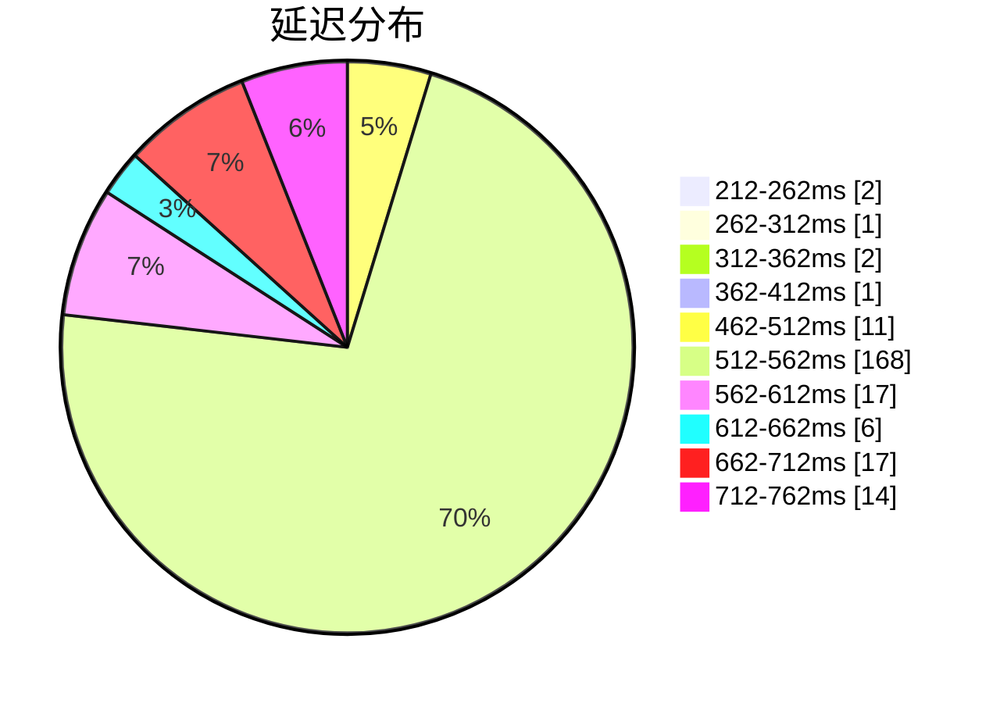
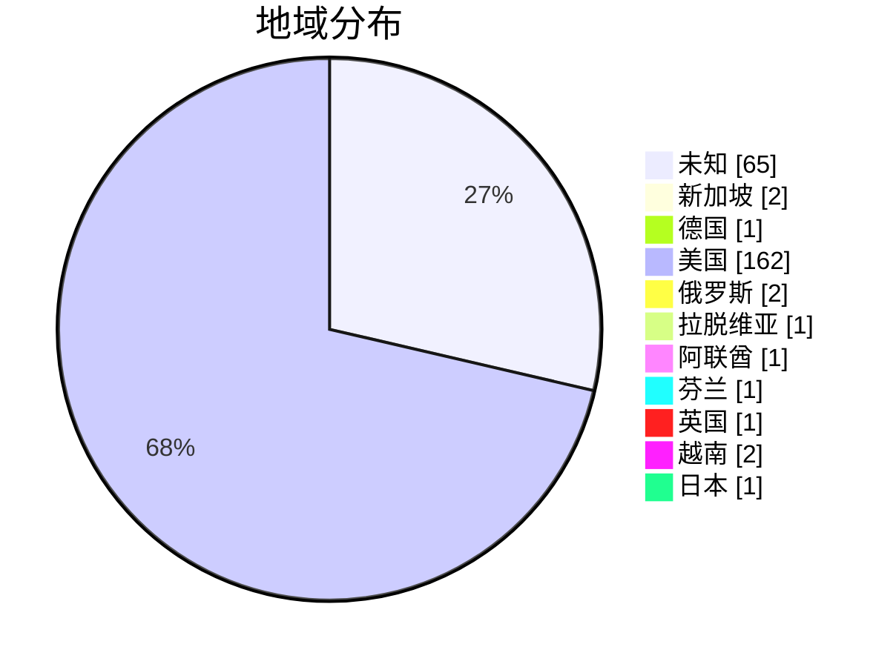
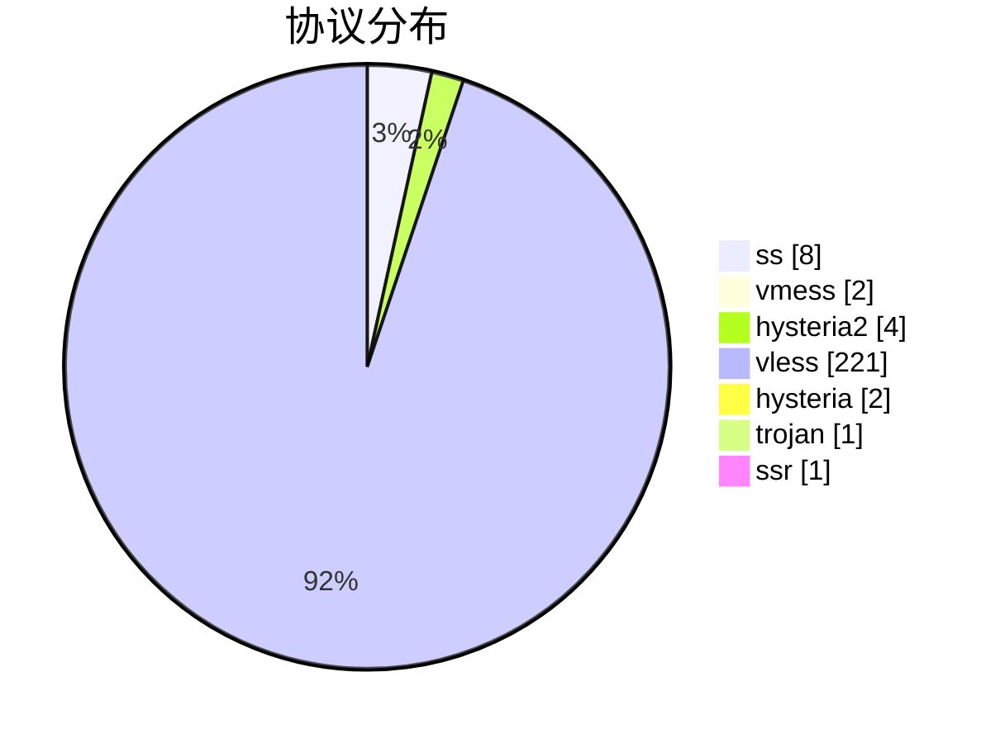

```mermaid
pie showData
title 延迟分布
"212-262ms" : 2
"262-312ms" : 1
"312-362ms" : 2
"362-412ms" : 1
"462-512ms" : 11
"512-562ms" : 168
"562-612ms" : 17
"612-662ms" : 6
"662-712ms" : 17
"712-762ms" : 14
```

```mermaid
pie showData
title 地域分布
"未知" : 65
"新加坡" : 2
"德国" : 1
"美国" : 162
"俄罗斯" : 2
"拉脱维亚" : 1
"阿联酋" : 1
"芬兰" : 1
"英国" : 1
"越南" : 2
"日本" : 1
```

```mermaid
pie showData
title 协议分布
"ss" : 8
"vmess" : 2
"hysteria2" : 4
"vless" : 221
"hysteria" : 2
"trojan" : 1
"ssr" : 1
```