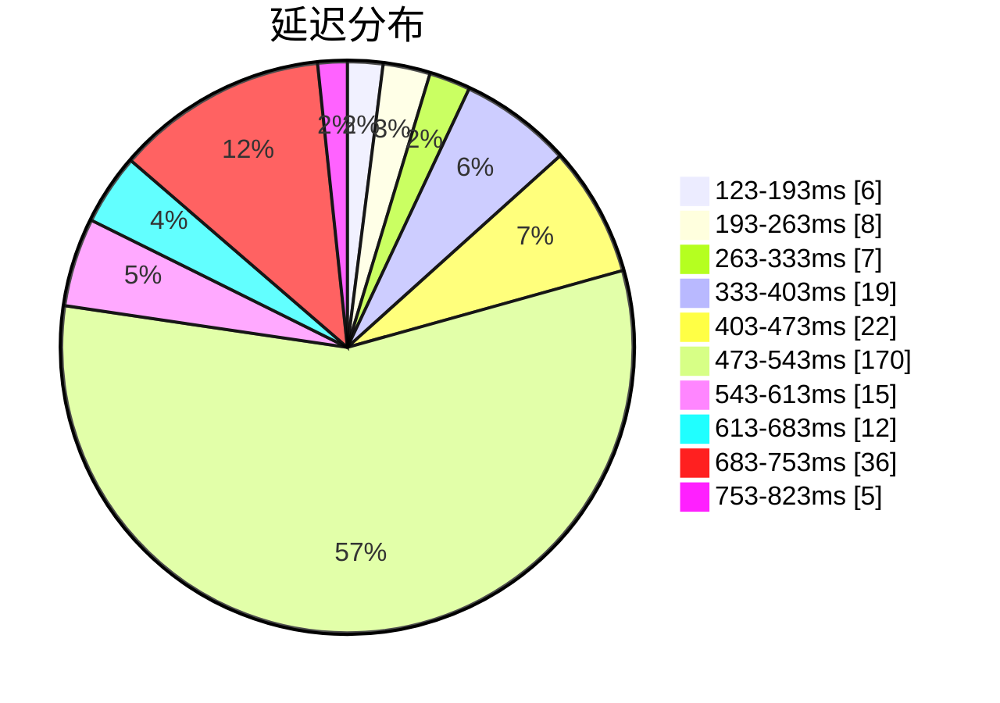
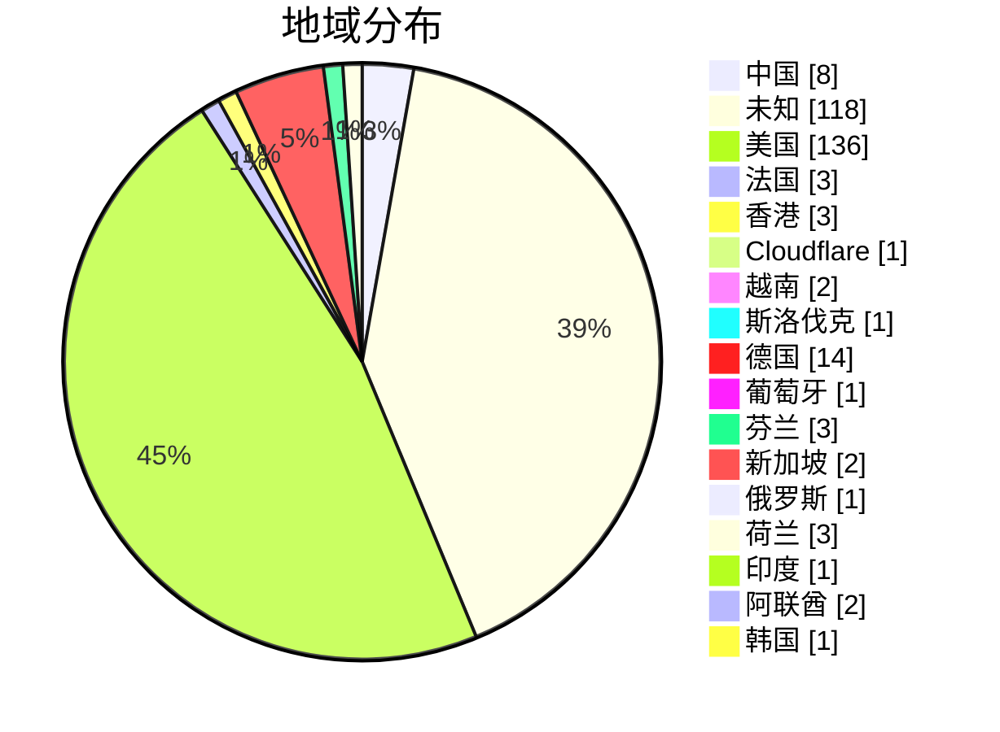
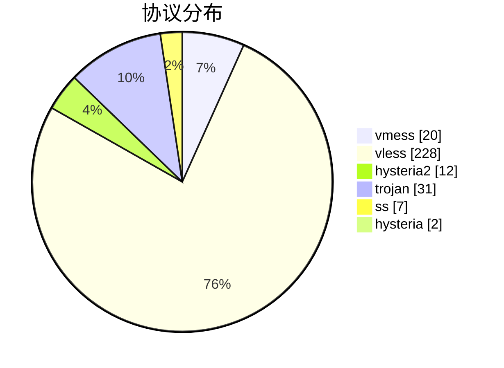

```mermaid
pie showData
title 延迟分布
"123-193ms" : 6
"193-263ms" : 8
"263-333ms" : 7
"333-403ms" : 19
"403-473ms" : 22
"473-543ms" : 170
"543-613ms" : 15
"613-683ms" : 12
"683-753ms" : 36
"753-823ms" : 5
```

```mermaid
pie showData
title 地域分布
"中国" : 8
"未知" : 118
"美国" : 136
"法国" : 3
"香港" : 3
"Cloudflare" : 1
"越南" : 2
"斯洛伐克" : 1
"德国" : 14
"葡萄牙" : 1
"芬兰" : 3
"新加坡" : 2
"俄罗斯" : 1
"荷兰" : 3
"印度" : 1
"阿联酋" : 2
"韩国" : 1
```

```mermaid
pie showData
title 协议分布
"vmess" : 20
"vless" : 228
"hysteria2" : 12
"trojan" : 31
"ss" : 7
"hysteria" : 2
```