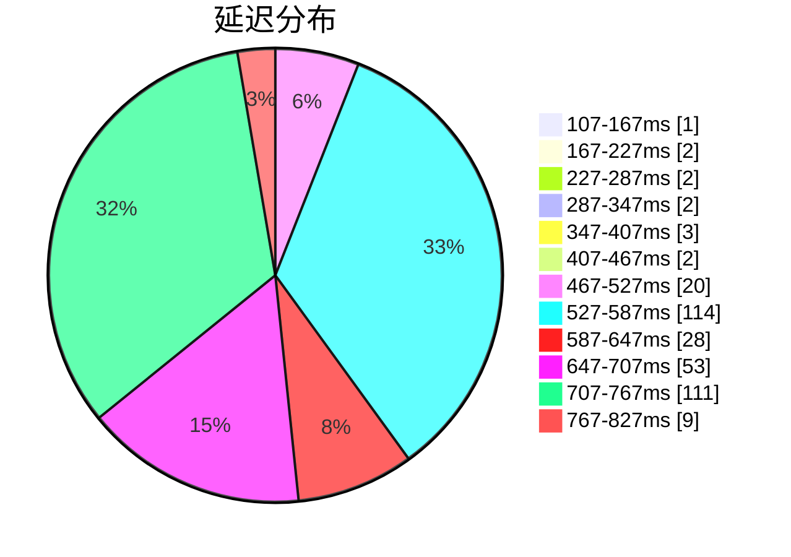
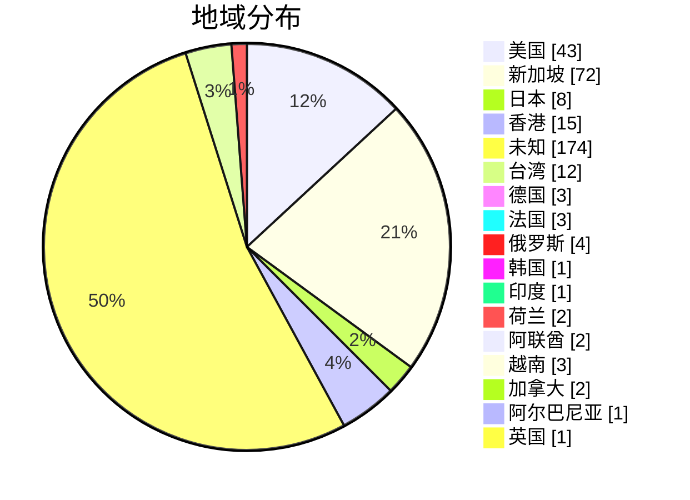
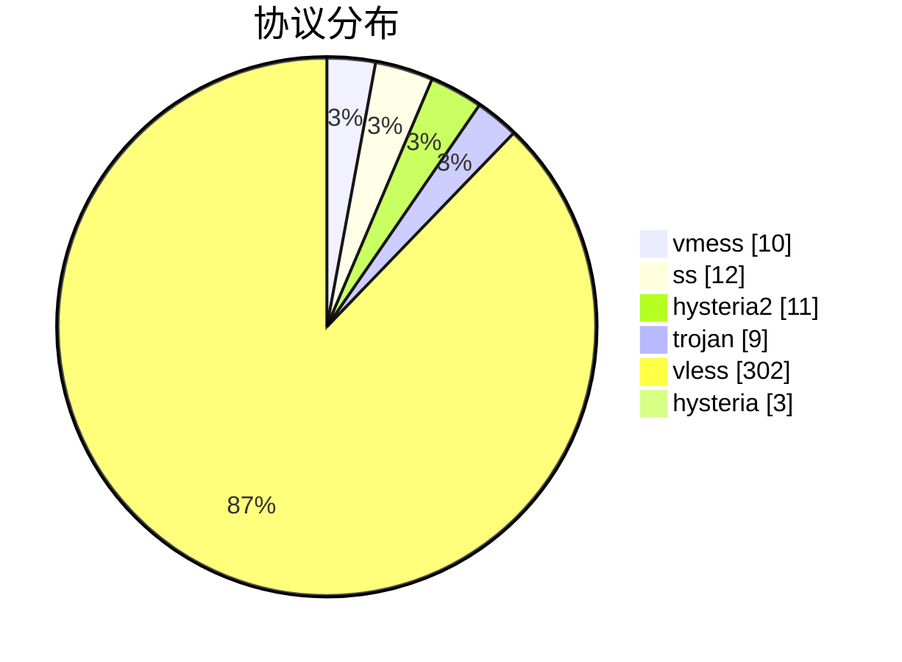

```mermaid
pie showData
title 延迟分布
"107-167ms" : 1
"167-227ms" : 2
"227-287ms" : 2
"287-347ms" : 2
"347-407ms" : 3
"407-467ms" : 2
"467-527ms" : 20
"527-587ms" : 114
"587-647ms" : 28
"647-707ms" : 53
"707-767ms" : 111
"767-827ms" : 9
```

```mermaid
pie showData
title 地域分布
"美国" : 43
"新加坡" : 72
"日本" : 8
"香港" : 15
"未知" : 174
"台湾" : 12
"德国" : 3
"法国" : 3
"俄罗斯" : 4
"韩国" : 1
"印度" : 1
"荷兰" : 2
"阿联酋" : 2
"越南" : 3
"加拿大" : 2
"阿尔巴尼亚" : 1
"英国" : 1
```

```mermaid
pie showData
title 协议分布
"vmess" : 10
"ss" : 12
"hysteria2" : 11
"trojan" : 9
"vless" : 302
"hysteria" : 3
```