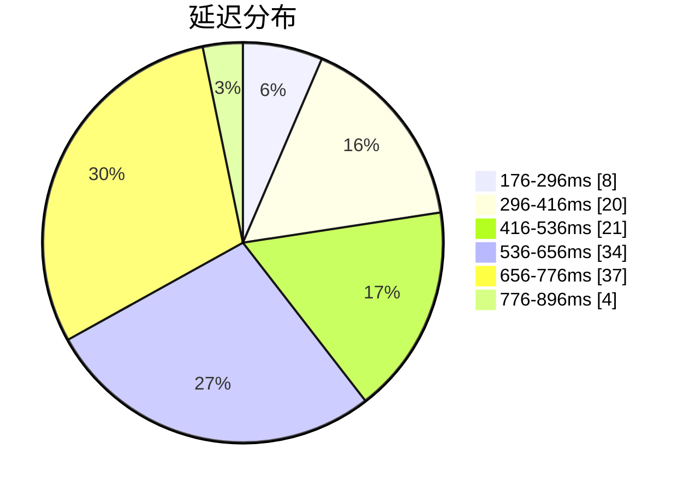
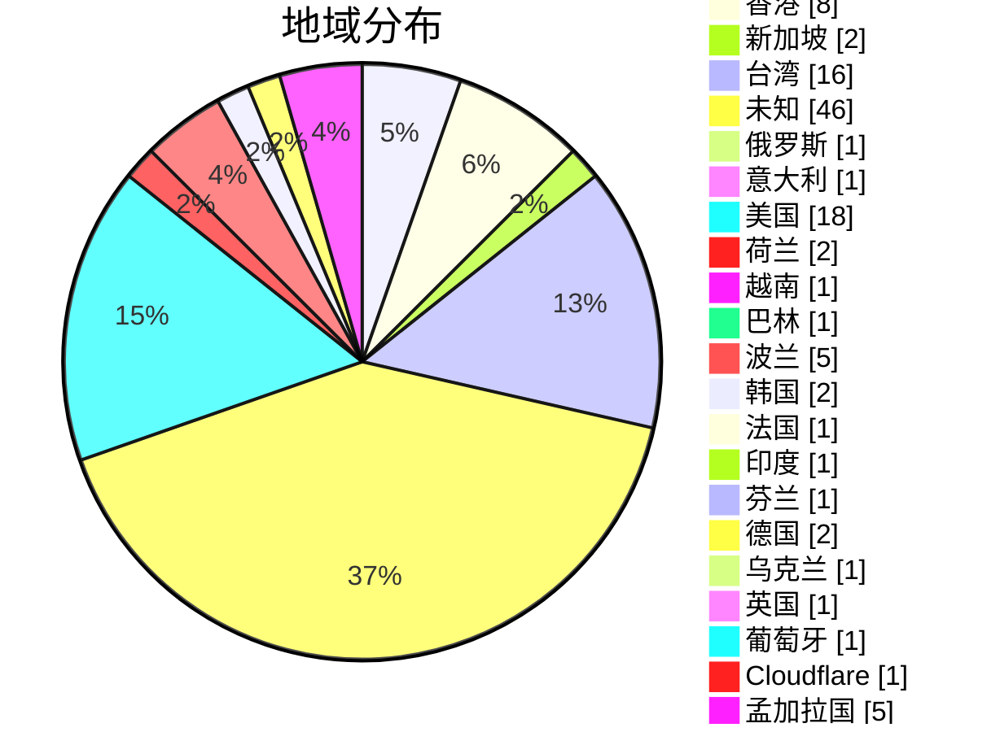
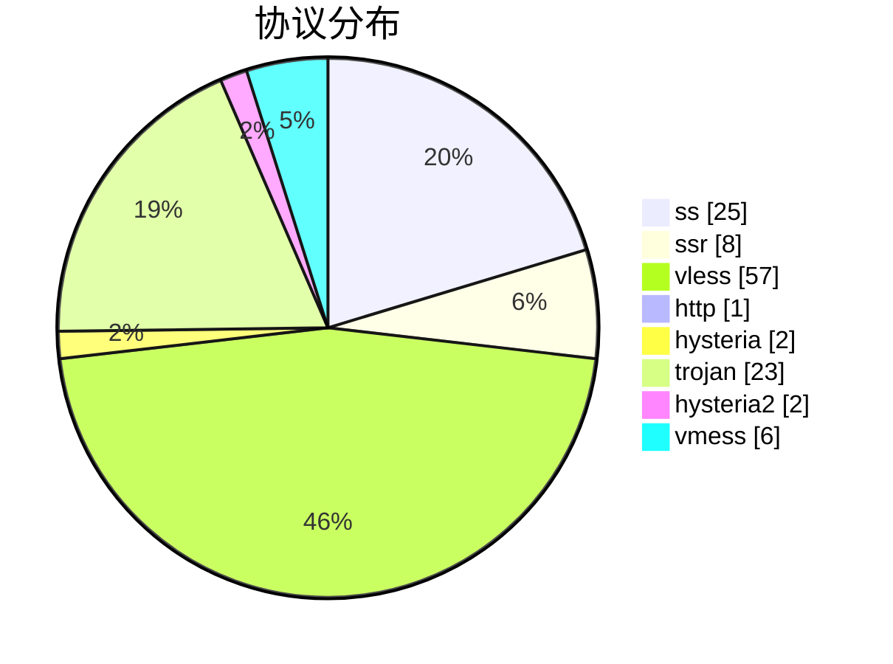

```mermaid
pie showData
title 延迟分布
"176-296ms" : 8
"296-416ms" : 20
"416-536ms" : 21
"536-656ms" : 34
"656-776ms" : 37
"776-896ms" : 4
```

```mermaid
pie showData
title 地域分布
"日本" : 6
"香港" : 8
"新加坡" : 2
"台湾" : 16
"未知" : 46
"俄罗斯" : 1
"意大利" : 1
"美国" : 18
"荷兰" : 2
"越南" : 1
"巴林" : 1
"波兰" : 5
"韩国" : 2
"法国" : 1
"印度" : 1
"芬兰" : 1
"德国" : 2
"乌克兰" : 1
"英国" : 1
"葡萄牙" : 1
"Cloudflare" : 1
"孟加拉国" : 5
"瑞典" : 1
```

```mermaid
pie showData
title 协议分布
"ss" : 25
"ssr" : 8
"vless" : 57
"http" : 1
"hysteria" : 2
"trojan" : 23
"hysteria2" : 2
"vmess" : 6
```