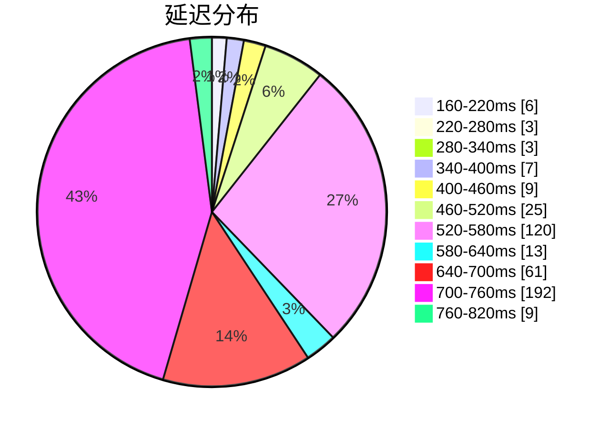
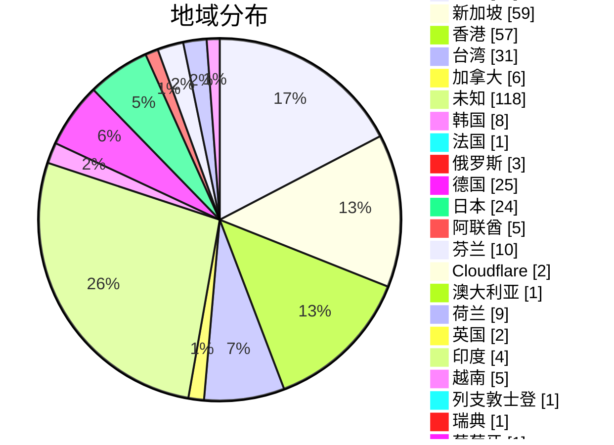
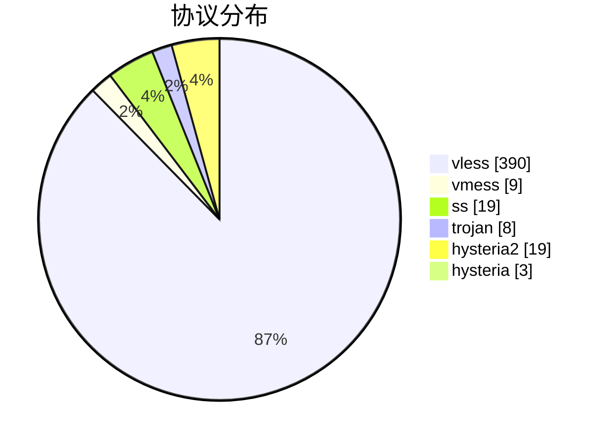

```mermaid
pie showData
title 延迟分布
"160-220ms" : 6
"220-280ms" : 3
"280-340ms" : 3
"340-400ms" : 7
"400-460ms" : 9
"460-520ms" : 25
"520-580ms" : 120
"580-640ms" : 13
"640-700ms" : 61
"700-760ms" : 192
"760-820ms" : 9
```

```mermaid
pie showData
title 地域分布
"美国" : 75
"新加坡" : 59
"香港" : 57
"台湾" : 31
"加拿大" : 6
"未知" : 118
"韩国" : 8
"法国" : 1
"俄罗斯" : 3
"德国" : 25
"日本" : 24
"阿联酋" : 5
"芬兰" : 10
"Cloudflare" : 2
"澳大利亚" : 1
"荷兰" : 9
"英国" : 2
"印度" : 4
"越南" : 5
"列支敦士登" : 1
"瑞典" : 1
"葡萄牙" : 1
```

```mermaid
pie showData
title 协议分布
"vless" : 390
"vmess" : 9
"ss" : 19
"trojan" : 8
"hysteria2" : 19
"hysteria" : 3
```