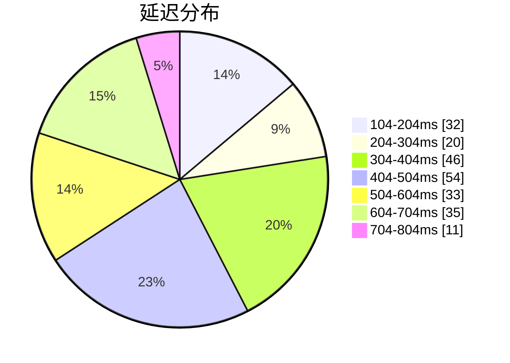
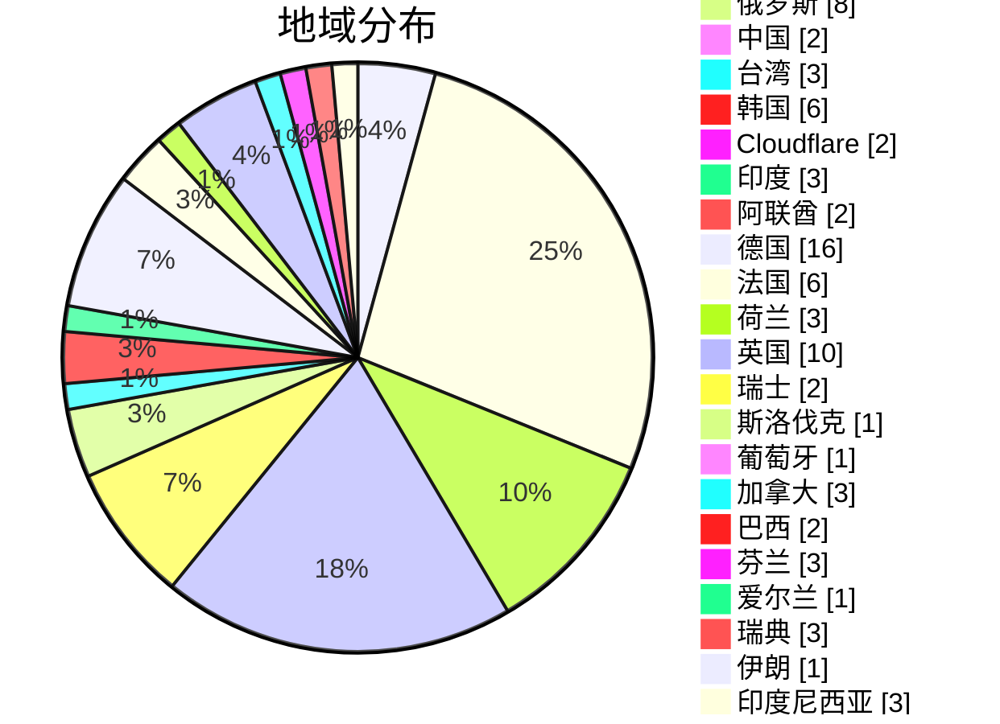
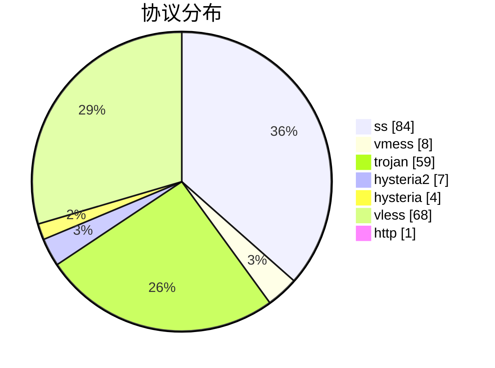

```mermaid
pie showData
title 延迟分布
"104-204ms" : 32
"204-304ms" : 20
"304-404ms" : 46
"404-504ms" : 54
"504-604ms" : 33
"604-704ms" : 35
"704-804ms" : 11
```

```mermaid
pie showData
title 地域分布
"香港" : 9
"未知" : 57
"日本" : 22
"美国" : 41
"新加坡" : 16
"俄罗斯" : 8
"中国" : 2
"台湾" : 3
"韩国" : 6
"Cloudflare" : 2
"印度" : 3
"阿联酋" : 2
"德国" : 16
"法国" : 6
"荷兰" : 3
"英国" : 10
"瑞士" : 2
"斯洛伐克" : 1
"葡萄牙" : 1
"加拿大" : 3
"巴西" : 2
"芬兰" : 3
"爱尔兰" : 1
"瑞典" : 3
"伊朗" : 1
"印度尼西亚" : 3
"科威特" : 1
"秘鲁" : 1
"斯洛文尼亚" : 1
"塞浦路斯" : 1
"丹麦" : 1
```

```mermaid
pie showData
title 协议分布
"ss" : 84
"vmess" : 8
"trojan" : 59
"hysteria2" : 7
"hysteria" : 4
"vless" : 68
"http" : 1
```