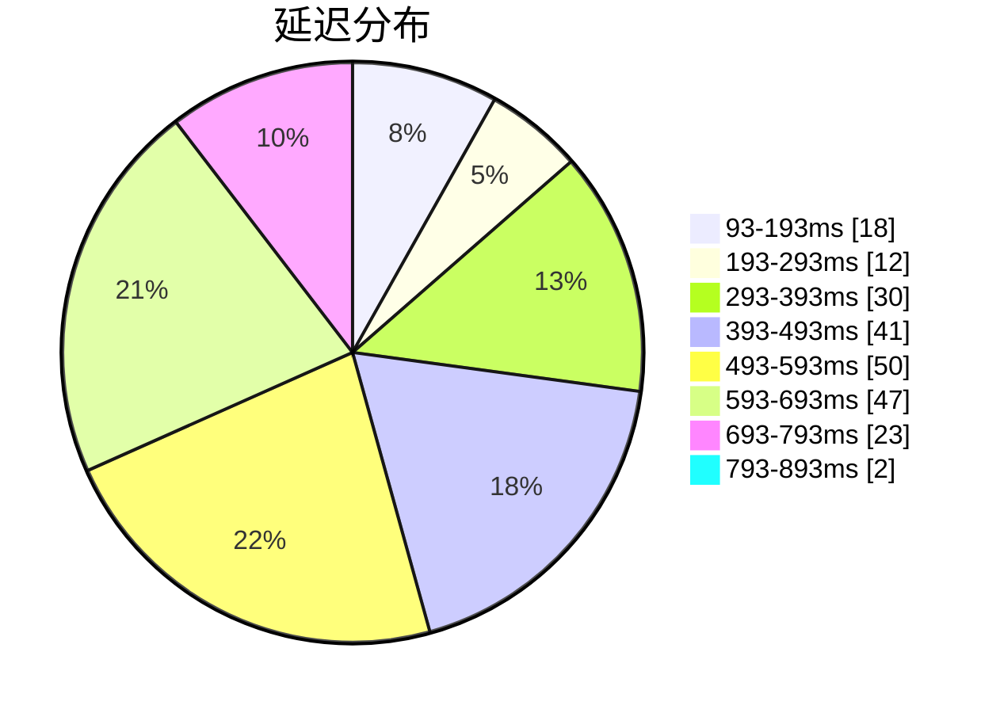
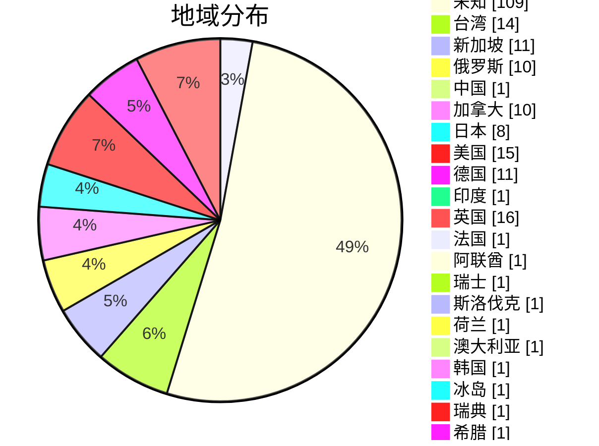
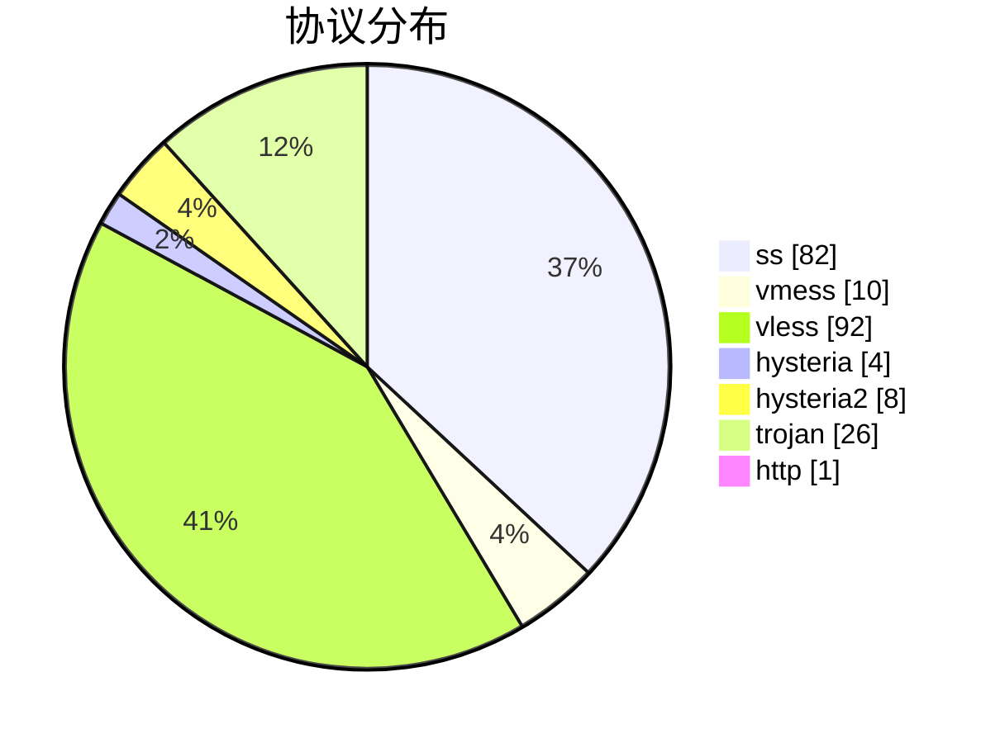

```mermaid
pie showData
title 延迟分布
"93-193ms" : 18
"193-293ms" : 12
"293-393ms" : 30
"393-493ms" : 41
"493-593ms" : 50
"593-693ms" : 47
"693-793ms" : 23
"793-893ms" : 2
```

```mermaid
pie showData
title 地域分布
"香港" : 6
"未知" : 109
"台湾" : 14
"新加坡" : 11
"俄罗斯" : 10
"中国" : 1
"加拿大" : 10
"日本" : 8
"美国" : 15
"德国" : 11
"印度" : 1
"英国" : 16
"法国" : 1
"阿联酋" : 1
"瑞士" : 1
"斯洛伐克" : 1
"荷兰" : 1
"澳大利亚" : 1
"韩国" : 1
"冰岛" : 1
"瑞典" : 1
"希腊" : 1
"塞浦路斯" : 1
```

```mermaid
pie showData
title 协议分布
"ss" : 82
"vmess" : 10
"vless" : 92
"hysteria" : 4
"hysteria2" : 8
"trojan" : 26
"http" : 1
```