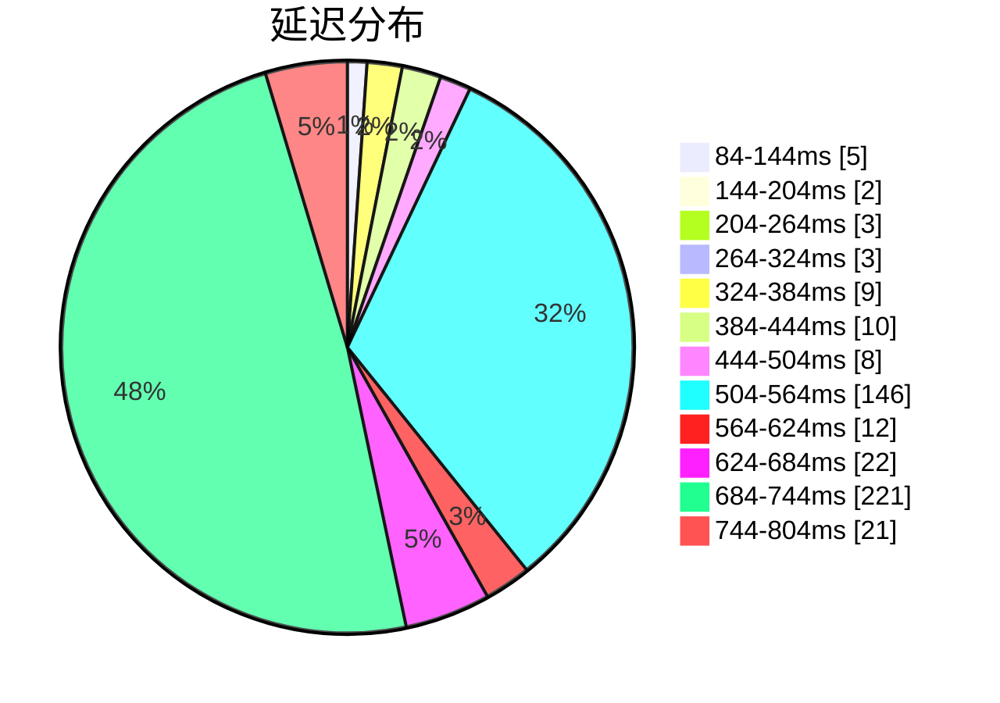
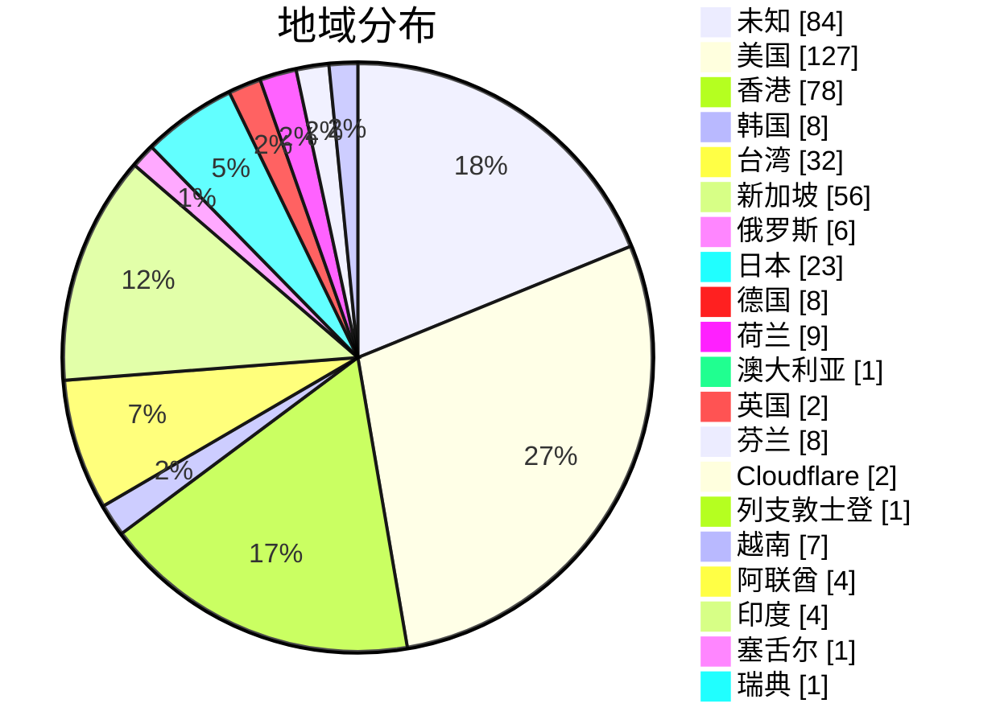
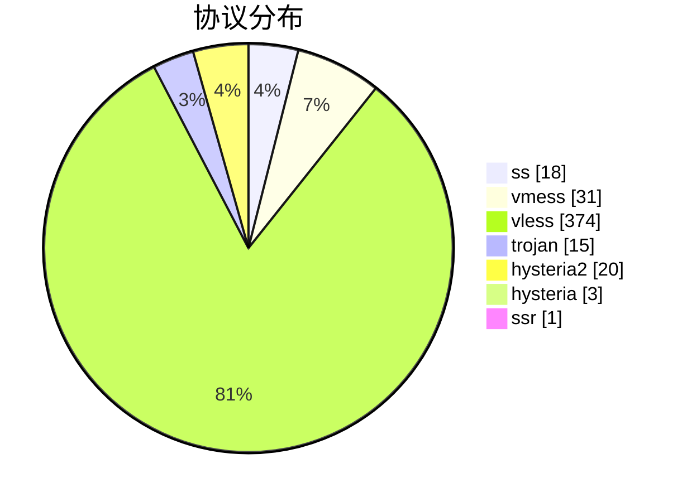

```mermaid
pie showData
title 延迟分布
"84-144ms" : 5
"144-204ms" : 2
"204-264ms" : 3
"264-324ms" : 3
"324-384ms" : 9
"384-444ms" : 10
"444-504ms" : 8
"504-564ms" : 146
"564-624ms" : 12
"624-684ms" : 22
"684-744ms" : 221
"744-804ms" : 21
```

```mermaid
pie showData
title 地域分布
"未知" : 84
"美国" : 127
"香港" : 78
"韩国" : 8
"台湾" : 32
"新加坡" : 56
"俄罗斯" : 6
"日本" : 23
"德国" : 8
"荷兰" : 9
"澳大利亚" : 1
"英国" : 2
"芬兰" : 8
"Cloudflare" : 2
"列支敦士登" : 1
"越南" : 7
"阿联酋" : 4
"印度" : 4
"塞舌尔" : 1
"瑞典" : 1
```

```mermaid
pie showData
title 协议分布
"ss" : 18
"vmess" : 31
"vless" : 374
"trojan" : 15
"hysteria2" : 20
"hysteria" : 3
"ssr" : 1
```