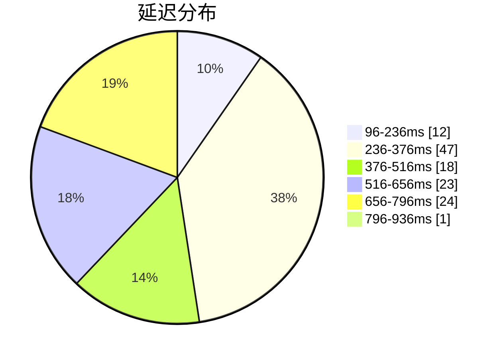
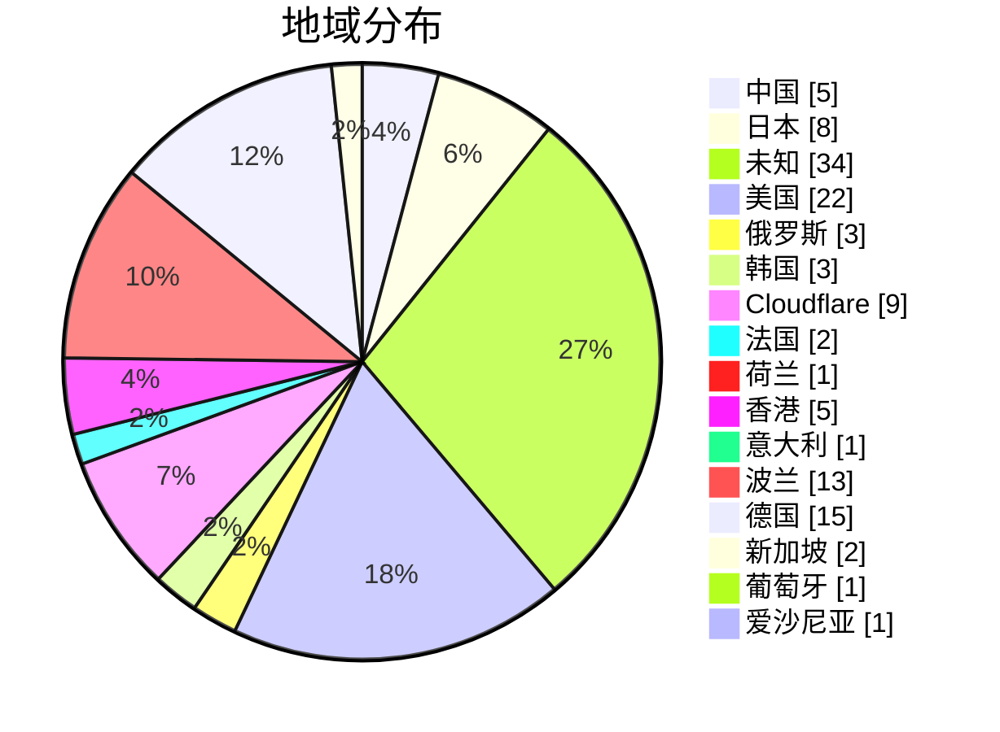
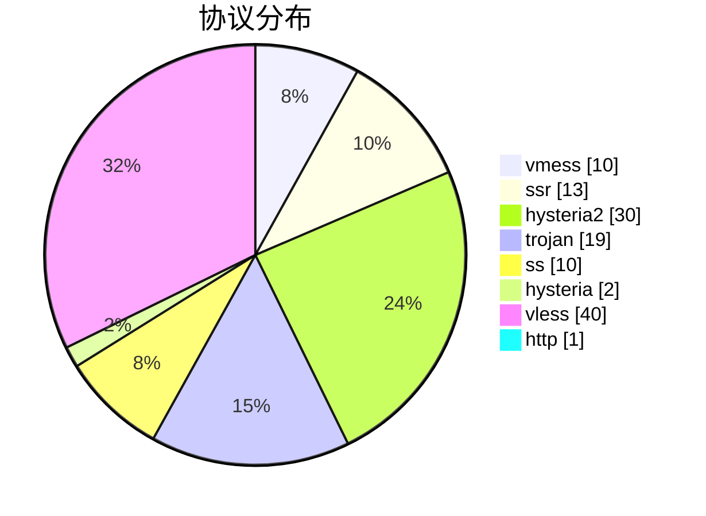

```mermaid
pie showData
title 延迟分布
"96-236ms" : 12
"236-376ms" : 47
"376-516ms" : 18
"516-656ms" : 23
"656-796ms" : 24
"796-936ms" : 1
```

```mermaid
pie showData
title 地域分布
"中国" : 5
"日本" : 8
"未知" : 34
"美国" : 22
"俄罗斯" : 3
"韩国" : 3
"Cloudflare" : 9
"法国" : 2
"荷兰" : 1
"香港" : 5
"意大利" : 1
"波兰" : 13
"德国" : 15
"新加坡" : 2
"葡萄牙" : 1
"爱沙尼亚" : 1
```

```mermaid
pie showData
title 协议分布
"vmess" : 10
"ssr" : 13
"hysteria2" : 30
"trojan" : 19
"ss" : 10
"hysteria" : 2
"vless" : 40
"http" : 1
```