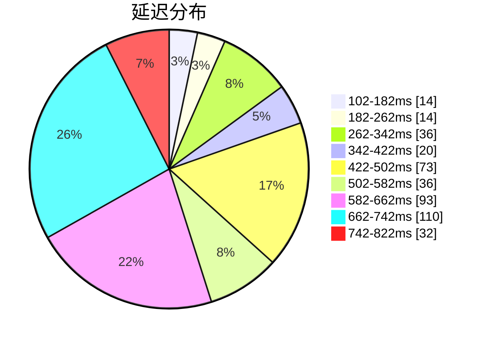
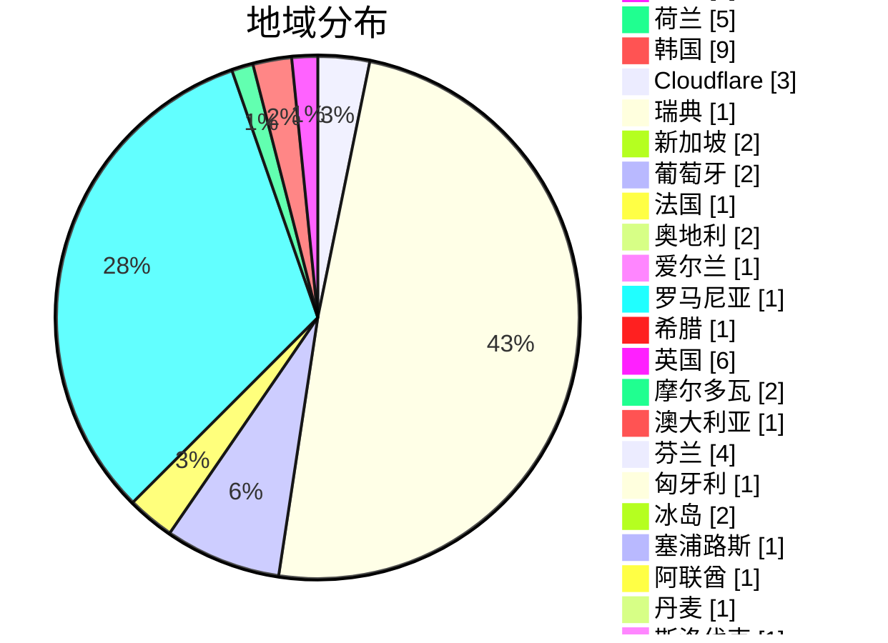
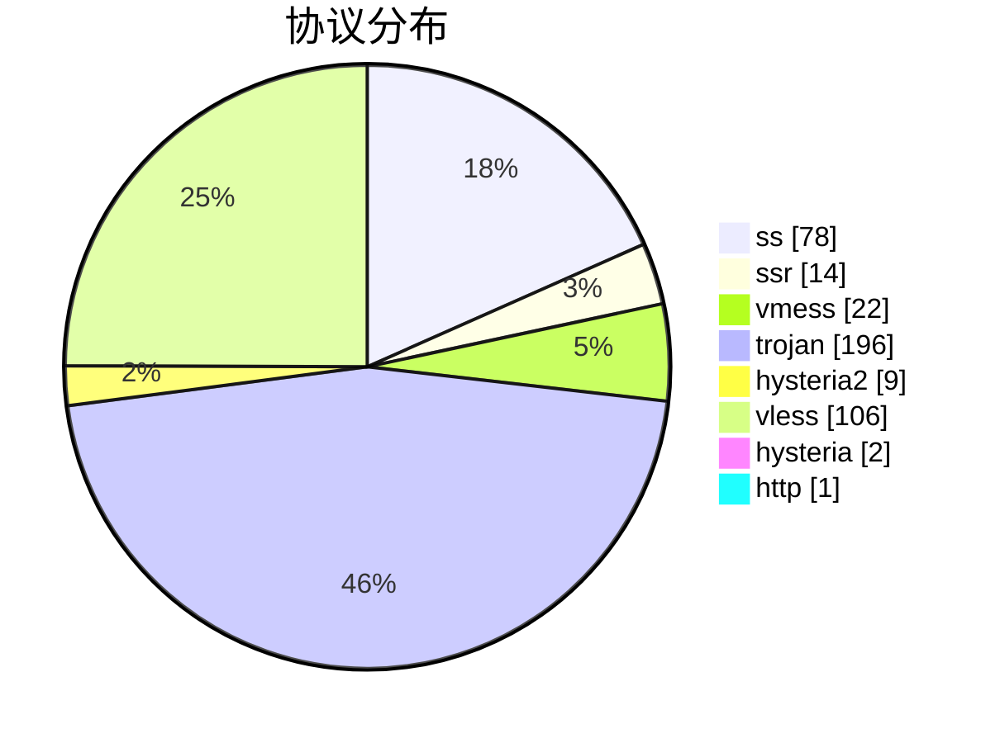

```mermaid
pie showData
title 延迟分布
"102-182ms" : 14
"182-262ms" : 14
"262-342ms" : 36
"342-422ms" : 20
"422-502ms" : 73
"502-582ms" : 36
"582-662ms" : 93
"662-742ms" : 110
"742-822ms" : 32
```

```mermaid
pie showData
title 地域分布
"香港" : 12
"未知" : 185
"孟加拉国" : 2
"美国" : 27
"日本" : 11
"中国" : 2
"俄罗斯" : 3
"台湾" : 121
"德国" : 3
"波兰" : 1
"荷兰" : 5
"韩国" : 9
"Cloudflare" : 3
"瑞典" : 1
"新加坡" : 2
"葡萄牙" : 2
"法国" : 1
"奥地利" : 2
"爱尔兰" : 1
"罗马尼亚" : 1
"希腊" : 1
"英国" : 6
"摩尔多瓦" : 2
"澳大利亚" : 1
"芬兰" : 4
"匈牙利" : 1
"冰岛" : 2
"塞浦路斯" : 1
"阿联酋" : 1
"丹麦" : 1
"斯洛伐克" : 1
"土耳其" : 2
"意大利" : 2
"西班牙" : 2
"立陶宛" : 2
"哈萨克斯坦" : 1
"保加利亚" : 1
"乌克兰" : 1
"拉脱维亚" : 1
"爱沙尼亚" : 1
```

```mermaid
pie showData
title 协议分布
"ss" : 78
"ssr" : 14
"vmess" : 22
"trojan" : 196
"hysteria2" : 9
"vless" : 106
"hysteria" : 2
"http" : 1
```