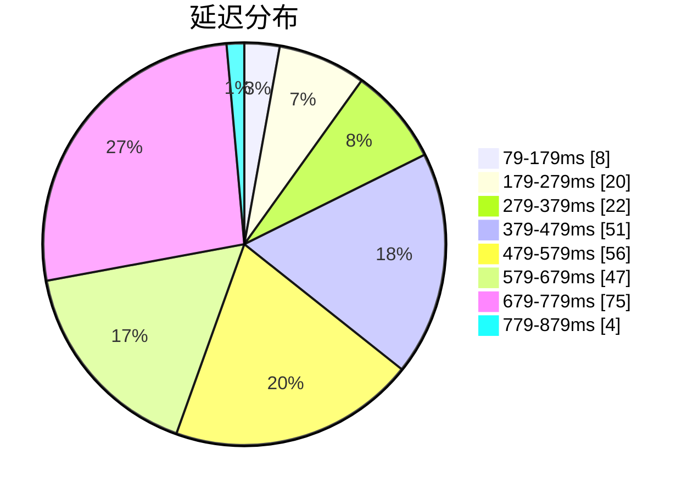
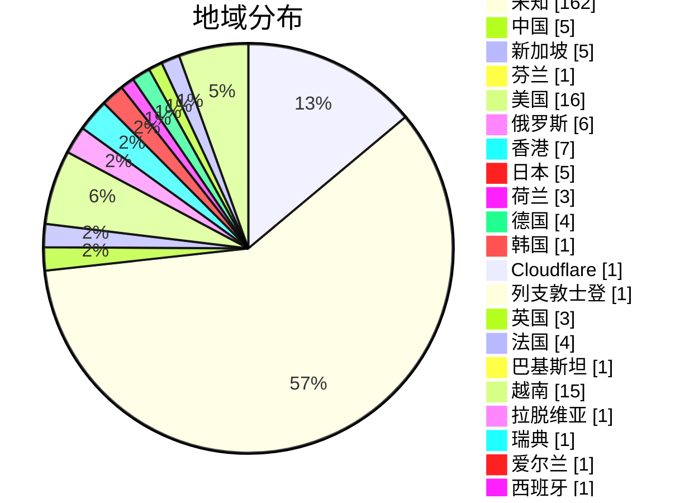
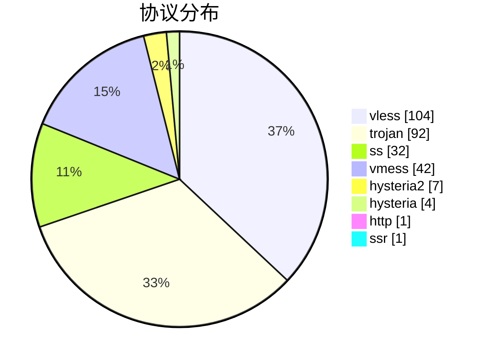

```mermaid
pie showData
title 延迟分布
"79-179ms" : 8
"179-279ms" : 20
"279-379ms" : 22
"379-479ms" : 51
"479-579ms" : 56
"579-679ms" : 47
"679-779ms" : 75
"779-879ms" : 4
```

```mermaid
pie showData
title 地域分布
"台湾" : 38
"未知" : 162
"中国" : 5
"新加坡" : 5
"芬兰" : 1
"美国" : 16
"俄罗斯" : 6
"香港" : 7
"日本" : 5
"荷兰" : 3
"德国" : 4
"韩国" : 1
"Cloudflare" : 1
"列支敦士登" : 1
"英国" : 3
"法国" : 4
"巴基斯坦" : 1
"越南" : 15
"拉脱维亚" : 1
"瑞典" : 1
"爱尔兰" : 1
"西班牙" : 1
"泰国" : 1
```

```mermaid
pie showData
title 协议分布
"vless" : 104
"trojan" : 92
"ss" : 32
"vmess" : 42
"hysteria2" : 7
"hysteria" : 4
"http" : 1
"ssr" : 1
```