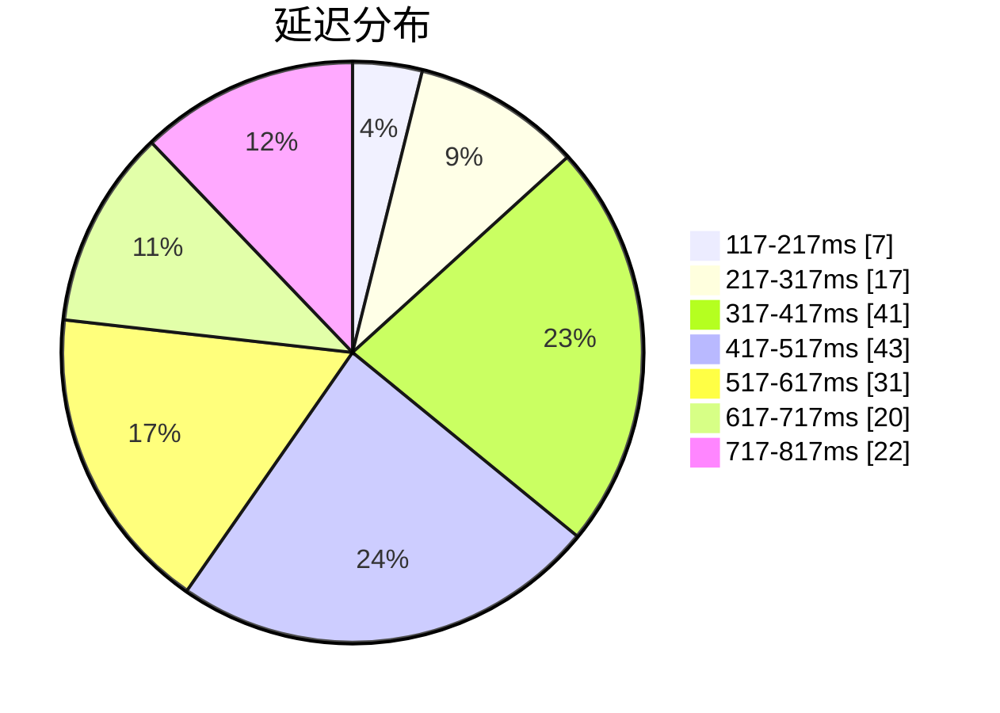
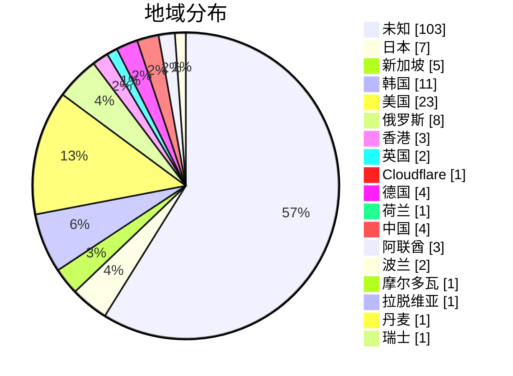
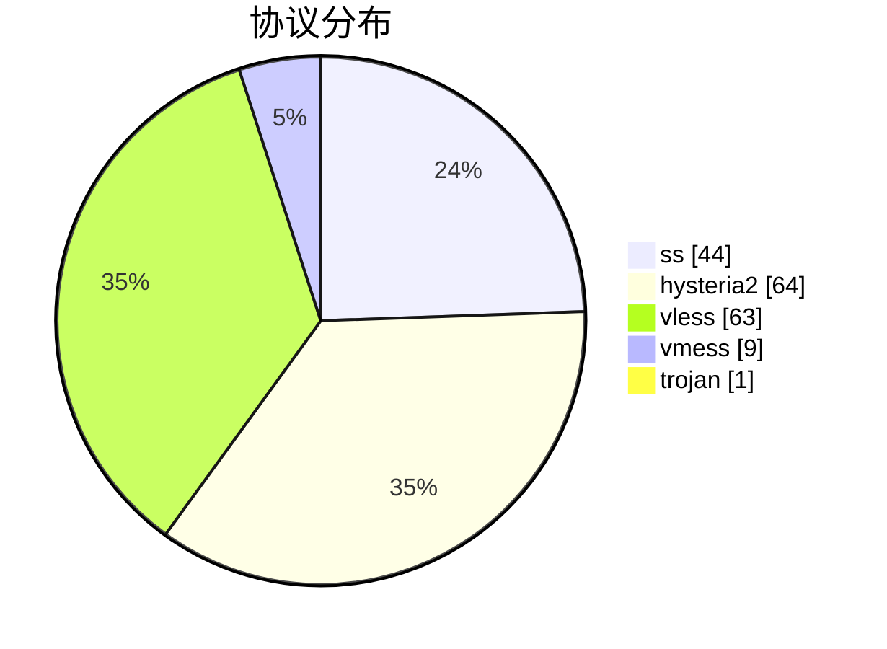

```mermaid
pie showData
title 延迟分布
"117-217ms" : 7
"217-317ms" : 17
"317-417ms" : 41
"417-517ms" : 43
"517-617ms" : 31
"617-717ms" : 20
"717-817ms" : 22
```

```mermaid
pie showData
title 地域分布
"未知" : 103
"日本" : 7
"新加坡" : 5
"韩国" : 11
"美国" : 23
"俄罗斯" : 8
"香港" : 3
"英国" : 2
"Cloudflare" : 1
"德国" : 4
"荷兰" : 1
"中国" : 4
"阿联酋" : 3
"波兰" : 2
"摩尔多瓦" : 1
"拉脱维亚" : 1
"丹麦" : 1
"瑞士" : 1
```

```mermaid
pie showData
title 协议分布
"ss" : 44
"hysteria2" : 64
"vless" : 63
"vmess" : 9
"trojan" : 1
```