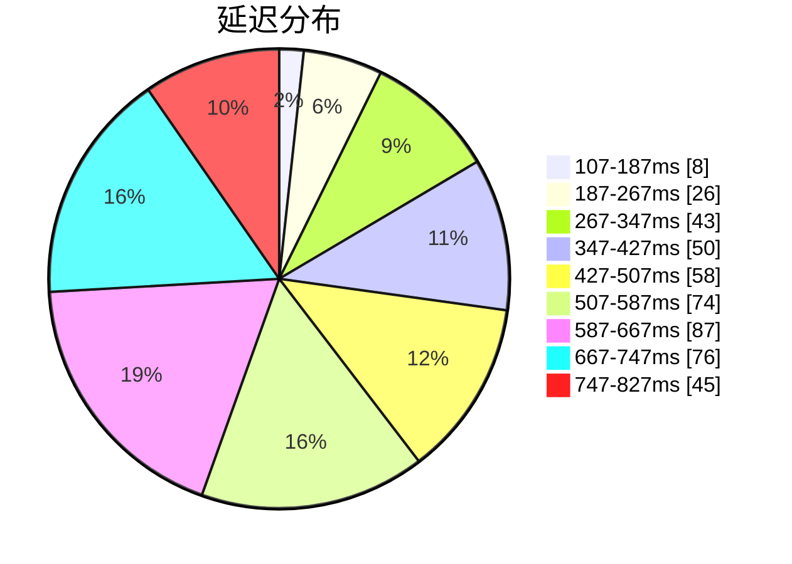
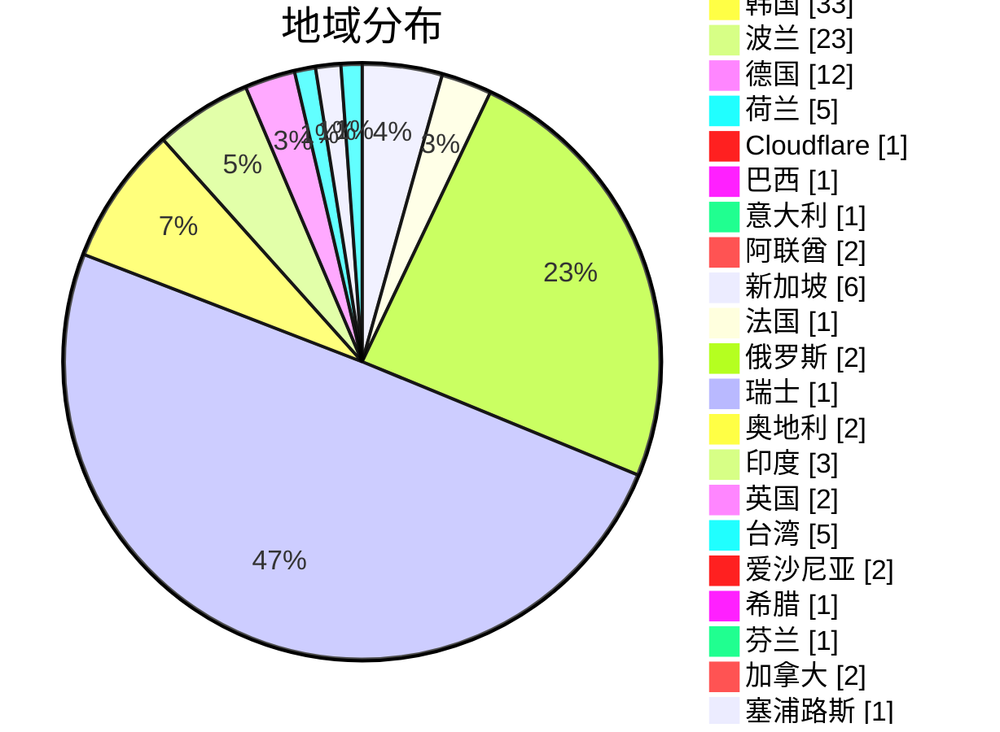
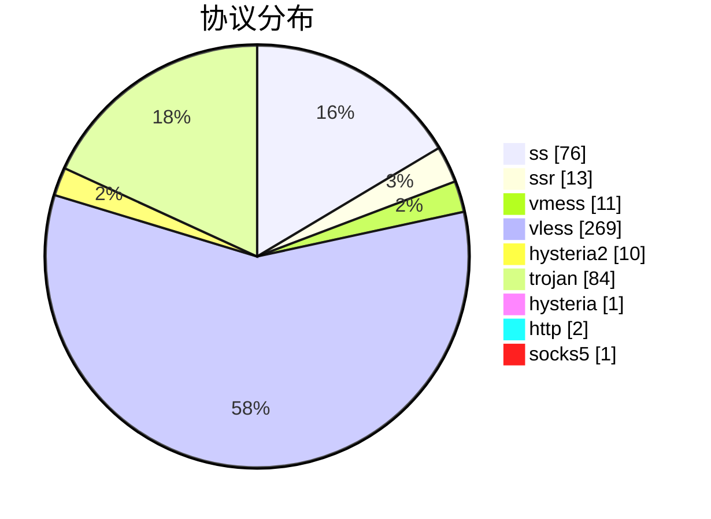

```mermaid
pie showData
title 延迟分布
"107-187ms" : 8
"187-267ms" : 26
"267-347ms" : 43
"347-427ms" : 50
"427-507ms" : 58
"507-587ms" : 74
"587-667ms" : 87
"667-747ms" : 76
"747-827ms" : 45
```

```mermaid
pie showData
title 地域分布
"香港" : 19
"日本" : 12
"美国" : 106
"未知" : 218
"韩国" : 33
"波兰" : 23
"德国" : 12
"荷兰" : 5
"Cloudflare" : 1
"巴西" : 1
"意大利" : 1
"阿联酋" : 2
"新加坡" : 6
"法国" : 1
"俄罗斯" : 2
"瑞士" : 1
"奥地利" : 2
"印度" : 3
"英国" : 2
"台湾" : 5
"爱沙尼亚" : 2
"希腊" : 1
"芬兰" : 1
"加拿大" : 2
"塞浦路斯" : 1
"孟加拉国" : 2
"冰岛" : 1
"摩尔多瓦" : 1
"澳大利亚" : 1
```

```mermaid
pie showData
title 协议分布
"ss" : 76
"ssr" : 13
"vmess" : 11
"vless" : 269
"hysteria2" : 10
"trojan" : 84
"hysteria" : 1
"http" : 2
"socks5" : 1
```