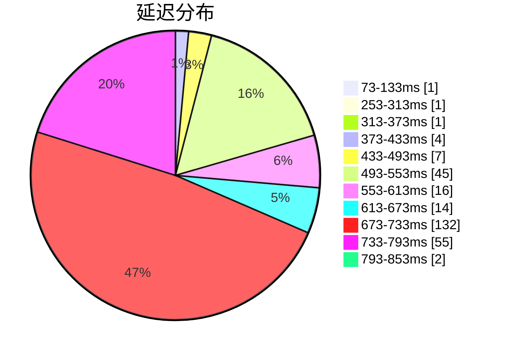
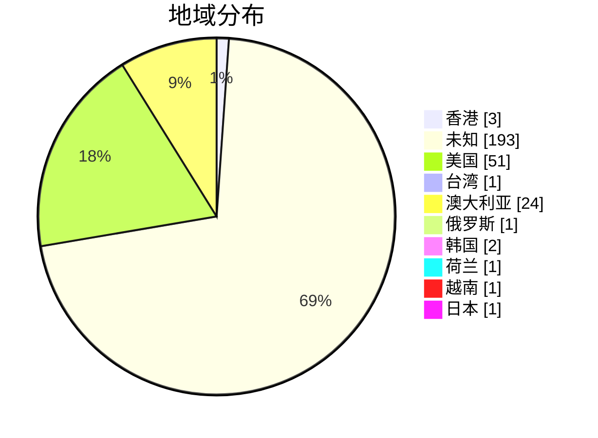
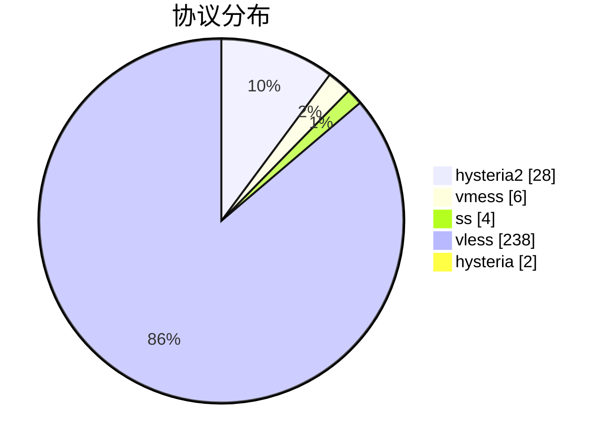

```mermaid
pie showData
title 延迟分布
"73-133ms" : 1
"253-313ms" : 1
"313-373ms" : 1
"373-433ms" : 4
"433-493ms" : 7
"493-553ms" : 45
"553-613ms" : 16
"613-673ms" : 14
"673-733ms" : 132
"733-793ms" : 55
"793-853ms" : 2
```

```mermaid
pie showData
title 地域分布
"香港" : 3
"未知" : 193
"美国" : 51
"台湾" : 1
"澳大利亚" : 24
"俄罗斯" : 1
"韩国" : 2
"荷兰" : 1
"越南" : 1
"日本" : 1
```

```mermaid
pie showData
title 协议分布
"hysteria2" : 28
"vmess" : 6
"ss" : 4
"vless" : 238
"hysteria" : 2
```