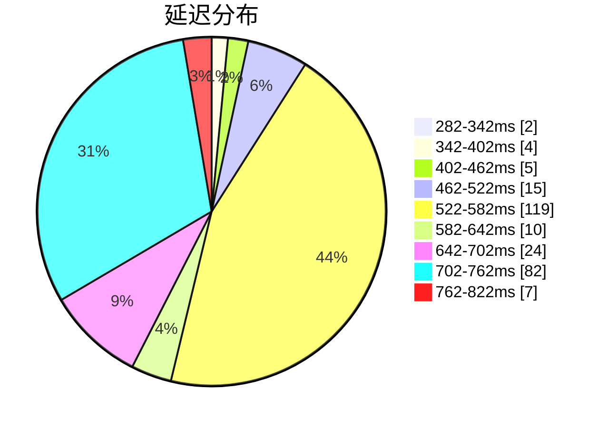
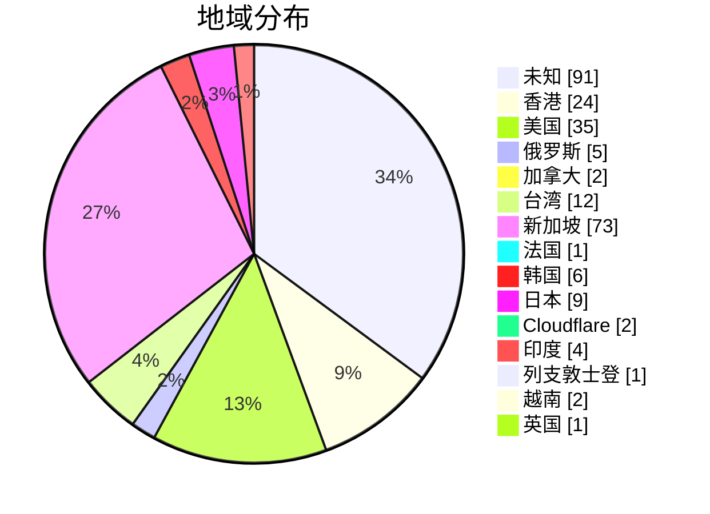
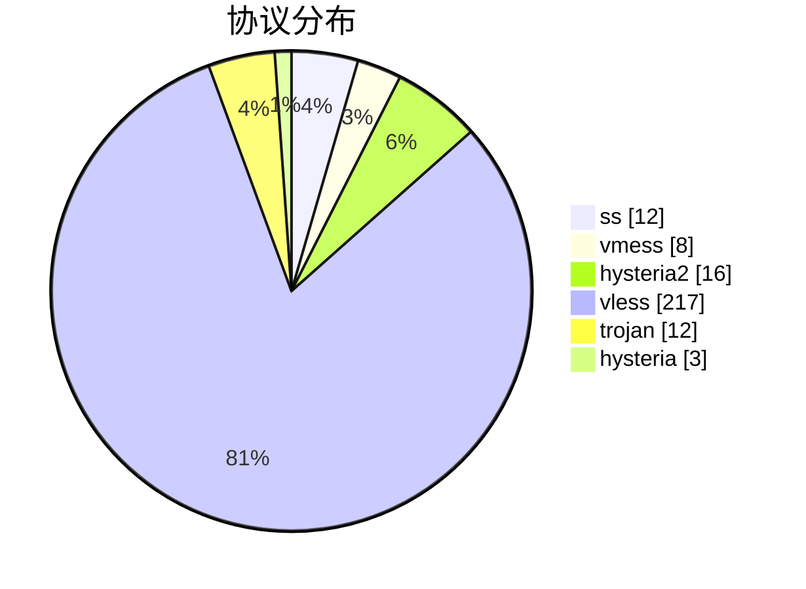

```mermaid
pie showData
title 延迟分布
"282-342ms" : 2
"342-402ms" : 4
"402-462ms" : 5
"462-522ms" : 15
"522-582ms" : 119
"582-642ms" : 10
"642-702ms" : 24
"702-762ms" : 82
"762-822ms" : 7
```

```mermaid
pie showData
title 地域分布
"未知" : 91
"香港" : 24
"美国" : 35
"俄罗斯" : 5
"加拿大" : 2
"台湾" : 12
"新加坡" : 73
"法国" : 1
"韩国" : 6
"日本" : 9
"Cloudflare" : 2
"印度" : 4
"列支敦士登" : 1
"越南" : 2
"英国" : 1
```

```mermaid
pie showData
title 协议分布
"ss" : 12
"vmess" : 8
"hysteria2" : 16
"vless" : 217
"trojan" : 12
"hysteria" : 3
```