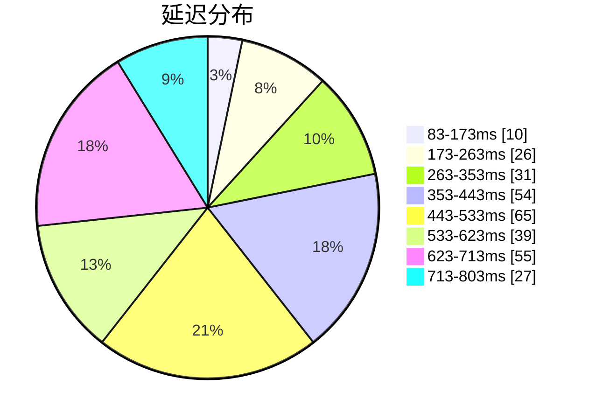
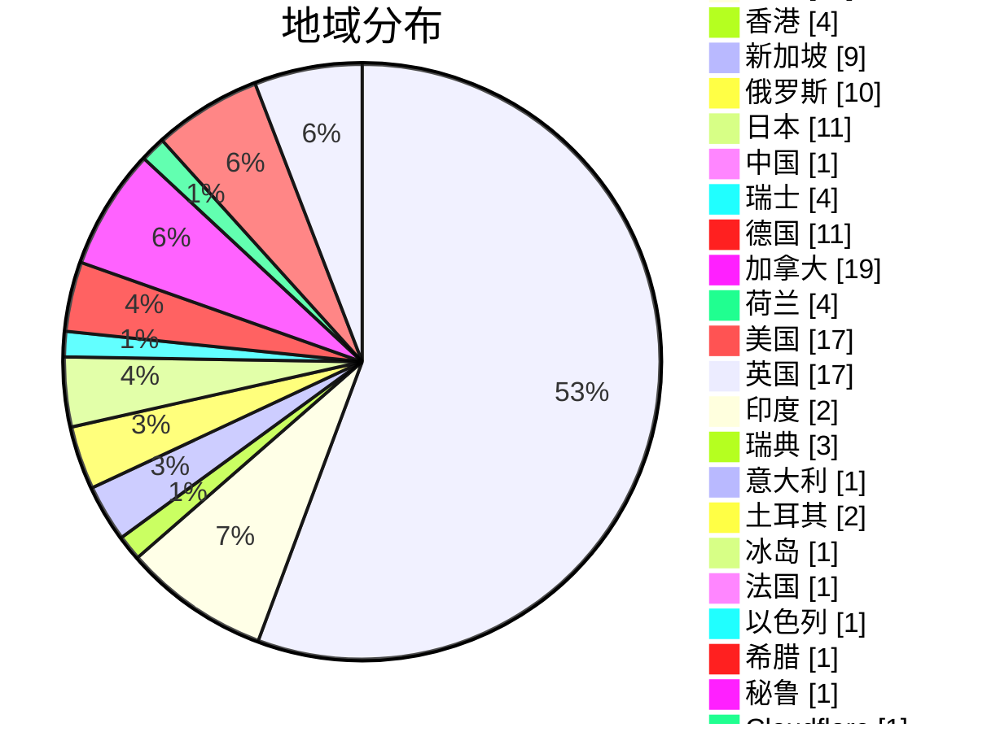
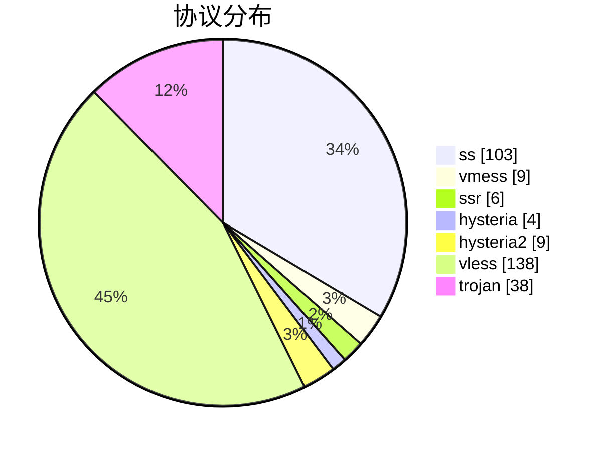

```mermaid
pie showData
title 延迟分布
"83-173ms" : 10
"173-263ms" : 26
"263-353ms" : 31
"353-443ms" : 54
"443-533ms" : 65
"533-623ms" : 39
"623-713ms" : 55
"713-803ms" : 27
```

```mermaid
pie showData
title 地域分布
"未知" : 162
"台湾" : 23
"香港" : 4
"新加坡" : 9
"俄罗斯" : 10
"日本" : 11
"中国" : 1
"瑞士" : 4
"德国" : 11
"加拿大" : 19
"荷兰" : 4
"美国" : 17
"英国" : 17
"印度" : 2
"瑞典" : 3
"意大利" : 1
"土耳其" : 2
"冰岛" : 1
"法国" : 1
"以色列" : 1
"希腊" : 1
"秘鲁" : 1
"Cloudflare" : 1
"塞浦路斯" : 1
```

```mermaid
pie showData
title 协议分布
"ss" : 103
"vmess" : 9
"ssr" : 6
"hysteria" : 4
"hysteria2" : 9
"vless" : 138
"trojan" : 38
```