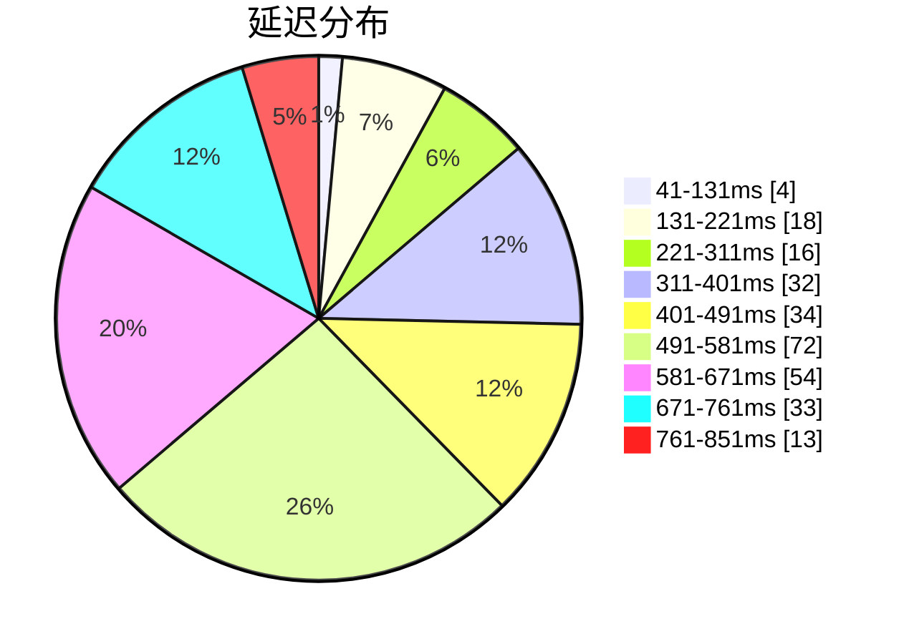
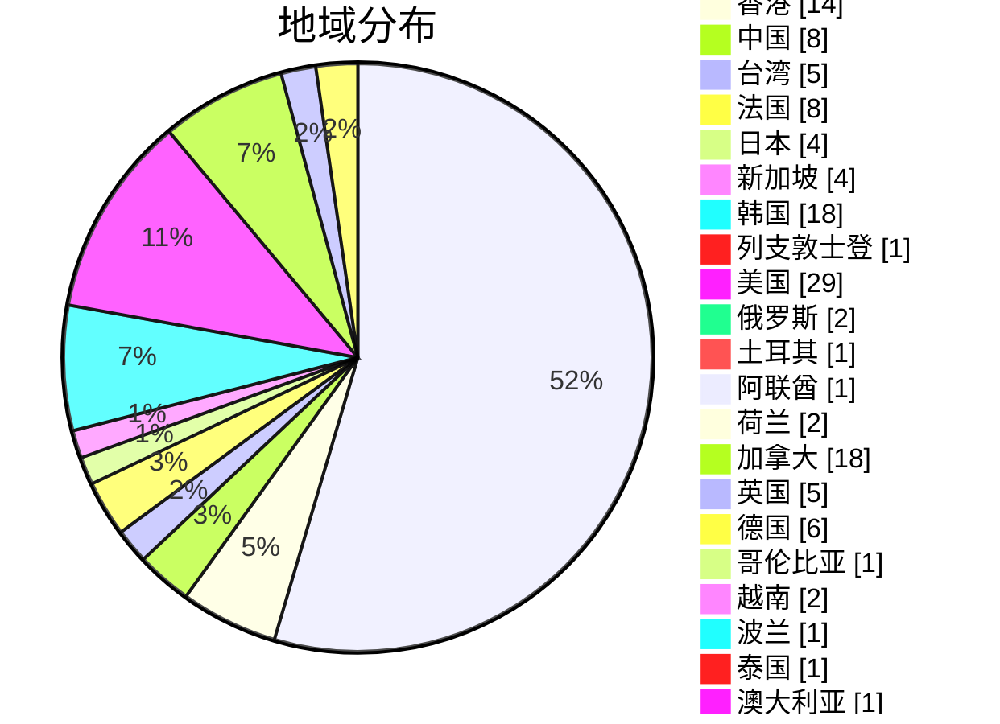
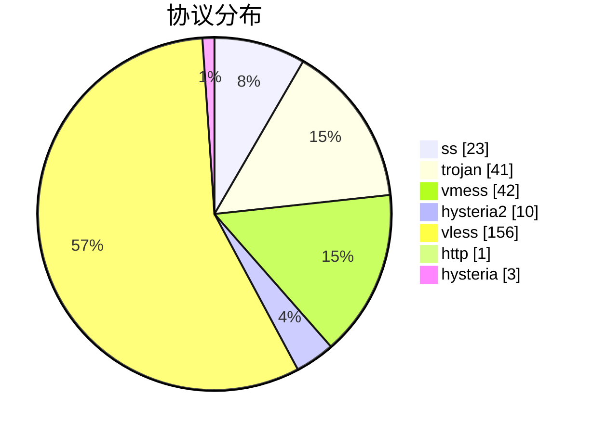

```mermaid
pie showData
title 延迟分布
"41-131ms" : 4
"131-221ms" : 18
"221-311ms" : 16
"311-401ms" : 32
"401-491ms" : 34
"491-581ms" : 72
"581-671ms" : 54
"671-761ms" : 33
"761-851ms" : 13
```

```mermaid
pie showData
title 地域分布
"未知" : 143
"香港" : 14
"中国" : 8
"台湾" : 5
"法国" : 8
"日本" : 4
"新加坡" : 4
"韩国" : 18
"列支敦士登" : 1
"美国" : 29
"俄罗斯" : 2
"土耳其" : 1
"阿联酋" : 1
"荷兰" : 2
"加拿大" : 18
"英国" : 5
"德国" : 6
"哥伦比亚" : 1
"越南" : 2
"波兰" : 1
"泰国" : 1
"澳大利亚" : 1
"芬兰" : 1
```

```mermaid
pie showData
title 协议分布
"ss" : 23
"trojan" : 41
"vmess" : 42
"hysteria2" : 10
"vless" : 156
"http" : 1
"hysteria" : 3
```