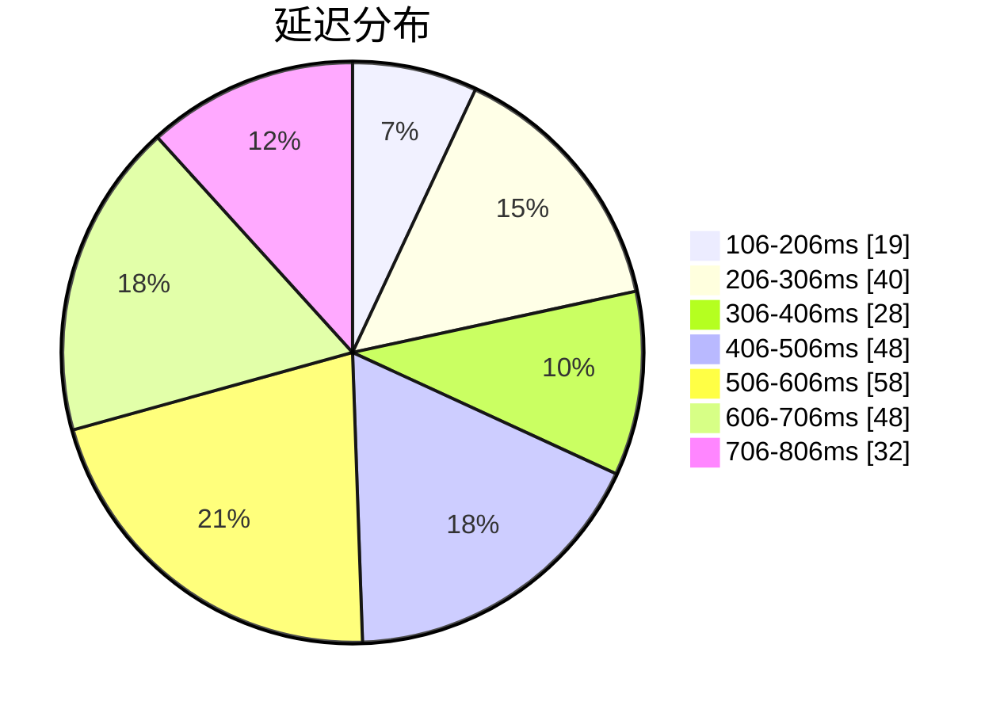
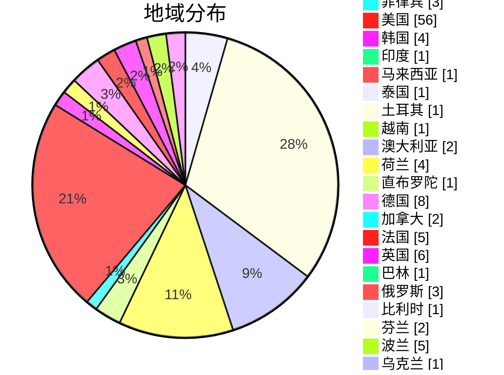
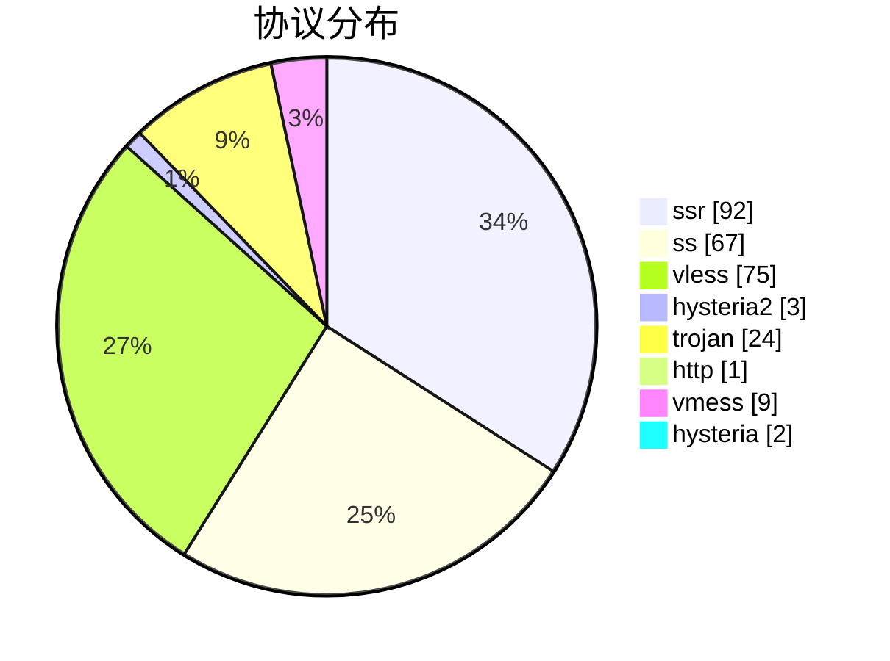

```mermaid
pie showData
title 延迟分布
"106-206ms" : 19
"206-306ms" : 40
"306-406ms" : 28
"406-506ms" : 48
"506-606ms" : 58
"606-706ms" : 48
"706-806ms" : 32
```

```mermaid
pie showData
title 地域分布
"日本" : 11
"未知" : 76
"中国" : 1
"香港" : 24
"新加坡" : 30
"台湾" : 7
"意大利" : 2
"菲律宾" : 3
"美国" : 56
"韩国" : 4
"印度" : 1
"马来西亚" : 1
"泰国" : 1
"土耳其" : 1
"越南" : 1
"澳大利亚" : 2
"荷兰" : 4
"直布罗陀" : 1
"德国" : 8
"加拿大" : 2
"法国" : 5
"英国" : 6
"巴林" : 1
"俄罗斯" : 3
"比利时" : 1
"芬兰" : 2
"波兰" : 5
"乌克兰" : 1
"哥伦比亚" : 1
"西班牙" : 2
"孟加拉国" : 5
"瑞典" : 2
"以色列" : 1
"巴西" : 1
"爱沙尼亚" : 1
```

```mermaid
pie showData
title 协议分布
"ssr" : 92
"ss" : 67
"vless" : 75
"hysteria2" : 3
"trojan" : 24
"http" : 1
"vmess" : 9
"hysteria" : 2
```