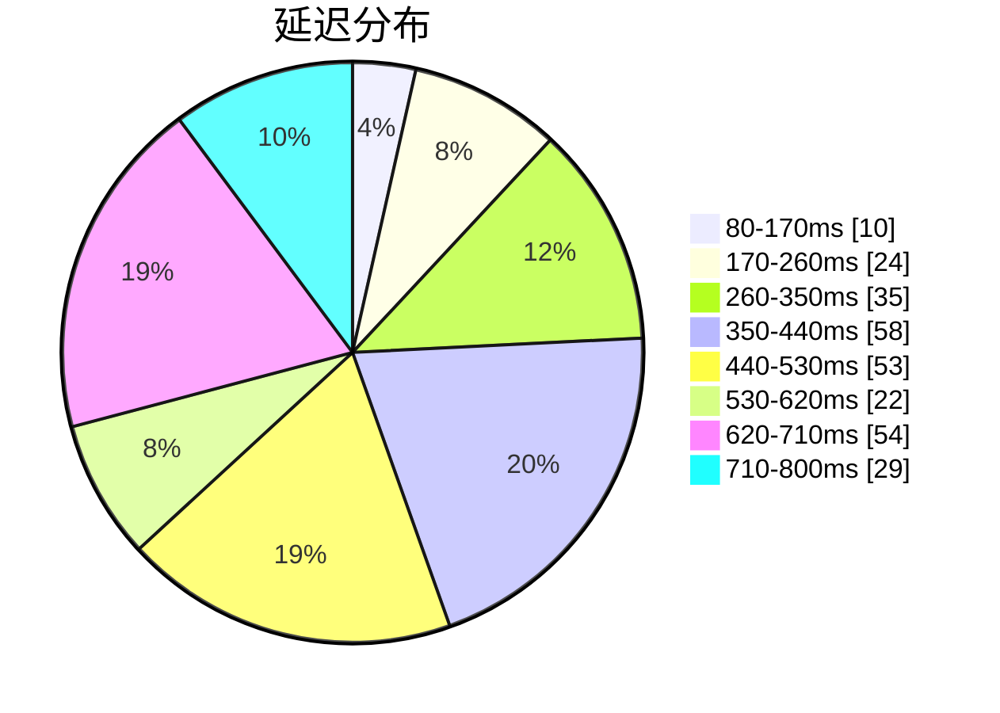
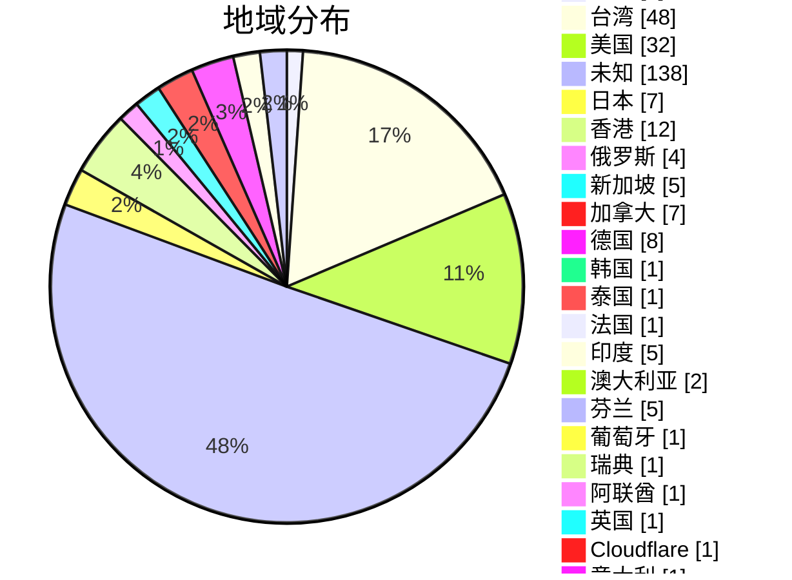
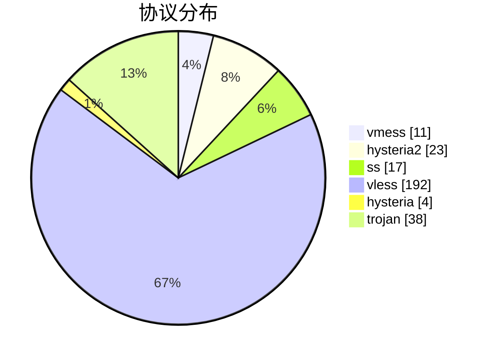

```mermaid
pie showData
title 延迟分布
"80-170ms" : 10
"170-260ms" : 24
"260-350ms" : 35
"350-440ms" : 58
"440-530ms" : 53
"530-620ms" : 22
"620-710ms" : 54
"710-800ms" : 29
```

```mermaid
pie showData
title 地域分布
"中国" : 3
"台湾" : 48
"美国" : 32
"未知" : 138
"日本" : 7
"香港" : 12
"俄罗斯" : 4
"新加坡" : 5
"加拿大" : 7
"德国" : 8
"韩国" : 1
"泰国" : 1
"法国" : 1
"印度" : 5
"澳大利亚" : 2
"芬兰" : 5
"葡萄牙" : 1
"瑞典" : 1
"阿联酋" : 1
"英国" : 1
"Cloudflare" : 1
"意大利" : 1
```

```mermaid
pie showData
title 协议分布
"vmess" : 11
"hysteria2" : 23
"ss" : 17
"vless" : 192
"hysteria" : 4
"trojan" : 38
```