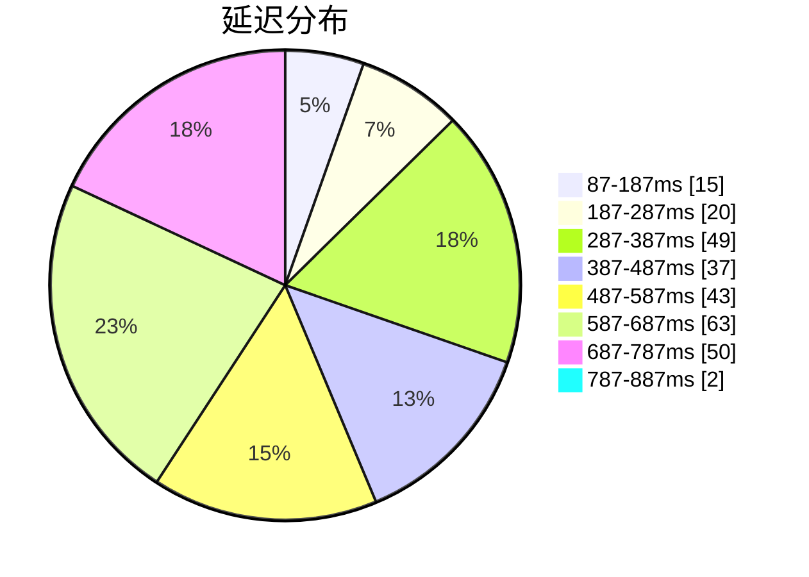
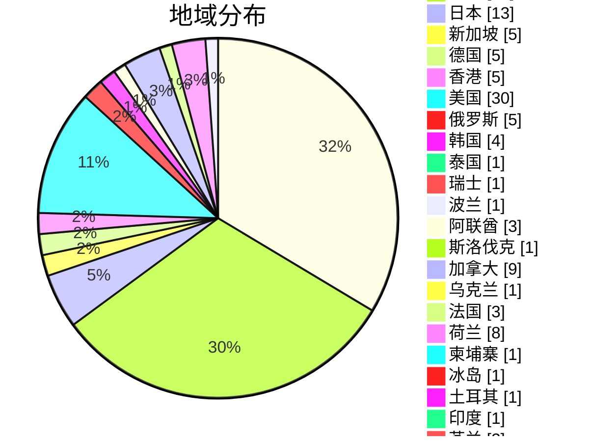
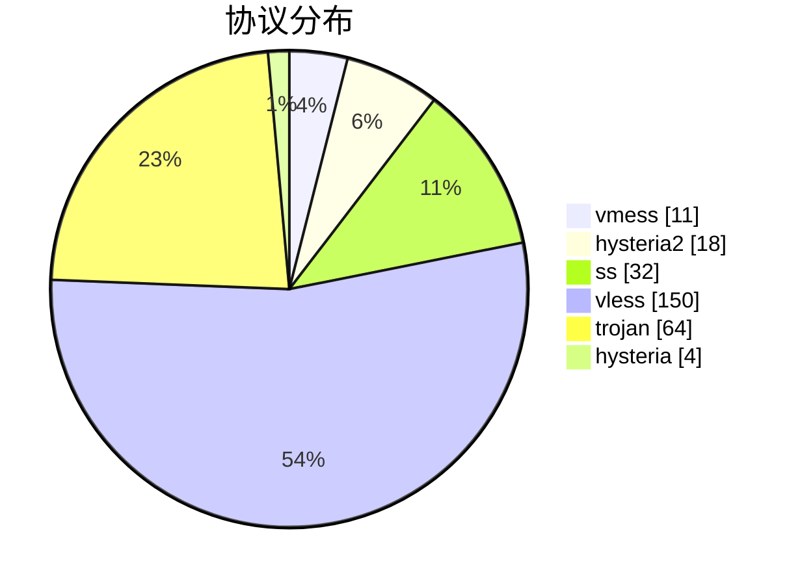

```mermaid
pie showData
title 延迟分布
"87-187ms" : 15
"187-287ms" : 20
"287-387ms" : 49
"387-487ms" : 37
"487-587ms" : 43
"587-687ms" : 63
"687-787ms" : 50
"787-887ms" : 2
```

```mermaid
pie showData
title 地域分布
"中国" : 2
"未知" : 89
"台湾" : 83
"日本" : 13
"新加坡" : 5
"德国" : 5
"香港" : 5
"美国" : 30
"俄罗斯" : 5
"韩国" : 4
"泰国" : 1
"瑞士" : 1
"波兰" : 1
"阿联酋" : 3
"斯洛伐克" : 1
"加拿大" : 9
"乌克兰" : 1
"法国" : 3
"荷兰" : 8
"柬埔寨" : 1
"冰岛" : 1
"土耳其" : 1
"印度" : 1
"芬兰" : 2
"瑞典" : 3
"意大利" : 1
```

```mermaid
pie showData
title 协议分布
"vmess" : 11
"hysteria2" : 18
"ss" : 32
"vless" : 150
"trojan" : 64
"hysteria" : 4
```