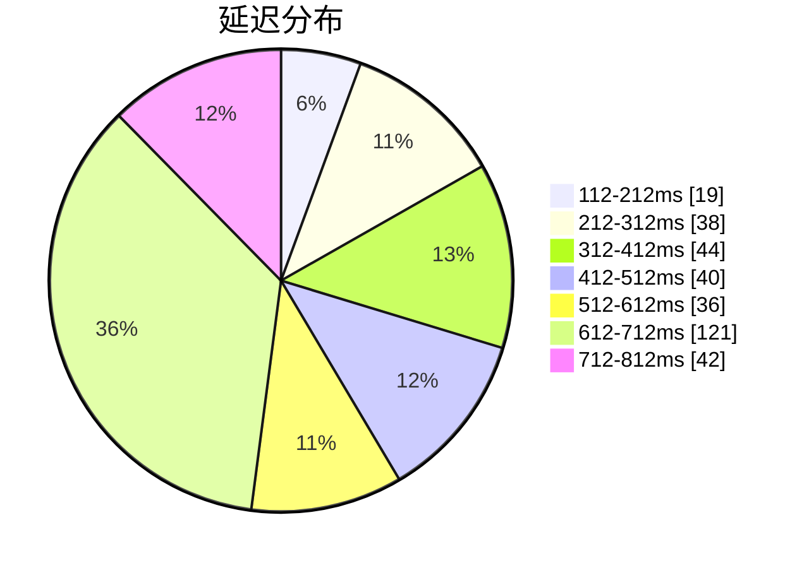
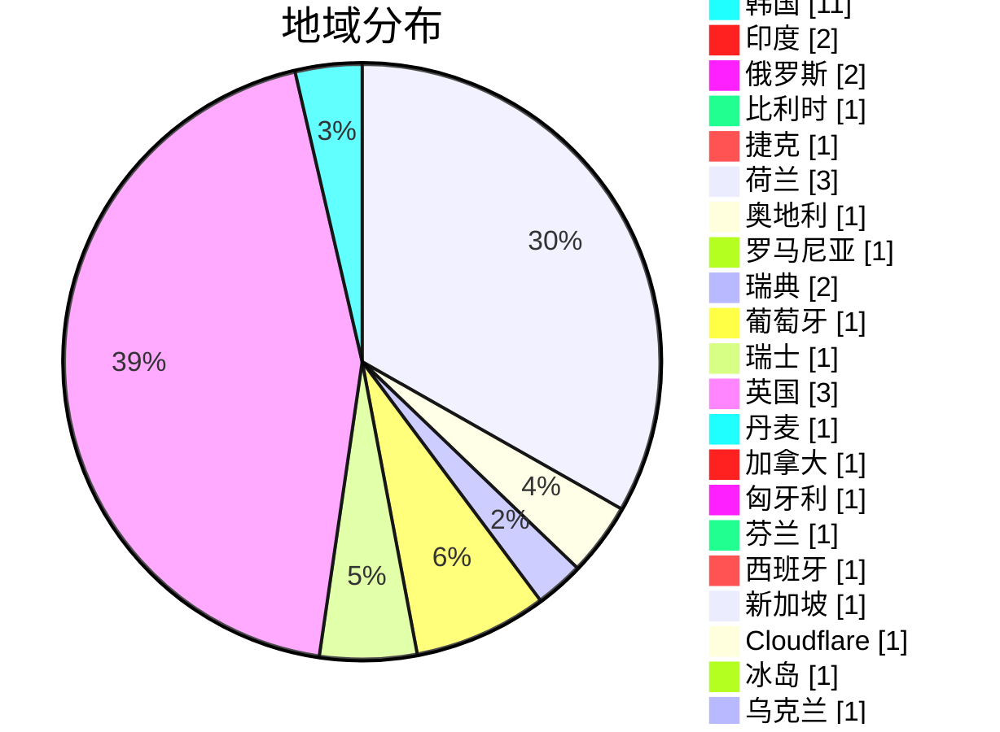
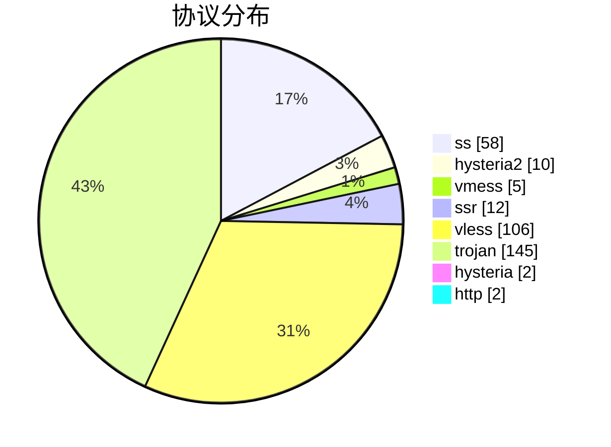

```mermaid
pie showData
title 延迟分布
"112-212ms" : 19
"212-312ms" : 38
"312-412ms" : 44
"412-512ms" : 40
"512-612ms" : 36
"612-712ms" : 121
"712-812ms" : 42
```

```mermaid
pie showData
title 地域分布
"未知" : 101
"香港" : 12
"中国" : 1
"日本" : 8
"波兰" : 22
"美国" : 16
"台湾" : 134
"韩国" : 11
"印度" : 2
"俄罗斯" : 2
"比利时" : 1
"捷克" : 1
"荷兰" : 3
"奥地利" : 1
"罗马尼亚" : 1
"瑞典" : 2
"葡萄牙" : 1
"瑞士" : 1
"英国" : 3
"丹麦" : 1
"加拿大" : 1
"匈牙利" : 1
"芬兰" : 1
"西班牙" : 1
"新加坡" : 1
"Cloudflare" : 1
"冰岛" : 1
"乌克兰" : 1
"爱沙尼亚" : 1
"保加利亚" : 1
"德国" : 1
"爱尔兰" : 1
"摩尔多瓦" : 1
"孟加拉国" : 2
"挪威" : 1
```

```mermaid
pie showData
title 协议分布
"ss" : 58
"hysteria2" : 10
"vmess" : 5
"ssr" : 12
"vless" : 106
"trojan" : 145
"hysteria" : 2
"http" : 2
```