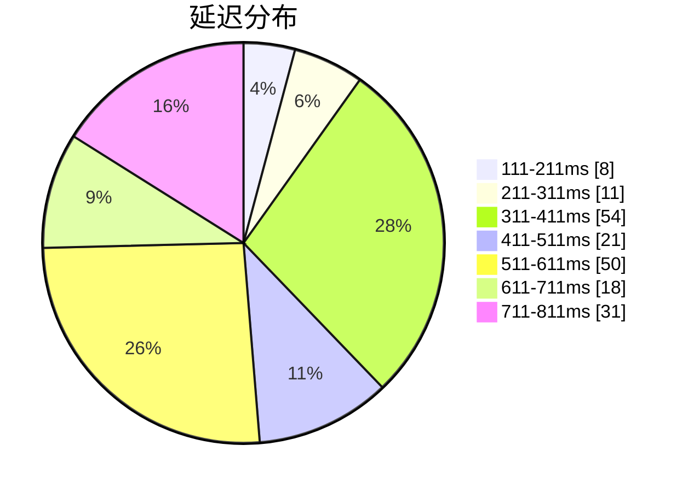
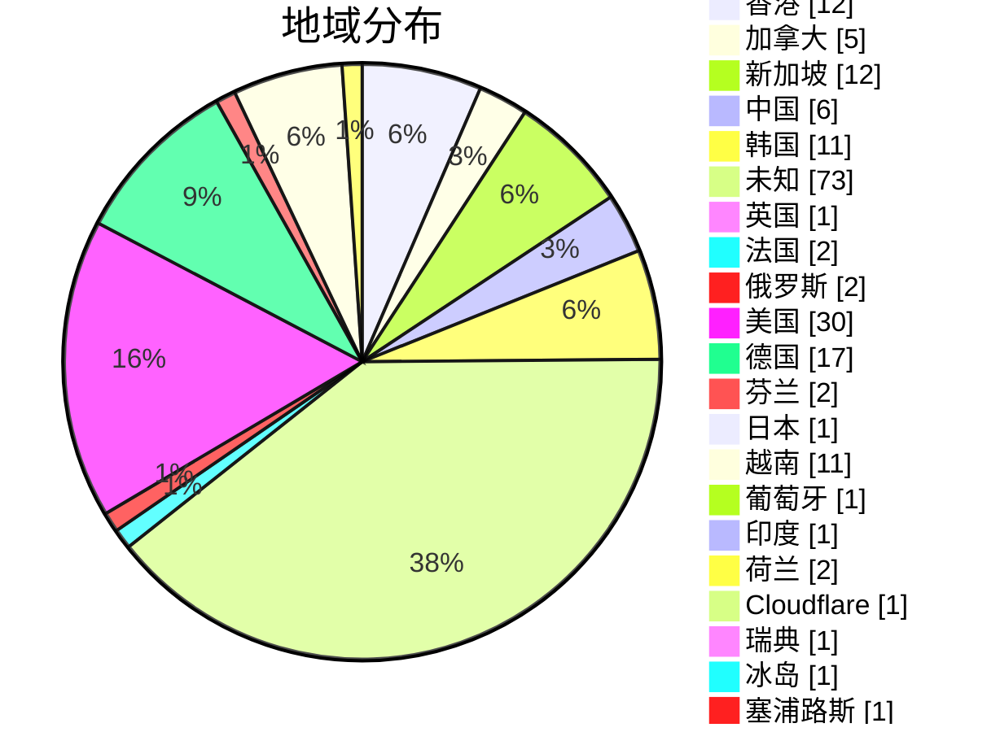
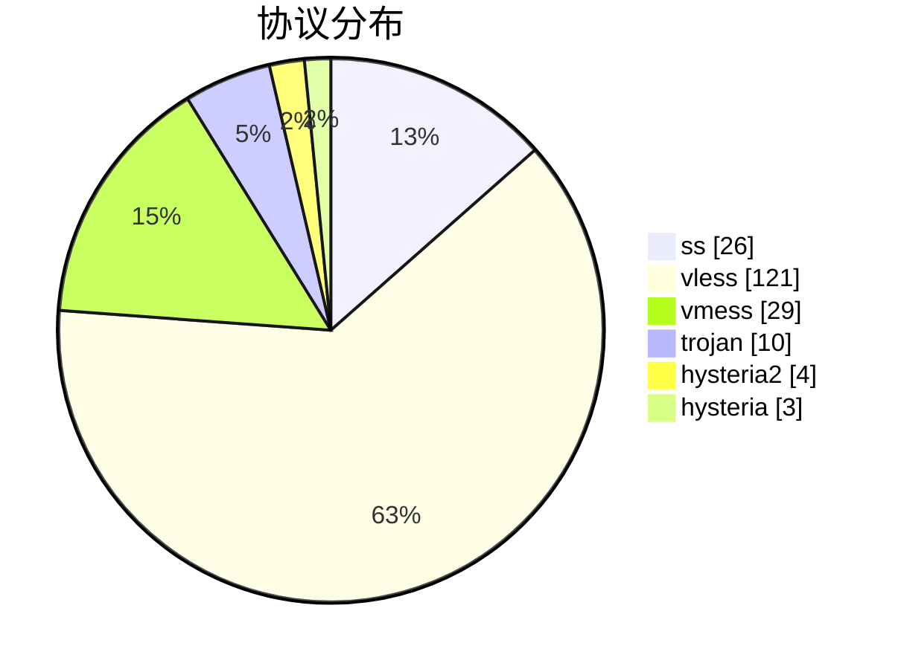

```mermaid
pie showData
title 延迟分布
"111-211ms" : 8
"211-311ms" : 11
"311-411ms" : 54
"411-511ms" : 21
"511-611ms" : 50
"611-711ms" : 18
"711-811ms" : 31
```

```mermaid
pie showData
title 地域分布
"香港" : 12
"加拿大" : 5
"新加坡" : 12
"中国" : 6
"韩国" : 11
"未知" : 73
"英国" : 1
"法国" : 2
"俄罗斯" : 2
"美国" : 30
"德国" : 17
"芬兰" : 2
"日本" : 1
"越南" : 11
"葡萄牙" : 1
"印度" : 1
"荷兰" : 2
"Cloudflare" : 1
"瑞典" : 1
"冰岛" : 1
"塞浦路斯" : 1
```

```mermaid
pie showData
title 协议分布
"ss" : 26
"vless" : 121
"vmess" : 29
"trojan" : 10
"hysteria2" : 4
"hysteria" : 3
```