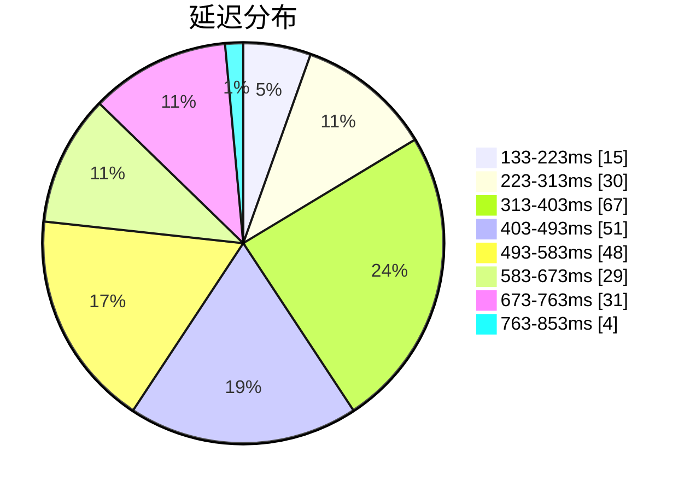
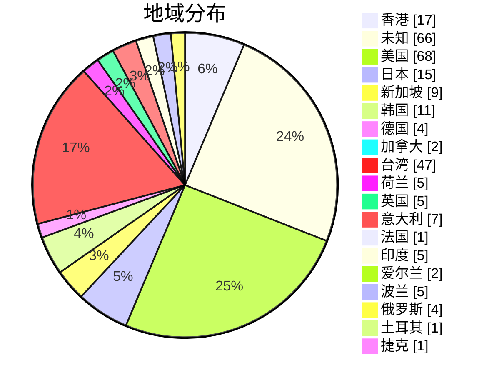
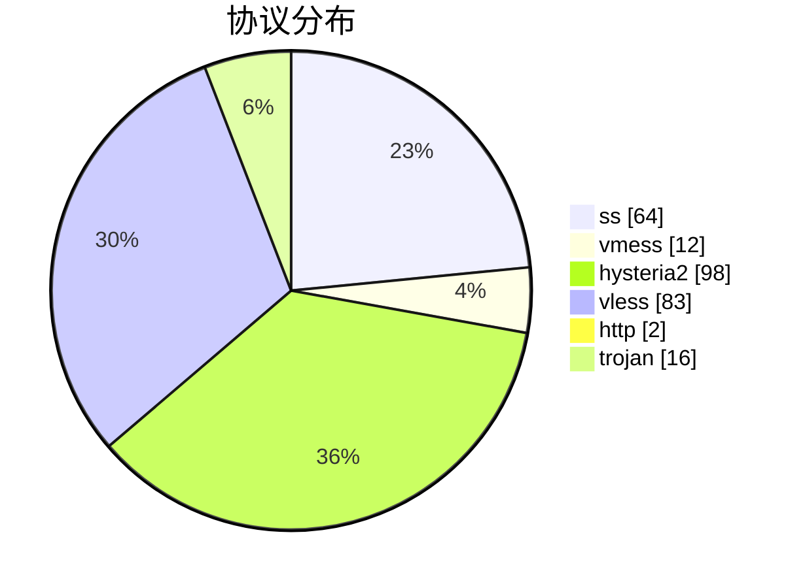

```mermaid
pie showData
title 延迟分布
"133-223ms" : 15
"223-313ms" : 30
"313-403ms" : 67
"403-493ms" : 51
"493-583ms" : 48
"583-673ms" : 29
"673-763ms" : 31
"763-853ms" : 4
```

```mermaid
pie showData
title 地域分布
"香港" : 17
"未知" : 66
"美国" : 68
"日本" : 15
"新加坡" : 9
"韩国" : 11
"德国" : 4
"加拿大" : 2
"台湾" : 47
"荷兰" : 5
"英国" : 5
"意大利" : 7
"法国" : 1
"印度" : 5
"爱尔兰" : 2
"波兰" : 5
"俄罗斯" : 4
"土耳其" : 1
"捷克" : 1
```

```mermaid
pie showData
title 协议分布
"ss" : 64
"vmess" : 12
"hysteria2" : 98
"vless" : 83
"http" : 2
"trojan" : 16
```