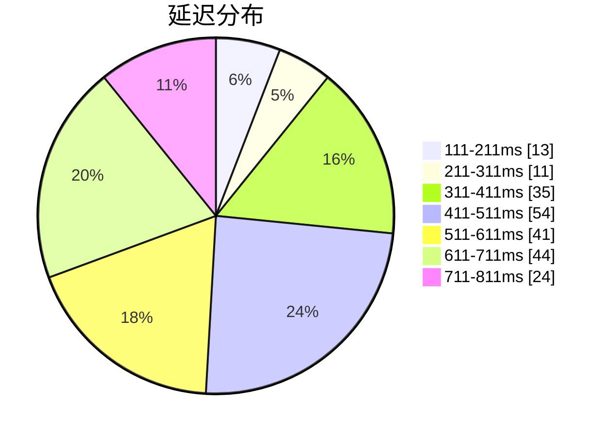
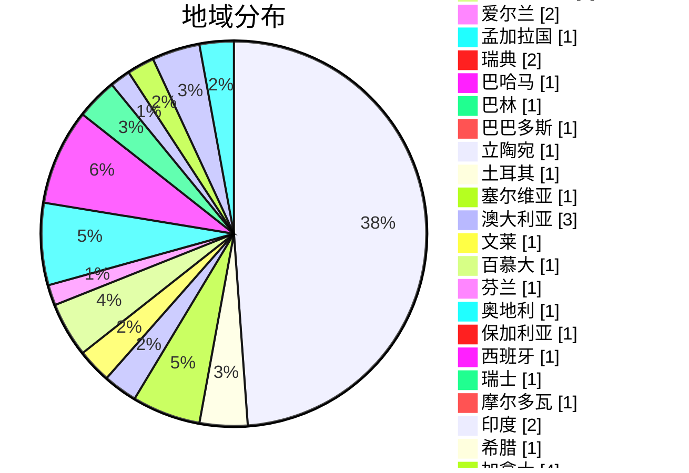
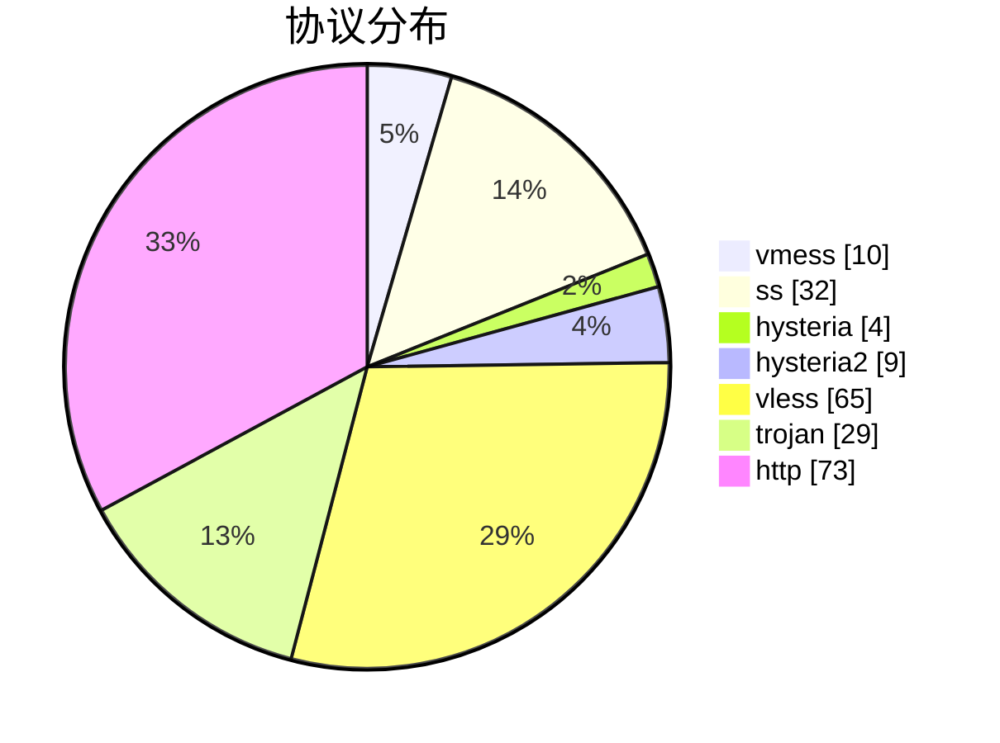

```mermaid
pie showData
title 延迟分布
"111-211ms" : 13
"211-311ms" : 11
"311-411ms" : 35
"411-511ms" : 54
"511-611ms" : 41
"611-711ms" : 44
"711-811ms" : 24
```

```mermaid
pie showData
title 地域分布
"未知" : 85
"日本" : 7
"新加坡" : 10
"俄罗斯" : 5
"香港" : 5
"韩国" : 8
"中国" : 3
"美国" : 12
"波兰" : 1
"台湾" : 14
"德国" : 6
"卢森堡" : 1
"罗马尼亚" : 1
"捷克" : 1
"阿尔及利亚" : 1
"阿联酋" : 2
"安哥拉" : 1
"阿尔巴尼亚" : 1
"爱尔兰" : 2
"孟加拉国" : 1
"瑞典" : 2
"巴哈马" : 1
"巴林" : 1
"巴巴多斯" : 1
"立陶宛" : 1
"土耳其" : 1
"塞尔维亚" : 1
"澳大利亚" : 3
"文莱" : 1
"百慕大" : 1
"芬兰" : 1
"奥地利" : 1
"保加利亚" : 1
"西班牙" : 1
"瑞士" : 1
"摩尔多瓦" : 1
"印度" : 2
"希腊" : 1
"加拿大" : 4
"荷兰" : 7
"葡萄牙" : 1
"爱沙尼亚" : 1
"匈牙利" : 1
"英国" : 5
"埃及" : 1
"巴拿马" : 1
"斯洛伐克" : 2
"阿鲁巴" : 1
"阿根廷" : 2
"越南" : 1
"智利" : 1
"阿曼" : 1
"英属维尔京群岛" : 1
"波多黎各" : 1
"尼日利亚" : 1
"摩纳哥" : 1
```

```mermaid
pie showData
title 协议分布
"vmess" : 10
"ss" : 32
"hysteria" : 4
"hysteria2" : 9
"vless" : 65
"trojan" : 29
"http" : 73
```