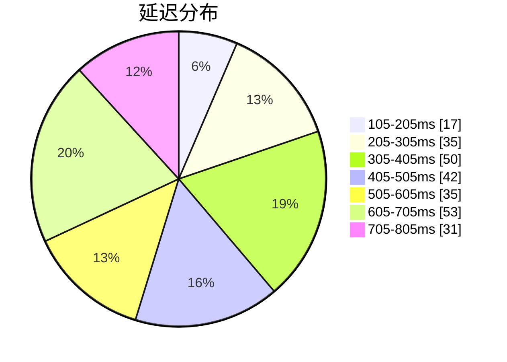
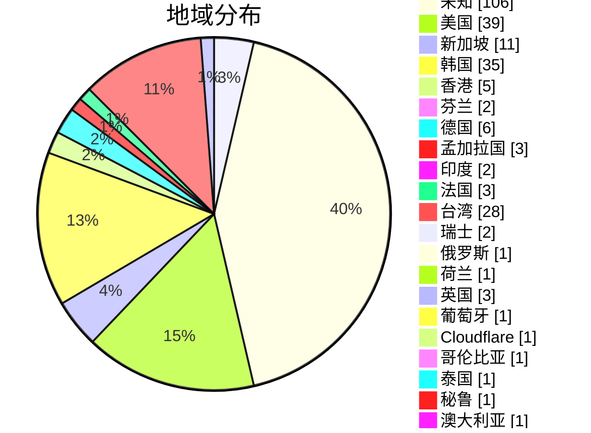
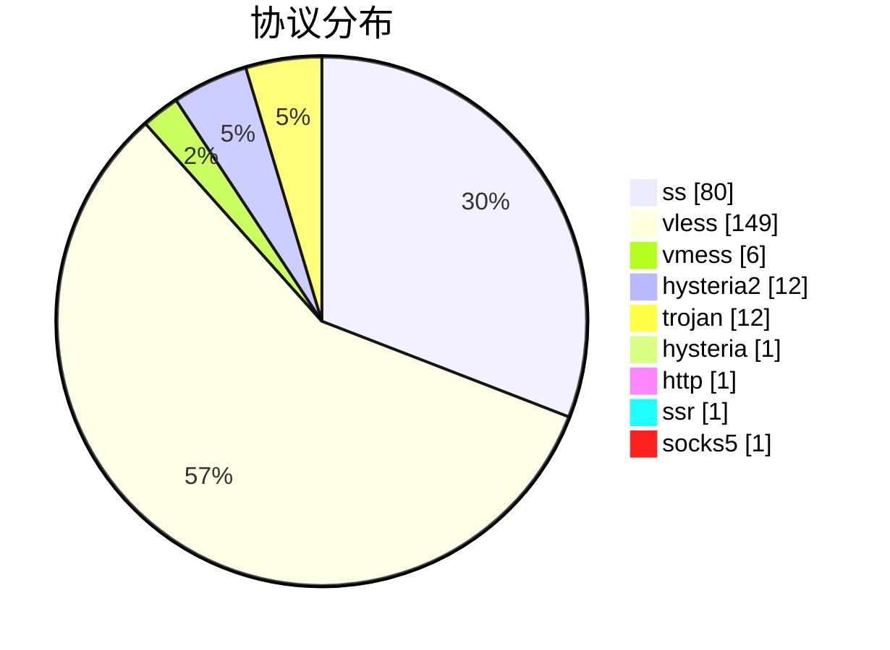

```mermaid
pie showData
title 延迟分布
"105-205ms" : 17
"205-305ms" : 35
"305-405ms" : 50
"405-505ms" : 42
"505-605ms" : 35
"605-705ms" : 53
"705-805ms" : 31
```

```mermaid
pie showData
title 地域分布
"日本" : 9
"未知" : 106
"美国" : 39
"新加坡" : 11
"韩国" : 35
"香港" : 5
"芬兰" : 2
"德国" : 6
"孟加拉国" : 3
"印度" : 2
"法国" : 3
"台湾" : 28
"瑞士" : 2
"俄罗斯" : 1
"荷兰" : 1
"英国" : 3
"葡萄牙" : 1
"Cloudflare" : 1
"哥伦比亚" : 1
"泰国" : 1
"秘鲁" : 1
"澳大利亚" : 1
"加拿大" : 1
```

```mermaid
pie showData
title 协议分布
"ss" : 80
"vless" : 149
"vmess" : 6
"hysteria2" : 12
"trojan" : 12
"hysteria" : 1
"http" : 1
"ssr" : 1
"socks5" : 1
```