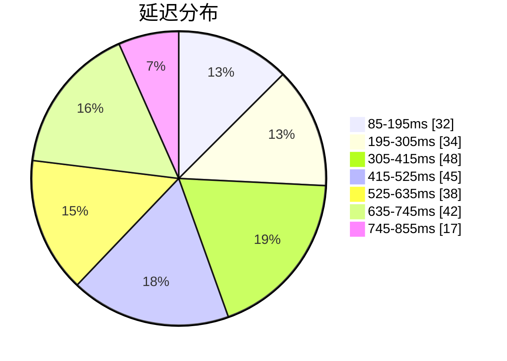
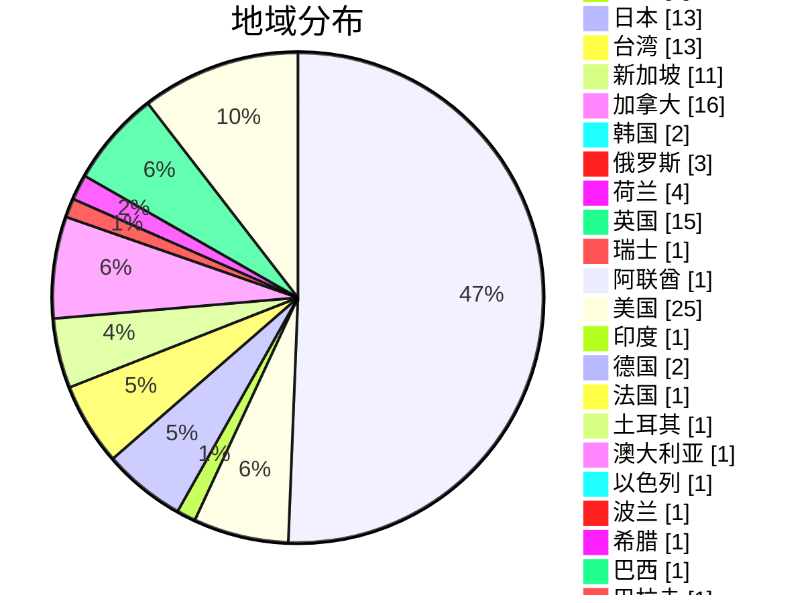
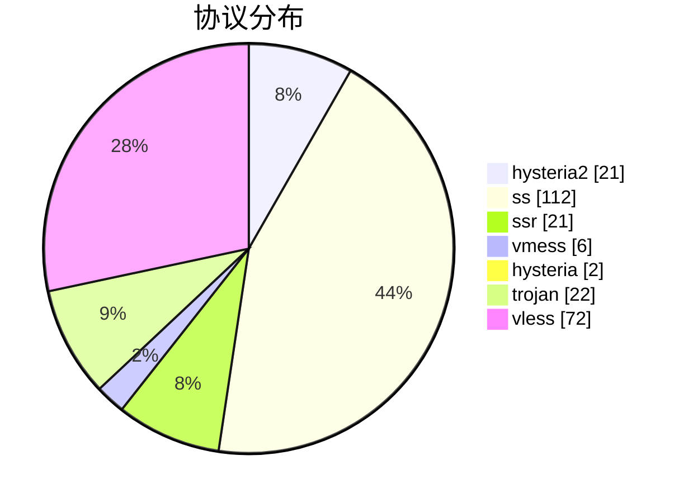

```mermaid
pie showData
title 延迟分布
"85-195ms" : 32
"195-305ms" : 34
"305-415ms" : 48
"415-525ms" : 45
"525-635ms" : 38
"635-745ms" : 42
"745-855ms" : 17
```

```mermaid
pie showData
title 地域分布
"未知" : 121
"香港" : 15
"中国" : 3
"日本" : 13
"台湾" : 13
"新加坡" : 11
"加拿大" : 16
"韩国" : 2
"俄罗斯" : 3
"荷兰" : 4
"英国" : 15
"瑞士" : 1
"阿联酋" : 1
"美国" : 25
"印度" : 1
"德国" : 2
"法国" : 1
"土耳其" : 1
"澳大利亚" : 1
"以色列" : 1
"波兰" : 1
"希腊" : 1
"巴西" : 1
"巴拉圭" : 1
"秘鲁" : 1
"塞浦路斯" : 1
```

```mermaid
pie showData
title 协议分布
"hysteria2" : 21
"ss" : 112
"ssr" : 21
"vmess" : 6
"hysteria" : 2
"trojan" : 22
"vless" : 72
```