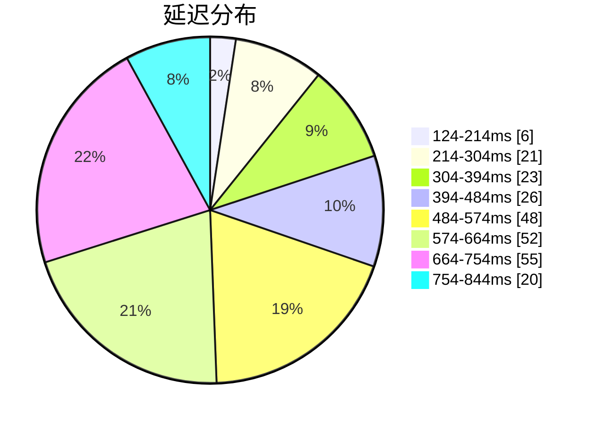
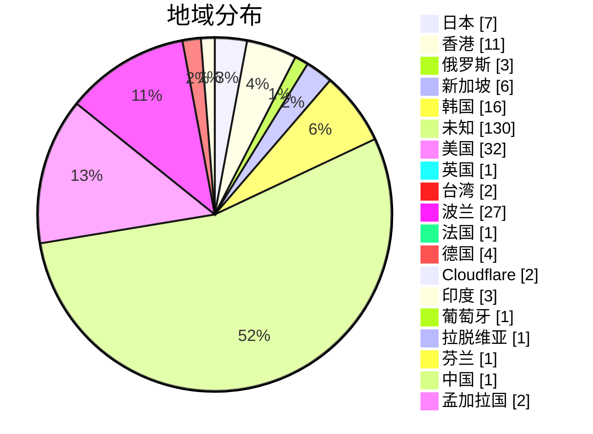
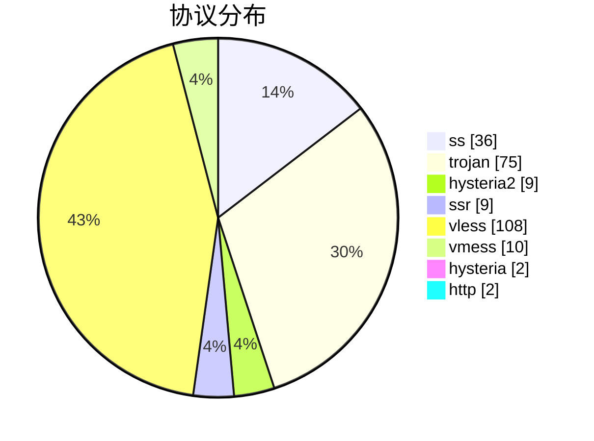

```mermaid
pie showData
title 延迟分布
"124-214ms" : 6
"214-304ms" : 21
"304-394ms" : 23
"394-484ms" : 26
"484-574ms" : 48
"574-664ms" : 52
"664-754ms" : 55
"754-844ms" : 20
```

```mermaid
pie showData
title 地域分布
"日本" : 7
"香港" : 11
"俄罗斯" : 3
"新加坡" : 6
"韩国" : 16
"未知" : 130
"美国" : 32
"英国" : 1
"台湾" : 2
"波兰" : 27
"法国" : 1
"德国" : 4
"Cloudflare" : 2
"印度" : 3
"葡萄牙" : 1
"拉脱维亚" : 1
"芬兰" : 1
"中国" : 1
"孟加拉国" : 2
```

```mermaid
pie showData
title 协议分布
"ss" : 36
"trojan" : 75
"hysteria2" : 9
"ssr" : 9
"vless" : 108
"vmess" : 10
"hysteria" : 2
"http" : 2
```