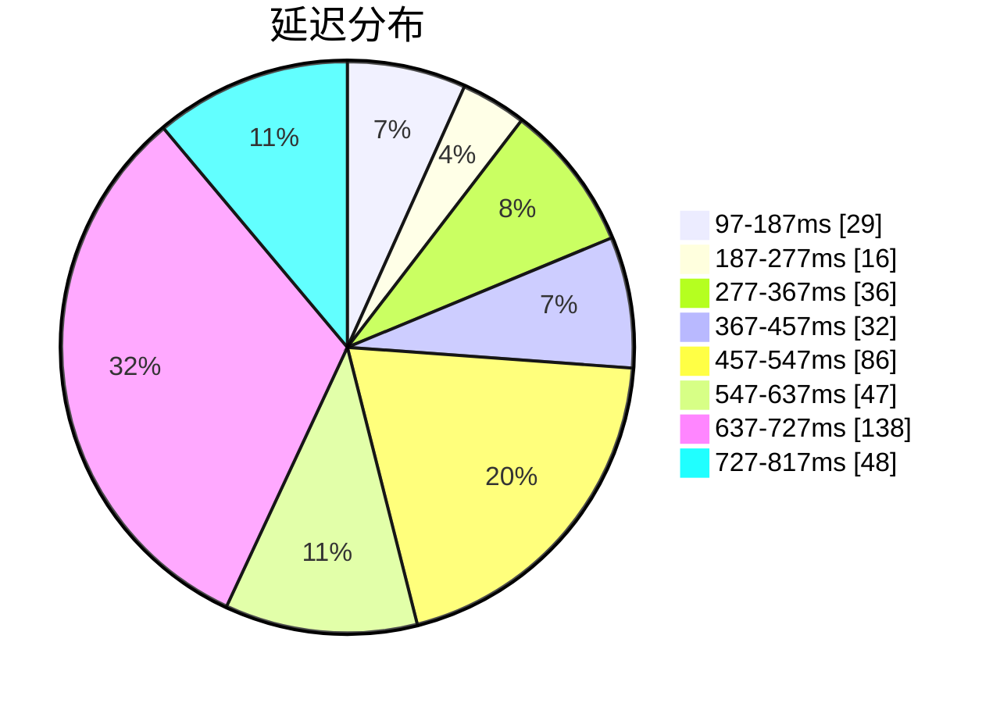
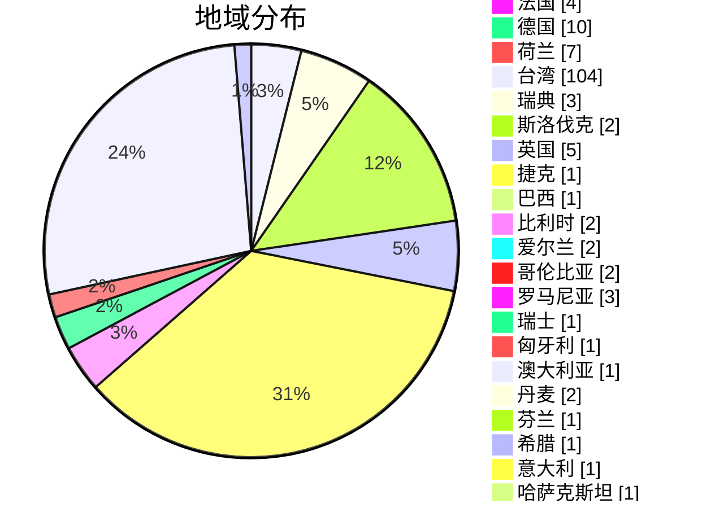
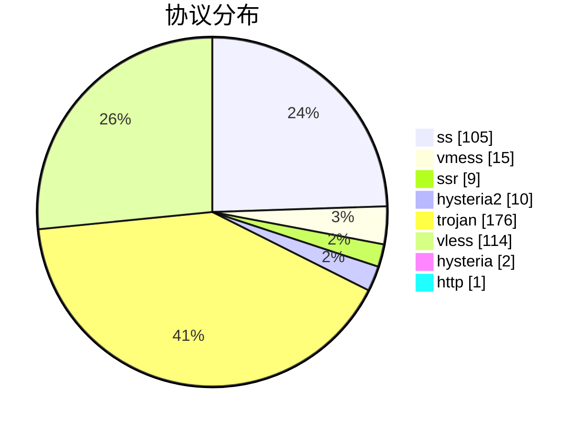

```mermaid
pie showData
title 延迟分布
"97-187ms" : 29
"187-277ms" : 16
"277-367ms" : 36
"367-457ms" : 32
"457-547ms" : 86
"547-637ms" : 47
"637-727ms" : 138
"727-817ms" : 48
```

```mermaid
pie showData
title 地域分布
"香港" : 15
"日本" : 22
"美国" : 50
"新加坡" : 21
"未知" : 136
"中国" : 1
"韩国" : 14
"俄罗斯" : 2
"波兰" : 2
"法国" : 4
"德国" : 10
"荷兰" : 7
"台湾" : 104
"瑞典" : 3
"斯洛伐克" : 2
"英国" : 5
"捷克" : 1
"巴西" : 1
"比利时" : 2
"爱尔兰" : 2
"哥伦比亚" : 2
"罗马尼亚" : 3
"瑞士" : 1
"匈牙利" : 1
"澳大利亚" : 1
"丹麦" : 2
"芬兰" : 1
"希腊" : 1
"意大利" : 1
"哈萨克斯坦" : 1
"西班牙" : 1
"冰岛" : 1
"爱沙尼亚" : 3
"秘鲁" : 1
"乌克兰" : 1
"保加利亚" : 1
"拉脱维亚" : 2
"孟加拉国" : 3
"挪威" : 1
```

```mermaid
pie showData
title 协议分布
"ss" : 105
"vmess" : 15
"ssr" : 9
"hysteria2" : 10
"trojan" : 176
"vless" : 114
"hysteria" : 2
"http" : 1
```