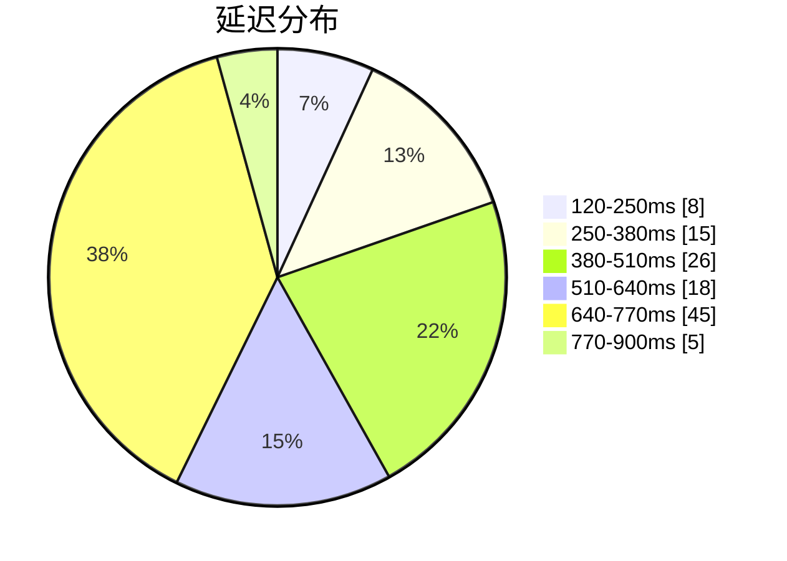
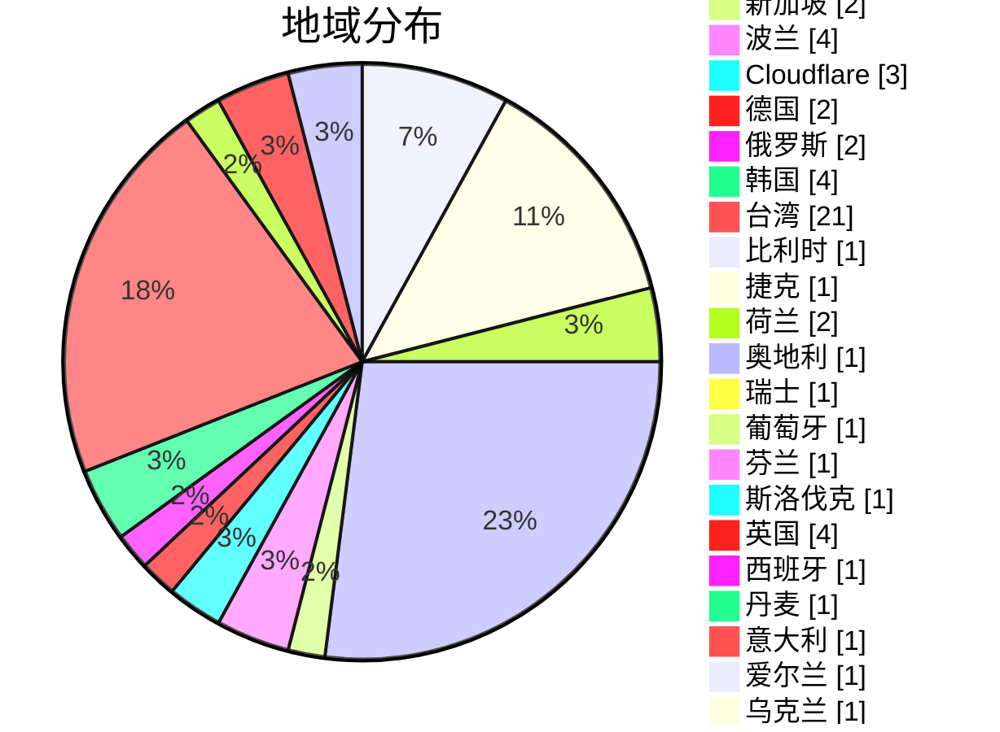
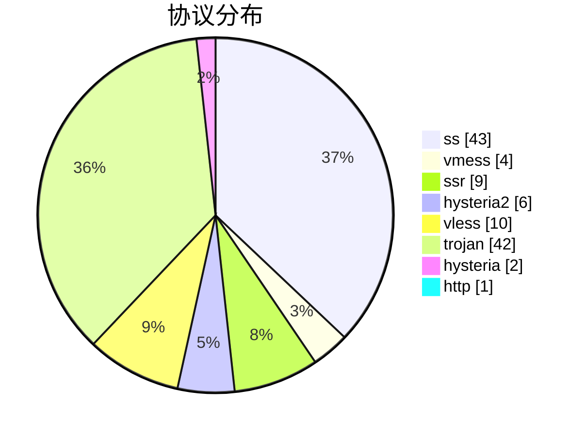

```mermaid
pie showData
title 延迟分布
"120-250ms" : 8
"250-380ms" : 15
"380-510ms" : 26
"510-640ms" : 18
"640-770ms" : 45
"770-900ms" : 5
```

```mermaid
pie showData
title 地域分布
"香港" : 8
"美国" : 13
"日本" : 4
"未知" : 27
"中国" : 1
"新加坡" : 2
"波兰" : 4
"Cloudflare" : 3
"德国" : 2
"俄罗斯" : 2
"韩国" : 4
"台湾" : 21
"比利时" : 1
"捷克" : 1
"荷兰" : 2
"奥地利" : 1
"瑞士" : 1
"葡萄牙" : 1
"芬兰" : 1
"斯洛伐克" : 1
"英国" : 4
"西班牙" : 1
"丹麦" : 1
"意大利" : 1
"爱尔兰" : 1
"乌克兰" : 1
"希腊" : 1
"孟加拉国" : 4
"拉脱维亚" : 1
"土耳其" : 1
"挪威" : 1
```

```mermaid
pie showData
title 协议分布
"ss" : 43
"vmess" : 4
"ssr" : 9
"hysteria2" : 6
"vless" : 10
"trojan" : 42
"hysteria" : 2
"http" : 1
```