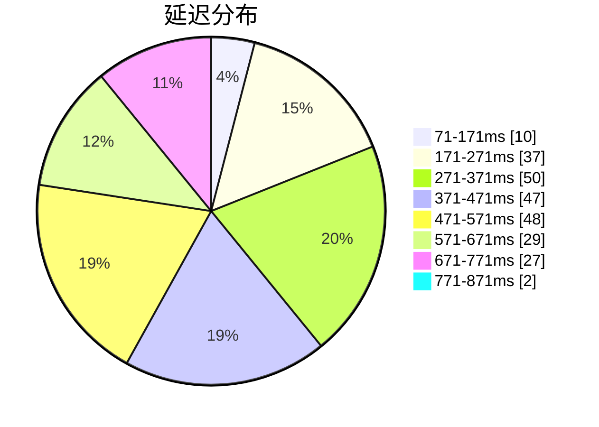
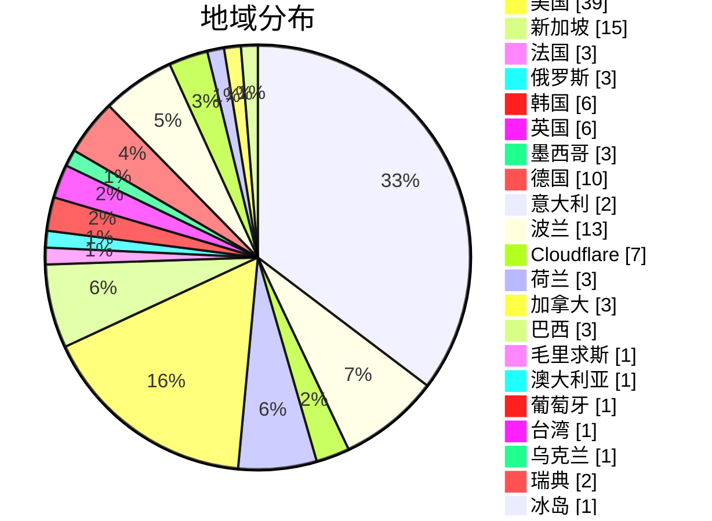
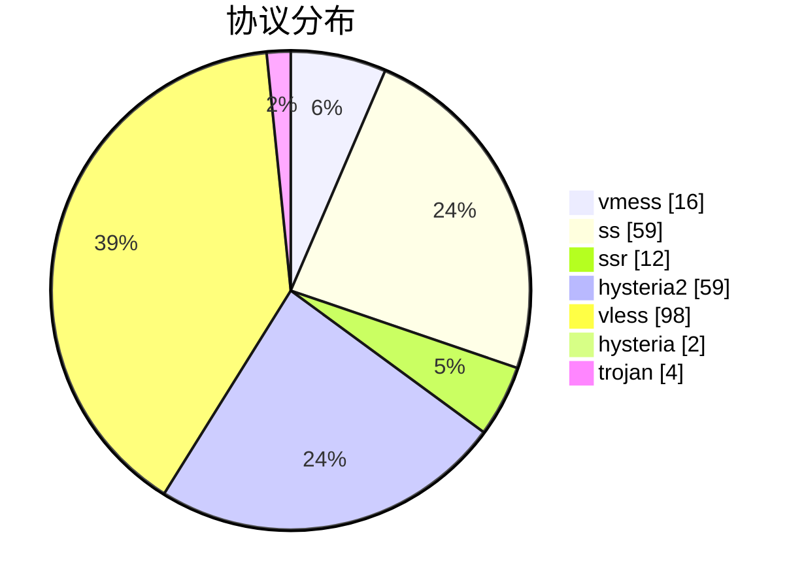

```mermaid
pie showData
title 延迟分布
"71-171ms" : 10
"171-271ms" : 37
"271-371ms" : 50
"371-471ms" : 47
"471-571ms" : 48
"571-671ms" : 29
"671-771ms" : 27
"771-871ms" : 2
```

```mermaid
pie showData
title 地域分布
"未知" : 83
"香港" : 18
"中国" : 6
"日本" : 14
"美国" : 39
"新加坡" : 15
"法国" : 3
"俄罗斯" : 3
"韩国" : 6
"英国" : 6
"墨西哥" : 3
"德国" : 10
"意大利" : 2
"波兰" : 13
"Cloudflare" : 7
"荷兰" : 3
"加拿大" : 3
"巴西" : 3
"毛里求斯" : 1
"澳大利亚" : 1
"葡萄牙" : 1
"台湾" : 1
"乌克兰" : 1
"瑞典" : 2
"冰岛" : 1
"芬兰" : 1
"立陶宛" : 1
"爱沙尼亚" : 2
"厄瓜多尔" : 1
```

```mermaid
pie showData
title 协议分布
"vmess" : 16
"ss" : 59
"ssr" : 12
"hysteria2" : 59
"vless" : 98
"hysteria" : 2
"trojan" : 4
```