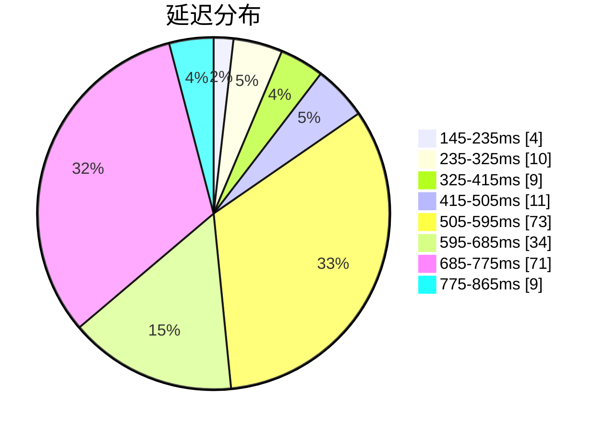
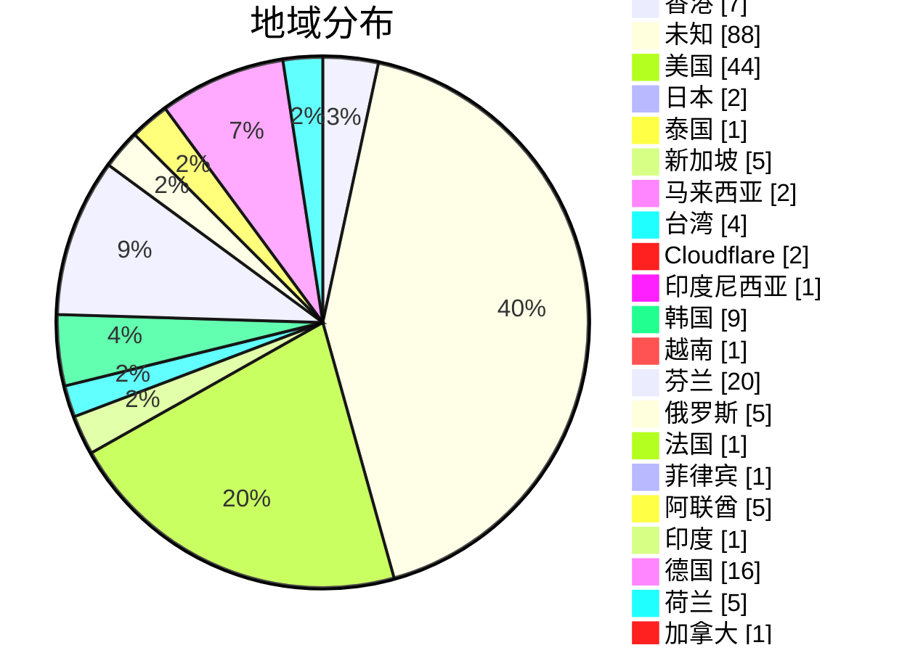
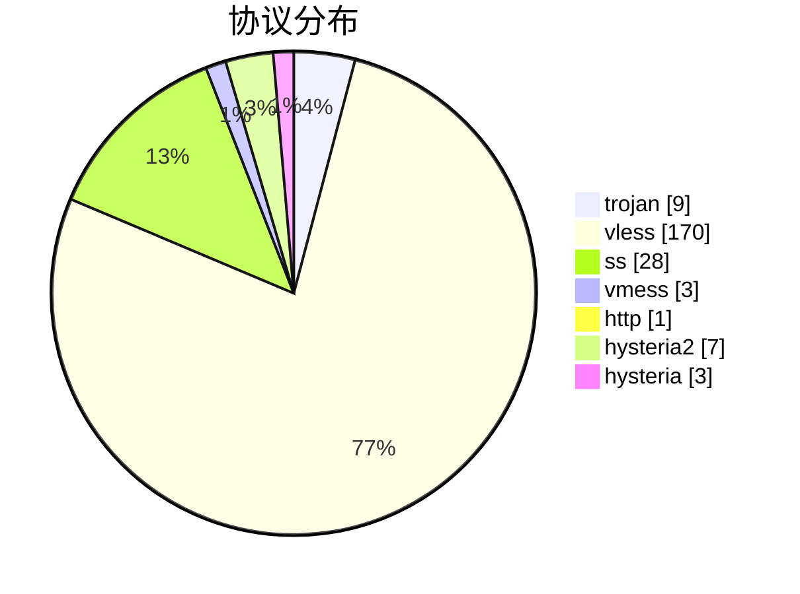

```mermaid
pie showData
title 延迟分布
"145-235ms" : 4
"235-325ms" : 10
"325-415ms" : 9
"415-505ms" : 11
"505-595ms" : 73
"595-685ms" : 34
"685-775ms" : 71
"775-865ms" : 9
```

```mermaid
pie showData
title 地域分布
"香港" : 7
"未知" : 88
"美国" : 44
"日本" : 2
"泰国" : 1
"新加坡" : 5
"马来西亚" : 2
"台湾" : 4
"Cloudflare" : 2
"印度尼西亚" : 1
"韩国" : 9
"越南" : 1
"芬兰" : 20
"俄罗斯" : 5
"法国" : 1
"菲律宾" : 1
"阿联酋" : 5
"印度" : 1
"德国" : 16
"荷兰" : 5
"加拿大" : 1
```

```mermaid
pie showData
title 协议分布
"trojan" : 9
"vless" : 170
"ss" : 28
"vmess" : 3
"http" : 1
"hysteria2" : 7
"hysteria" : 3
```