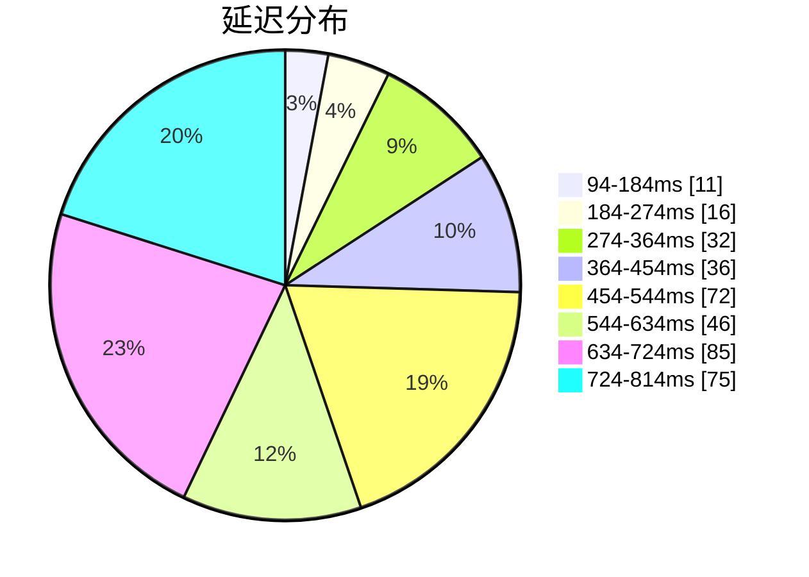
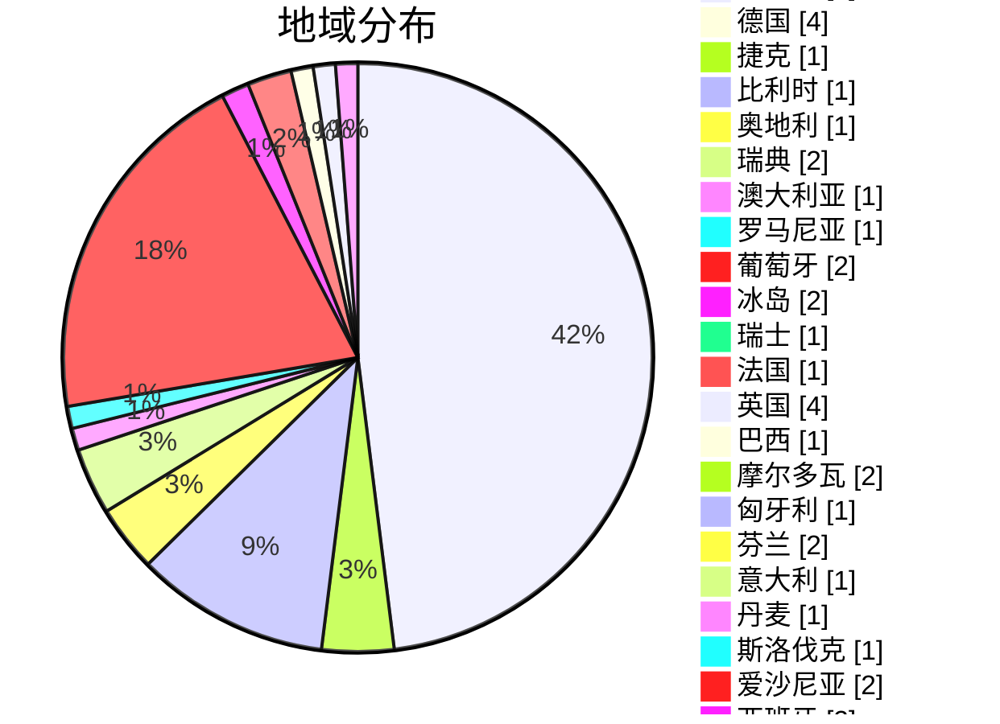
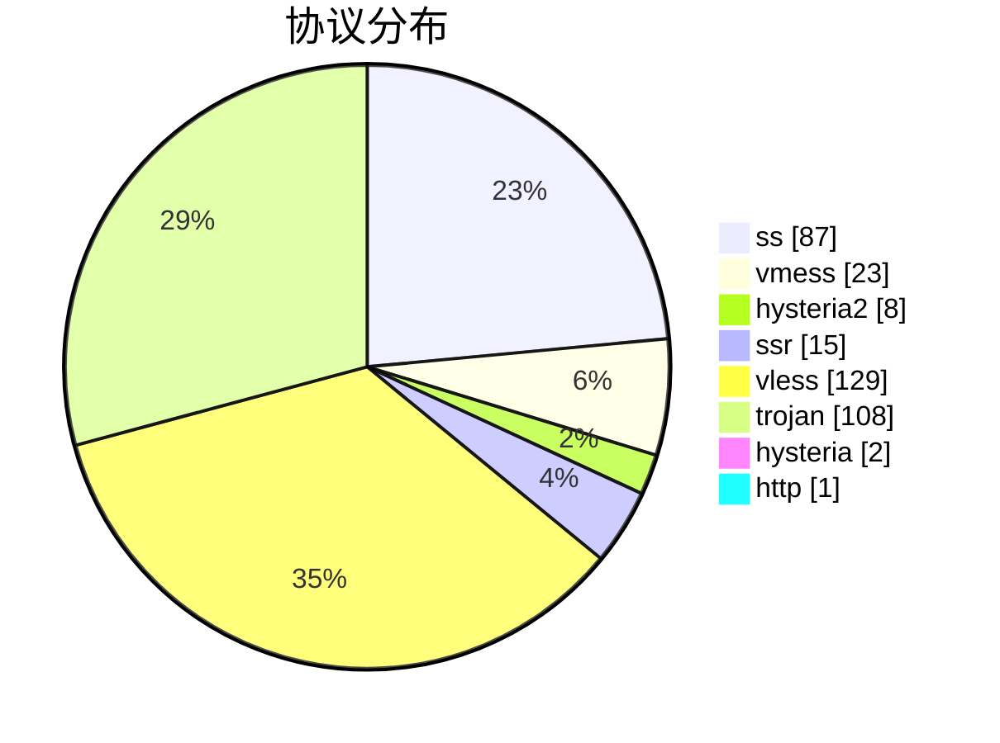

```mermaid
pie showData
title 延迟分布
"94-184ms" : 11
"184-274ms" : 16
"274-364ms" : 32
"364-454ms" : 36
"454-544ms" : 72
"544-634ms" : 46
"634-724ms" : 85
"724-814ms" : 75
```

```mermaid
pie showData
title 地域分布
"未知" : 158
"中国" : 2
"日本" : 13
"美国" : 35
"新加坡" : 12
"香港" : 12
"俄罗斯" : 4
"Cloudflare" : 4
"台湾" : 66
"荷兰" : 5
"波兰" : 3
"韩国" : 8
"加拿大" : 2
"德国" : 4
"捷克" : 1
"比利时" : 1
"奥地利" : 1
"瑞典" : 2
"澳大利亚" : 1
"罗马尼亚" : 1
"葡萄牙" : 2
"冰岛" : 2
"瑞士" : 1
"法国" : 1
"英国" : 4
"巴西" : 1
"摩尔多瓦" : 2
"匈牙利" : 1
"芬兰" : 2
"意大利" : 1
"丹麦" : 1
"斯洛伐克" : 1
"爱沙尼亚" : 2
"西班牙" : 2
"爱尔兰" : 1
"保加利亚" : 1
"哥伦比亚" : 1
"乌克兰" : 1
"哈萨克斯坦" : 1
"阿联酋" : 1
"土耳其" : 1
"拉脱维亚" : 1
"孟加拉国" : 4
"挪威" : 1
"立陶宛" : 1
"斯洛文尼亚" : 1
```

```mermaid
pie showData
title 协议分布
"ss" : 87
"vmess" : 23
"hysteria2" : 8
"ssr" : 15
"vless" : 129
"trojan" : 108
"hysteria" : 2
"http" : 1
```