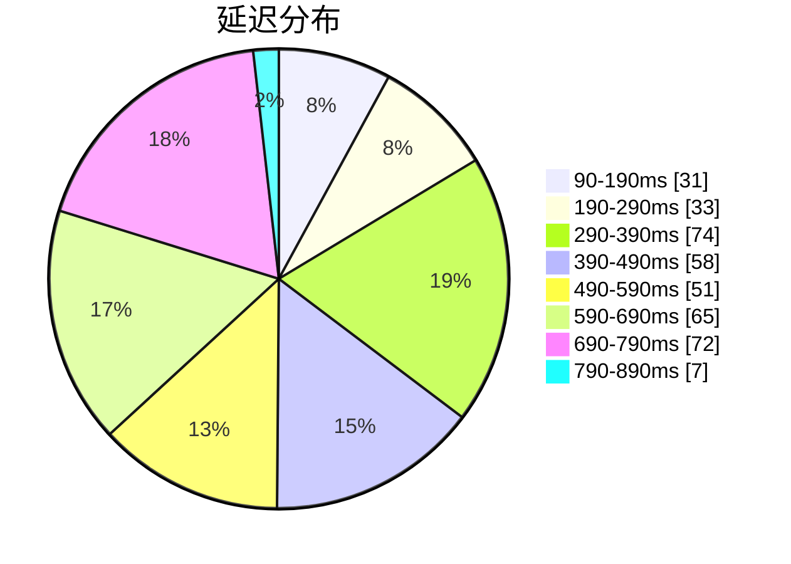
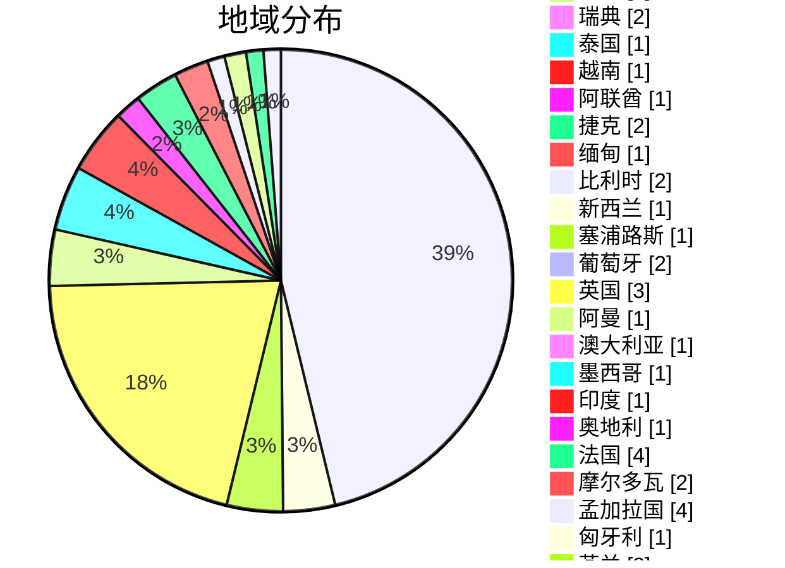
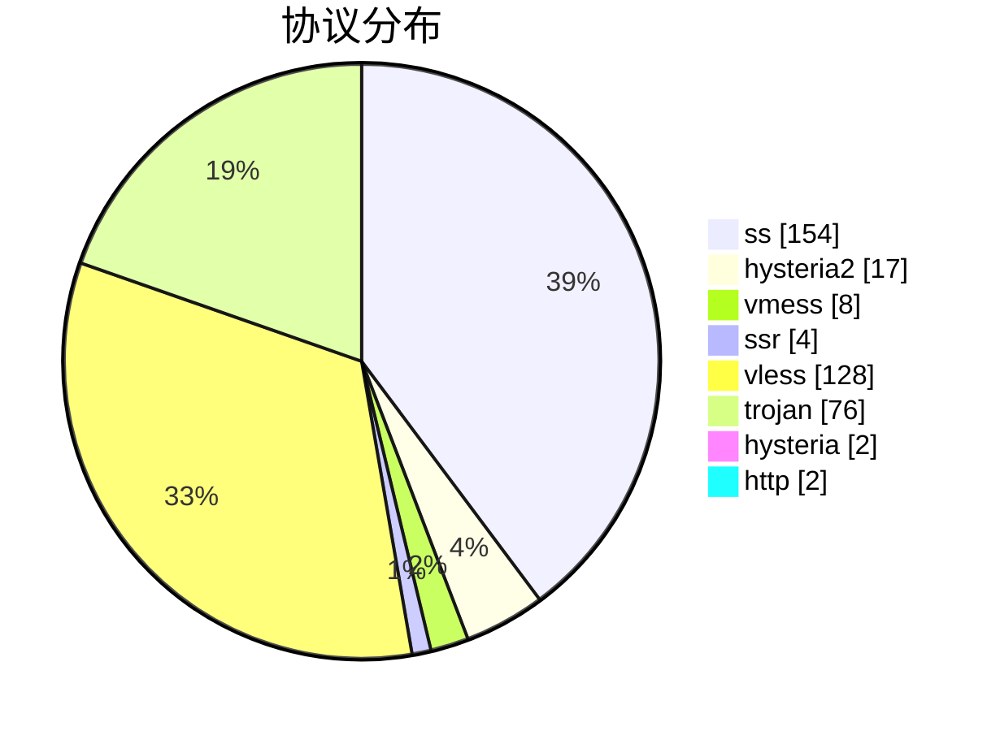

```mermaid
pie showData
title 延迟分布
"90-190ms" : 31
"190-290ms" : 33
"290-390ms" : 74
"390-490ms" : 58
"490-590ms" : 51
"590-690ms" : 65
"690-790ms" : 72
"790-890ms" : 7
```

```mermaid
pie showData
title 地域分布
"未知" : 153
"香港" : 12
"日本" : 13
"中国" : 2
"台湾" : 69
"新加坡" : 13
"俄罗斯" : 2
"波兰" : 15
"美国" : 15
"荷兰" : 6
"加拿大" : 10
"韩国" : 8
"Cloudflare" : 4
"菲律宾" : 1
"瑞士" : 2
"意大利" : 2
"印度尼西亚" : 1
"德国" : 5
"瑞典" : 2
"泰国" : 1
"越南" : 1
"阿联酋" : 1
"捷克" : 2
"缅甸" : 1
"比利时" : 2
"新西兰" : 1
"塞浦路斯" : 1
"葡萄牙" : 2
"英国" : 3
"阿曼" : 1
"澳大利亚" : 1
"墨西哥" : 1
"印度" : 1
"奥地利" : 1
"法国" : 4
"摩尔多瓦" : 2
"孟加拉国" : 4
"匈牙利" : 1
"芬兰" : 2
"塞尔维亚" : 2
"丹麦" : 1
"西班牙" : 2
"罗马尼亚" : 1
"斯洛伐克" : 1
"立陶宛" : 2
"冰岛" : 1
"爱沙尼亚" : 1
"波黑" : 1
"爱尔兰" : 2
"挪威" : 1
"乌克兰" : 2
"保加利亚" : 2
"白俄罗斯" : 1
"希腊" : 1
"土耳其" : 1
"卡塔尔" : 1
```

```mermaid
pie showData
title 协议分布
"ss" : 154
"hysteria2" : 17
"vmess" : 8
"ssr" : 4
"vless" : 128
"trojan" : 76
"hysteria" : 2
"http" : 2
```