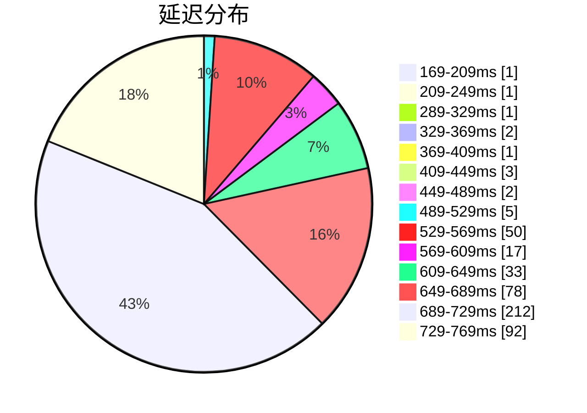
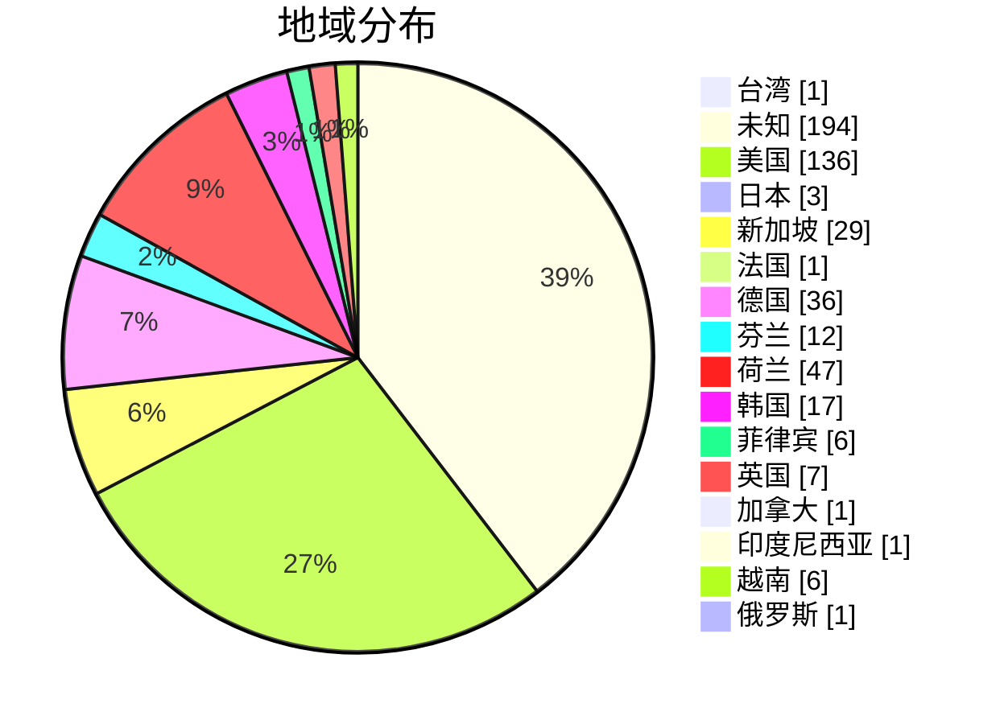
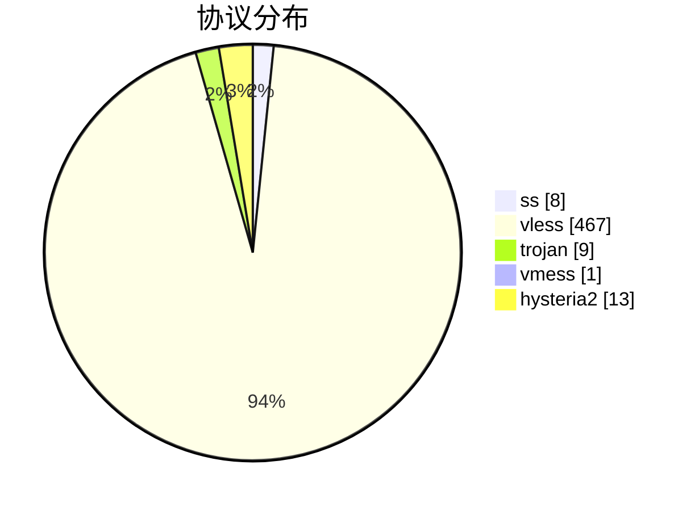

```mermaid
pie showData
title 延迟分布
"169-209ms" : 1
"209-249ms" : 1
"289-329ms" : 1
"329-369ms" : 2
"369-409ms" : 1
"409-449ms" : 3
"449-489ms" : 2
"489-529ms" : 5
"529-569ms" : 50
"569-609ms" : 17
"609-649ms" : 33
"649-689ms" : 78
"689-729ms" : 212
"729-769ms" : 92
```

```mermaid
pie showData
title 地域分布
"台湾" : 1
"未知" : 194
"美国" : 136
"日本" : 3
"新加坡" : 29
"法国" : 1
"德国" : 36
"芬兰" : 12
"荷兰" : 47
"韩国" : 17
"菲律宾" : 6
"英国" : 7
"加拿大" : 1
"印度尼西亚" : 1
"越南" : 6
"俄罗斯" : 1
```

```mermaid
pie showData
title 协议分布
"ss" : 8
"vless" : 467
"trojan" : 9
"vmess" : 1
"hysteria2" : 13
```