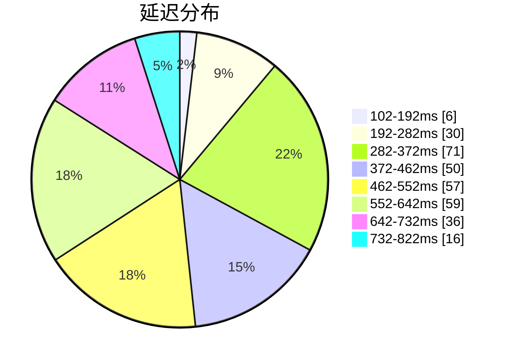
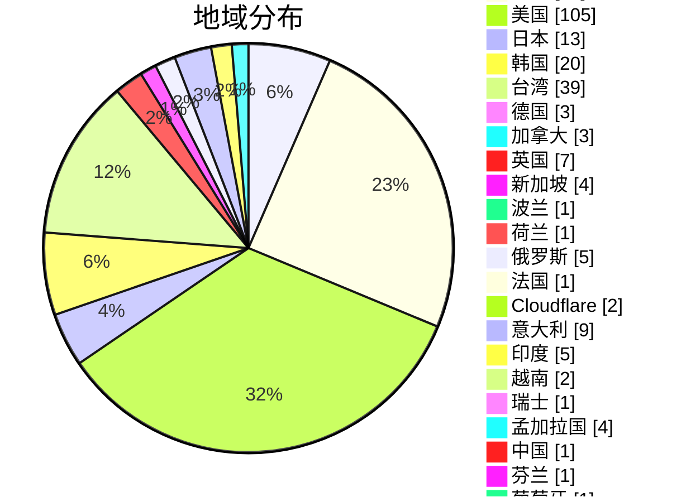
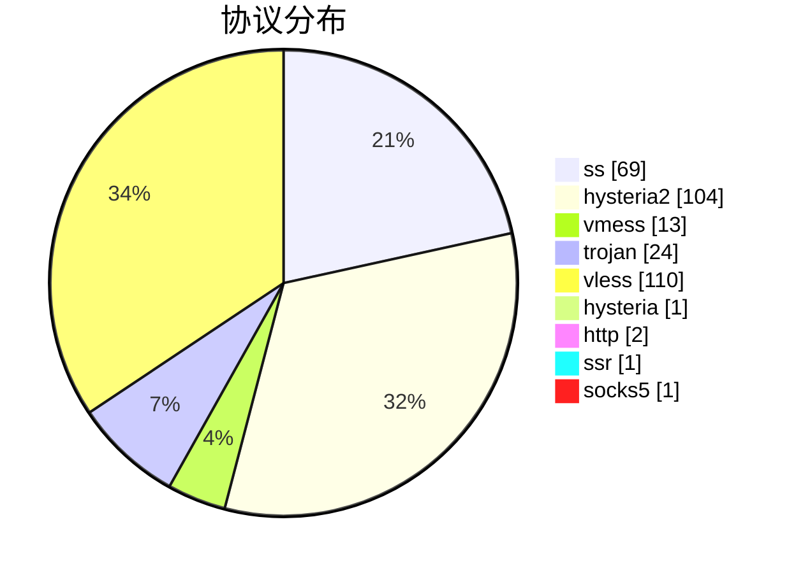

```mermaid
pie showData
title 延迟分布
"102-192ms" : 6
"192-282ms" : 30
"282-372ms" : 71
"372-462ms" : 50
"462-552ms" : 57
"552-642ms" : 59
"642-732ms" : 36
"732-822ms" : 16
```

```mermaid
pie showData
title 地域分布
"香港" : 20
"未知" : 76
"美国" : 105
"日本" : 13
"韩国" : 20
"台湾" : 39
"德国" : 3
"加拿大" : 3
"英国" : 7
"新加坡" : 4
"波兰" : 1
"荷兰" : 1
"俄罗斯" : 5
"法国" : 1
"Cloudflare" : 2
"意大利" : 9
"印度" : 5
"越南" : 2
"瑞士" : 1
"孟加拉国" : 4
"中国" : 1
"芬兰" : 1
"葡萄牙" : 1
"以色列" : 1
```

```mermaid
pie showData
title 协议分布
"ss" : 69
"hysteria2" : 104
"vmess" : 13
"trojan" : 24
"vless" : 110
"hysteria" : 1
"http" : 2
"ssr" : 1
"socks5" : 1
```